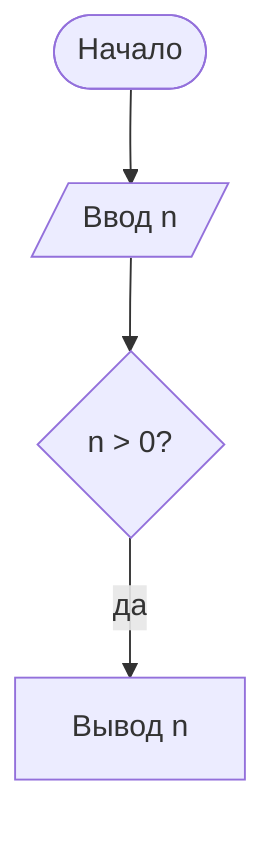

# Как добавить лекцию

Всё содержимое приложения — это Markdown-файлы в этой папке. Чтобы добавить лекцию, не нужно трогать код: положите файл, сделайте коммит — через минуту-две (после публикации GitHub Pages) лекция появится в приложении.

## Через сайт GitHub (без программ)

1. Откройте папку нужного предмета, например [`history/`](history).
2. **Add file → Create new file** (или **Upload files**, если файл уже готов).
3. Назовите файл по схеме `NN-короткое-имя.md`, например `03-kievan-rus.md`. Число задаёт порядок лекций.
4. Напишите текст (шпаргалка ниже) → **Commit changes**.

Новый предмет — это новая папка: `content/physics/01-kinematics.md`. Название предмета, иконку и цвет можно задать в `subject.json` (необязательно, пример — в любой папке предмета).

## Структура папок

```text
content/
  history/                  ← предмет (имя папки = адрес в приложении)
    subject.json            ← название, иконка, цвет, описания файлов (необязательно)
    01-introduction.md      ← лекции: NN-имя.md
    02-...md
    exam.md                 ← вопросы к экзамену/зачёту с ответами (exam-*.md — ещё списки)
    materials/              ← PDF, DOC, DOCX — появятся в разделе «Файлы»
    images/                 ← картинки для лекций (любая папка, кроме materials)
  _черновик.md              ← файлы и папки с «_» в начале не публикуются
```

## Шпаргалка по Markdown

```markdown
# Название лекции

Первый абзац после названия — вводный, он же подпись в списке лекций.

## Раздел (попадёт в оглавление)

### Подраздел

Обычный текст, **жирный**, *курсив*, `код`, [ссылка](https://example.com),
ссылка на другую лекцию: [см. введение](01-introduction.md).

- пункт списка
- ещё пункт
  1. вложенный нумерованный

| Дата | Событие |
|------|---------|
| 862  | Призвание варягов |


```

### Формулы (LaTeX)

- в строке: `$E = mc^2$`
- отдельной строкой:

```markdown
$$
\det A = \begin{vmatrix} a & b \\ c & d \end{vmatrix} = ad - bc
$$
```

Правила: после открывающего `$` и перед закрывающим — без пробела; для денег пишите «долларов», а не `$5`; внутри таблиц не используйте `|` в формулах (модуль — `\lvert x \rvert`). Кириллицу внутри формул оборачивайте в `\text{…}`.

### Выноски

```markdown
> [!TIP] Мнемоника
> Текст подсказки.

> [!WARNING]
> Типичная ошибка.

> [!QUESTION]- Вопрос с раскрывающимся ответом
> Ответ скрыт, пока не нажать.
```

Типы: `NOTE`, `TIP`, `IMPORTANT`, `WARNING`, `CAUTION`, `EXAMPLE`, `QUESTION`, `DEFINITION`, `THEOREM`.

### Блок-схемы

````markdown

````

## Вопросы для самопроверки (квиз по лекции)

В конце лекции добавьте раздел — из него автоматически соберётся квиз:

```markdown
## Вопросы для самопроверки

### Что изучает история?

Ответ: …

### Назовите функции истории

Познавательная, прогностическая, …
```

Каждый `###` внутри раздела — карточка, текст под ним — ответ.

## Вопросы к экзамену (`exam.md`)

```markdown
# Вопросы к зачёту

Короткое описание списка.

## 1. История как наука. Исторические источники

Ответ на вопрос…

## 2. Основные этапы всемирной истории

> Условие или уточнение к вопросу (необязательно) — цитата сразу после заголовка.

Ответ…
```

- Вопрос — любой заголовок, начинающийся с номера (`## 12. …`). Номер — это ключ прогресса: не перенумеровывайте существующие вопросы, иначе у всех собьются отметки «Знаю / Учу».
- Заголовки без номера группируют вопросы (например `## Unit 1` → `### Theme 1.1` → `#### 1. …`).
- Внутри ответа не используйте заголовки того же или более высокого уровня — пишите **жирные** подзаголовки.

## Чего не делать

- Не начинайте файл с блока `---` (YAML front matter): GitHub Pages превратит такой файл в HTML, и приложение его не увидит. Метаданные, если нужны, пишите комментарием:

  ```markdown
  <!-- meta
  title: Название, если оно отличается от заголовка
  order: 3
  -->
  ```
- Не переименовывайте опубликованные файлы без необходимости: имя (без номера) — ключ прогресса «прочитано».

## Проверка перед коммитом (по желанию)

Если на компьютере есть Node.js: `node tools/check-content.mjs` проверит все файлы так же, как их прочитает приложение, а `node tools/serve.mjs` покажет приложение локально на http://localhost:4173/.
