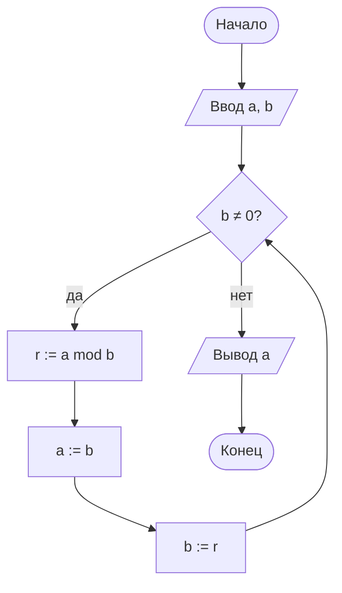
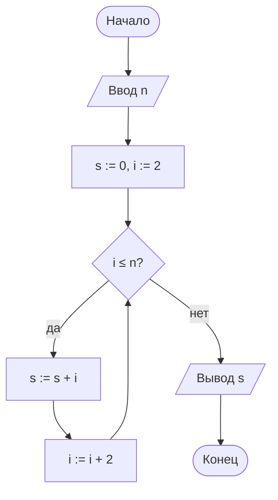
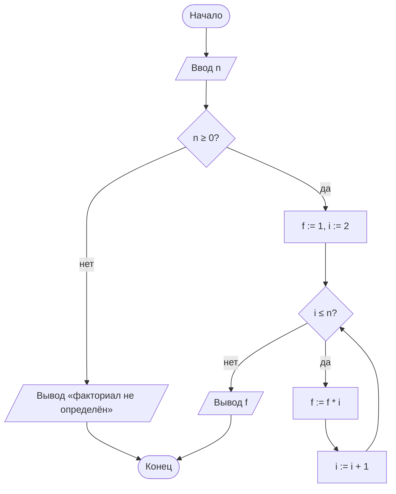
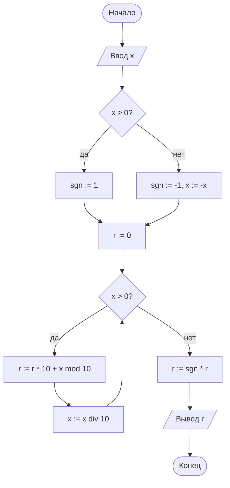
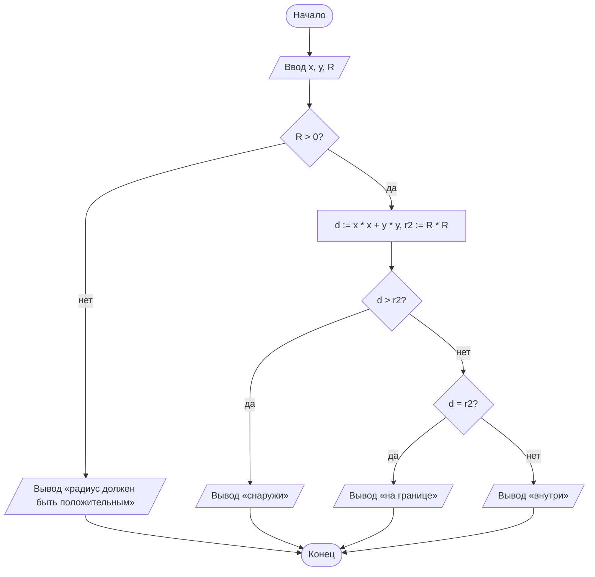
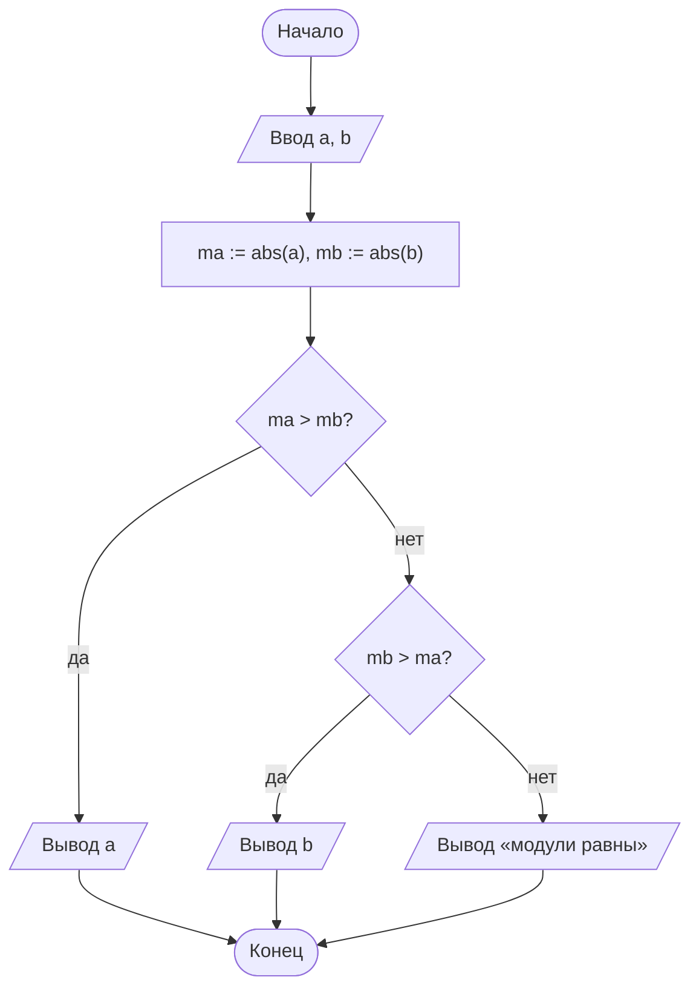
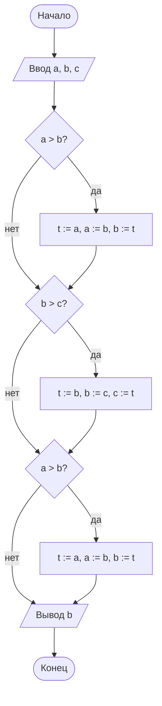
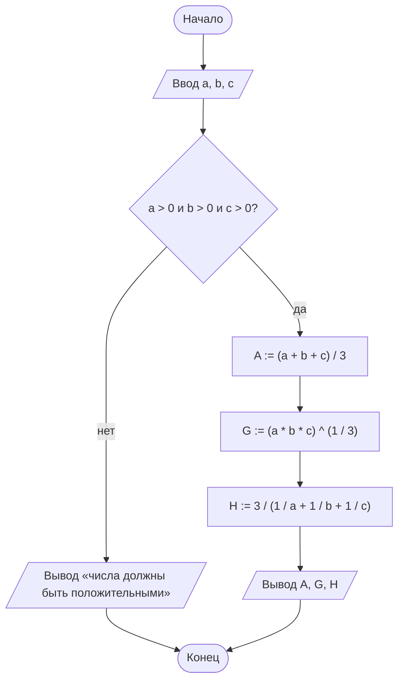

# Контрольные вопросы к зачёту и экзамену

100 вопросов из файла [mlita-questions.pdf](materials/mlita-questions.pdf). Ответы — ориентир для подготовки: сверяйтесь с конспектами и требованиями преподавателя.

## 1. Математическая логика и теория алгоритмов: предмет изучения, задачи, области применения.

Математическая логика изучает правильные рассуждения математическими методами: она формализует понятия высказывания, истинности, доказательства и логического вывода. Теория алгоритмов изучает, что такое алгоритм, какие задачи можно решить алгоритмически и сколько ресурсов (времени, памяти) на это нужно.

**Предмет изучения.** По определению П. С. Порецкого, математическая логика — это «логика по предмету своему, математика по методу». Её объекты — высказывания и предикаты, логические операции, формулы, законы логики и правила вывода. Предмет теории алгоритмов — алгоритмы и их свойства (дискретность, понятность, определённость, результативность, массовость), а также точные модели вычислений: машина Тьюринга, машина Поста, нормальные алгоритмы Маркова, рекурсивные функции.

**Разделы курса.**
- Теория множеств — язык, на котором формулируются остальные понятия.
- Алгебра логики: булевы функции, нормальные формы (ДНФ, КНФ, СДНФ, СКНФ), полином Жегалкина, полнота систем функций и теорема Поста.
- Логика предикатов — высказывания с переменными и кванторами.
- Теория алгоритмов: понятие и свойства алгоритма, блок-схемы и псевдокод, оценка сложности в $O$-нотации.

**Задачи.**
1. Формализовать рассуждения и проверять их правильность.
2. Преобразовывать и упрощать логические формулы, приводить их к стандартному виду.
3. Выяснять, через какие операции выражаются все остальные (полные системы, базисы).
4. Дать точное определение алгоритма и доказывать, что некоторые задачи алгоритмически неразрешимы.
5. Сравнивать алгоритмы по трудоёмкости.

**Области применения.**
- Цифровая техника: логические элементы И, ИЛИ, НЕ, И-НЕ реализуют булевы функции, а схемы процессоров описываются формулами алгебры логики.
- Программирование: условия ветвлений и циклов, битовые операции, верификация программ, компиляторы.
- Базы данных: язык запросов SQL основан на реляционной алгебре и логике предикатов.
- Искусственный интеллект: логический вывод, экспертные системы, язык Пролог.
- Криптография, теория кодирования, теория сложности вычислений.

> [!TIP]
> Коротко: логика даёт язык и правила точных рассуждений, теория алгоритмов — точное понятие вычисления и его границы. Вместе они составляют теоретический фундамент информатики.

## 2. Множество и его подмножества. Способы задания. Эквивалентность множеств.

Множество — совокупность объектов, объединённых общим признаком; объекты называют элементами ($a \in A$ — «$a$ принадлежит $A$»). Множество $B$ — подмножество $A$, если каждый элемент $B$ принадлежит $A$. Множества эквивалентны (равномощны), если между ними существует взаимно однозначное соответствие.

**Подмножества.**
- Нестрогое включение: $B \subseteq A \iff \forall x\,(x \in B \Rightarrow x \in A)$.
- Строгое включение: $B \subset A$, если $B \subseteq A$ и $B \ne A$ (собственное подмножество).
- Пустое множество $\varnothing$ и само $A$ — несобственные подмножества любого множества $A$.
- Равенство: $A = B \iff A \subseteq B$ и $B \subseteq A$; порядок элементов не важен: $\{3, 2, 1\} = \{1, 2, 3\}$.
- У множества из $n$ элементов ровно $2^n$ подмножеств.
- Универсум $U$ — множество всех объектов, рассматриваемых в задаче; остальные множества — его подмножества.

**Способы задания.**
1. *Перечислением* элементов: $A = \{1, 2, 3\}$ — подходит для конечных множеств.
2. *Характеристическим свойством*: $A = \{x \mid P(x)\}$ — все объекты, для которых истинно $P(x)$; например, $\{x \in \mathbb{N} \mid x \text{ чётно}\}$.
3. *Порождающей процедурой*: $1 \in M$; если $x \in M$, то $2x \in M$; других элементов нет. Получаем степени двойки $\{1, 2, 4, 8, \dots\}$.

Наглядно множества изображают диаграммами Эйлера.

**Эквивалентность множеств.** Множества $A$ и $B$ эквивалентны ($A \sim B$), если существует биекция $f\colon A \to B$: каждому элементу $A$ соответствует ровно один элемент $B$, и каждый элемент $B$ получается ровно из одного элемента $A$. Эквивалентные множества имеют одинаковую мощность (кардинальное число): $|A| = |B|$; для конечных множеств это просто равное число элементов. Отношение эквивалентности рефлексивно, симметрично и транзитивно.

> [!EXAMPLE]
> $\mathbb{N} \sim \{2, 4, 6, \dots\}$ — биекция $f(n) = 2n$. Бесконечное множество может быть эквивалентно своей собственной части, конечное — никогда. Отрезки $[0, 1]$ и $[0, 2]$ тоже эквивалентны: $f(x) = 2x$.

**См. также:** лекция [«Теория множеств»](01-sets.md).

## 3. История развития математической логики.

Математическая логика прошла путь от формальной логики Аристотеля через идею Лейбница о «логическом исчислении» и алгебру логики Дж. Буля (XIX в.) к строгим формальным теориям и теории алгоритмов XX века, которые стали теоретической основой вычислительной техники.

**Ключевые имена и даты.**

| Время | Учёные | Вклад |
|---|---|---|
| IV в. до н. э. | Аристотель | основатель формальной логики, теория силлогизмов |
| IV–III вв. до н. э. | Эвбулид, стоики (Хрисипп) | парадокс лжеца; начала логики высказываний |
| конец XVII — начало XVIII в. | Г. В. Лейбниц | идея универсального символического языка и «исчисления рассуждений», двоичная арифметика |
| 1847–1854 | Дж. Буль, О. де Морган | алгебра логики, законы де Моргана |
| конец XIX в. | Ч. С. Пирс, Э. Шрёдер, П. С. Порецкий | развитие алгебры логики; Порецкий в 1887–1888 гг. прочитал в Казани первые в России лекции по математической логике |
| 1879 | Г. Фреге | «Исчисление понятий» — первая формальная логика с кванторами |
| 1870–1890-е | Г. Кантор | теория множеств |
| 1901–1913 | Б. Рассел, А. Уайтхед | парадокс Рассела, «Principia Mathematica» |
| 1913 | Г. Шеффер | штрих Шеффера: все логические операции выражаются через одну |
| 1920-е | Д. Гильберт | программа обоснования математики формальными методами |
| 1927 | И. И. Жегалкин | запись булевых функций полиномами по модулю 2 |
| 1930–1931 | К. Гёдель | теорема о полноте логики предикатов, теоремы о неполноте арифметики |
| 1936 | А. Тьюринг, Э. Пост, А. Чёрч | точные модели алгоритма, алгоритмически неразрешимые задачи |
| 1938 | К. Шеннон (независимо — В. И. Шестаков) | применение алгебры логики к релейно-контактным схемам |
| 1941 | Э. Пост | описание замкнутых классов булевых функций, критерий полноты |
| 1950-е | А. А. Марков, С. В. Яблонский | нормальные алгоритмы; теория функциональных систем |

**Этапы развития.**
1. *Традиционная логика* (до XVII в.) изучала формы умозаключений словесно.
2. *Алгебра логики* (XIX в.) перенесла в логику алгебраические методы: высказывания стали переменными, связки — операциями.
3. *Основания математики* (рубеж XIX–XX вв.): парадоксы теории множеств заставили строить аксиоматические теории и изучать сами доказательства.
4. *Теория алгоритмов* (1930-е): уточнено понятие вычислимости, доказано существование неразрешимых задач.
5. *Приложения* (с 1938 г.): проектирование схем, ЭВМ, программирование, базы данных, искусственный интеллект.

## 4. Парадоксы теории множеств: парадокс Рассела, парадокс лжеца. Софизмы.

Парадокс (антиномия) — пара взаимоисключающих утверждений, каждое из которых выводится внешне безупречным рассуждением. Парадоксы Рассела и лжеца показали, что «наивная» теория множеств, в которой любое свойство задаёт множество, противоречива. Софизм — умышленно ложное рассуждение, в котором ошибка замаскирована.

**Парадокс Рассела (1901).** Большинство множеств не содержат себя в качестве элемента: множество студентов — не студент. Рассмотрим множество всех таких множеств:

$$
R = \{X \mid X \notin X\}
$$

Принадлежит ли $R$ самому себе?
- Если $R \in R$, то $R$ обладает свойством своих элементов, т. е. $R \notin R$.
- Если $R \notin R$, то $R$ удовлетворяет условию, значит, $R \in R$.

Получаем $R \in R \iff R \notin R$ — противоречие.

Популярная версия — *парадокс брадобрея*: брадобрей бреет тех и только тех жителей деревни, кто не бреется сам. Бреет ли он себя? Оба ответа ведут к противоречию, значит, такого брадобрея быть не может.

*Выход* — аксиоматические теории множеств (Цермело — Френкель): свойством можно выделять подмножество только из уже имеющегося множества, $\{x \in A \mid P(x)\}$; «множества всех множеств» не существует.

**Парадокс лжеца** (Эвбулид, IV в. до н. э.): «Высказывание, которое я сейчас произношу, ложно». Если оно истинно, то, согласно его содержанию, оно ложно; если ложно — значит, истинно. Причина — самоприменимость: высказывание говорит о собственной истинности. *Выход* (А. Тарский): разделять язык и метаязык — об истинности фраз языка можно говорить только средствами метаязыка.

**Софизмы.** В отличие от парадокса, в софизме есть конкретная ошибка, которую можно указать.
- «Рогатый» (Эвбулид): «Что ты не терял, то имеешь; рогов ты не терял; значит, у тебя есть рога». Ошибка — двусмысленная первая посылка: она верна лишь для того, что у тебя было.
- «$2 = 1$»: пусть $a = b$; тогда $a^2 = ab$, $a^2 - b^2 = ab - b^2$, $(a - b)(a + b) = b(a - b)$, откуда $a + b = b$, $2b = b$, $2 = 1$. Ошибка — деление на $a - b = 0$.

> [!NOTE]
> Парадокс указывает на противоречие в исходных принципах теории, софизм — на ошибку в конкретном рассуждении.

## 5. Счетные и несчетные множества. Множество-степень.

Множество счётно, если оно эквивалентно множеству натуральных чисел $\mathbb{N}$, т. е. его элементы можно занумеровать: $a_1, a_2, a_3, \dots$. Бесконечное множество, которое занумеровать нельзя, называется несчётным. Множество-степень (булеан) $P(A)$ — множество всех подмножеств $A$; если $|A| = n$, то $|P(A)| = 2^n$.

**Счётные множества** (их мощность обозначают $\aleph_0$ — «алеф-нуль»):
- чётные числа: нумерация $n \mapsto 2n$;
- целые числа $\mathbb{Z}$: $0, 1, -1, 2, -2, \dots$;
- пары $\mathbb{N} \times \mathbb{N}$: нумеруем «по диагоналям» — сначала пары с суммой $i + j = 2$, затем $3$, $4$ и т. д.;
- рациональные числа $\mathbb{Q}$: так же по диагоналям $p + q = 2, 3, 4, \dots$ перечисляют дроби $p/q$, пропуская повторы (например, $2/2 = 1/1$), а отрицательные числа и 0 вставляют так же, как для $\mathbb{Z}$.

Свойства: любое бесконечное множество содержит счётное подмножество; подмножество счётного множества конечно или счётно; объединение счётного числа счётных множеств счётно.

**Несчётные множества.** Теорема Кантора: отрезок $[0, 1]$ несчётен.

*Доказательство (диагональный метод).* Допустим, все числа отрезка занумерованы: $x_1 = 0{,}a_{11}a_{12}a_{13}\dots$, $x_2 = 0{,}a_{21}a_{22}a_{23}\dots$ и т. д. Построим $y = 0{,}b_1b_2b_3\dots$, где $b_k \ne a_{kk}$ и $b_k \notin \{0, 9\}$ (чтобы у $y$ была единственная десятичная запись). Число $y$ отличается от каждого $x_k$ в $k$-й цифре, значит, его нет в списке — противоречие. Мощность отрезка $[0, 1]$ и прямой $\mathbb{R}$ называют континуумом.

**Множество-степень.** Для $A = \{a, b, c\}$:

$$
P(A) = \{\varnothing, \{a\}, \{b\}, \{c\}, \{a, b\}, \{a, c\}, \{b, c\}, \{a, b, c\}\}, \qquad |P(A)| = 8 = 2^3
$$

Почему $2^n$: подмножество задаётся двоичным набором длины $n$ (1 — элемент входит, 0 — не входит), а таких наборов $2^n$. На этой же идее построены булевы функции.

**Теорема Кантора о булеане:** $|A| < |P(A)|$ для любого множества $A$. Пусть существует биекция $f\colon A \to P(A)$. Рассмотрим $D = \{x \in A \mid x \notin f(x)\}$ и элемент $d$ с $f(d) = D$: тогда $d \in D \iff d \notin D$ — противоречие. Поэтому $P(\mathbb{N})$ несчётно, и «самого мощного» множества не существует.

**См. также:** лекция [«Теория множеств»](01-sets.md).

## 6. Основные операции над множествами.

Основные операции над множествами — объединение, пересечение, разность, симметрическая разность и дополнение до универсума $U$. Каждая определяется условием принадлежности элемента и соответствует логической операции: ∨, ∧, «и не», ⊕, ¬.

| Операция | Обозначение | $x$ входит в результат, если… | Логика |
|---|---|---|---|
| Объединение | $A \cup B$ | $x \in A$ или $x \in B$ | $a \lor b$ |
| Пересечение | $A \cap B$ | $x \in A$ и $x \in B$ | $a \land b$ |
| Разность | $A \setminus B$ | $x \in A$ и $x \notin B$ | $a \land \overline{b}$ |
| Симметрическая разность | $A \triangle B$ | $x$ лежит ровно в одном из множеств | $a \oplus b$ |
| Дополнение | $\overline{A}$ | $x \in U$ и $x \notin A$ | $\overline{a}$ |

Здесь $a$ и $b$ — высказывания «$x \in A$» и «$x \in B$». Наглядно операции показывают диаграммами Эйлера: объединение — оба круга целиком, пересечение — их общая часть, симметрическая разность — два «полумесяца» без общей части.

**Полезные тождества:**

$$
A \triangle B = (A \cup B) \setminus (A \cap B) = (A \setminus B) \cup (B \setminus A), \qquad A \setminus B = A \cap \overline{B}
$$

$$
A \setminus A = \varnothing, \qquad A \cup \overline{A} = U, \qquad A \cap \overline{A} = \varnothing
$$

Число элементов объединения конечных множеств (формула включений и исключений): $|A \cup B| = |A| + |B| - |A \cap B|$.

Ещё одна важная операция — *декартово произведение* $A \times B = \{(u, v) \mid u \in A,\ v \in B\}$, множество упорядоченных пар; $|A \times B| = |A| \cdot |B|$.

**Пример.** $U = \{1, \dots, 8\}$, $A = \{1, 2, 3, 4\}$, $B = \{3, 4, 5, 6\}$:
- $A \cup B = \{1, 2, 3, 4, 5, 6\}$;
- $A \cap B = \{3, 4\}$;
- $A \setminus B = \{1, 2\}$, $B \setminus A = \{5, 6\}$;
- $A \triangle B = \{1, 2, 5, 6\}$;
- $\overline{A} = \{5, 6, 7, 8\}$.

Проверка: $|A \cup B| = 4 + 4 - 2 = 6$ — столько элементов и в найденном объединении.

> [!TIP]
> Разность и симметрическую разность легко перепутать: $A \setminus B$ — «что есть в $A$, но нет в $B$» (один полумесяц), $A \triangle B$ — «что есть ровно в одном из двух» (оба полумесяца).

**См. также:** лекция [«Теория множеств»](01-sets.md).

## 7. Булева алгебра подмножеств данного множества. Аксиомы булевой алгебры.

Множество $P(U)$ всех подмножеств универсума $U$ с операциями объединения, пересечения, дополнения и выделенными элементами $\varnothing$ и $U$ образует булеву алгебру. Булева алгебра — любое множество с двумя бинарными операциями, одной унарной и двумя константами 0 и 1, для которых выполняются аксиомы коммутативности, ассоциативности, дистрибутивности, нейтральных элементов и дополнения.

**Определение.** Булева алгебра — система $\langle B;\ \lor,\ \land,\ \overline{\phantom{a}},\ 0,\ 1 \rangle$, в которой для любых $a, b, c \in B$ выполняются аксиомы:

| Аксиома | Первая форма | Двойственная форма |
|---|---|---|
| Коммутативность | $a \lor b = b \lor a$ | $a \land b = b \land a$ |
| Ассоциативность | $a \lor (b \lor c) = (a \lor b) \lor c$ | $a \land (b \land c) = (a \land b) \land c$ |
| Дистрибутивность | $a \lor (b \land c) = (a \lor b) \land (a \lor c)$ | $a \land (b \lor c) = (a \land b) \lor (a \land c)$ |
| Нейтральные элементы | $a \lor 0 = a$ | $a \land 1 = a$ |
| Дополнение | $a \lor \overline{a} = 1$ | $a \land \overline{a} = 0$ |

Ассоциативность можно вывести из остальных аксиом, но обычно её включают в список.

**Булева алгебра подмножеств.** Для $B = P(U)$ операция ∨ — это объединение ∪, ∧ — пересечение ∩, $\overline{a}$ — дополнение $\overline{A} = U \setminus A$, $0 = \varnothing$, $1 = U$. Все аксиомы проверяются через принадлежность элемента. Например, $A \cup \overline{A} = U$, потому что любой $x \in U$ либо лежит в $A$, либо нет.

**Следствия аксиом** (верны в любой булевой алгебре):
- идемпотентность: $A \cup A = A$, $A \cap A = A$;
- поглощение: $A \cup (A \cap B) = A$, $A \cap (A \cup B) = A$;
- законы де Моргана: $\overline{A \cup B} = \overline{A} \cap \overline{B}$, $\overline{A \cap B} = \overline{A} \cup \overline{B}$;
- двойное дополнение: $\overline{\overline{A}} = A$;
- $A \cup U = U$, $A \cap \varnothing = \varnothing$.

**Принцип двойственности.** Аксиомы разбиты на двойственные пары, поэтому из любого верного тождества получается верное тождество заменой $\cup \leftrightarrow \cap$ и $\varnothing \leftrightarrow U$.

> [!EXAMPLE]
> $U = \{a, b\}$: $P(U) = \{\varnothing, \{a\}, \{b\}, U\}$. Здесь $\{a\} \cup \{b\} = U$, $\{a\} \cap \{b\} = \varnothing$, $\overline{\{a\}} = \{b\}$. При $|U| = n$ алгебра $P(U)$ устроена так же, как алгебра двоичных наборов длины $n$ (подмножество ↔ его характеристический вектор); при $n = 1$ получается двухэлементная алгебра $\{0, 1\}$ — алгебра логики.

**См. также:** лекция [«Теория множеств»](01-sets.md).

## 8. Основные и элементарные булевы функции.

Булева функция $f(x_1,\dots,x_n)$ — функция, аргументы и значения которой принадлежат множеству $\{0, 1\}$: $f\colon \{0,1\}^n \to \{0,1\}$. Элементарными называют простейшие функции одной и двух переменных, имеющие собственные названия и обозначения; основными — отрицание, конъюнкцию и дизъюнкцию, потому что через них выражается любая булева функция.

**Сколько функций.** У $n$ переменных $2^n$ наборов значений, и на каждом функция равна 0 или 1, поэтому функций от $n$ переменных $2^{2^n}$. Множество всех булевых функций обозначают $P_2$.

**Функции одной переменной** (их $2^{2^1} = 4$):

| $x$ | $0$ | $x$ | $\overline{x}$ | $1$ |
|---|---|---|---|---|
| 0 | 0 | 0 | 1 | 1 |
| 1 | 0 | 1 | 0 | 1 |

Это константа 0, тождественная функция, отрицание («не $x$») и константа 1. Константы считают также функциями от нуля переменных.

**Элементарные функции двух переменных:**

| Название | Обозначение | Равна 1, когда… |
|---|---|---|
| Конъюнкция («и») | $x \land y$, $xy$ | $x = y = 1$ |
| Дизъюнкция («или») | $x \lor y$ | хотя бы один аргумент равен 1 |
| Импликация («если…, то…») | $x \to y$ | во всех случаях, кроме $x = 1$, $y = 0$ |
| Эквиваленция | $x \sim y$ | $x = y$ |
| Сложение по модулю 2 | $x \oplus y$ | $x \ne y$ |
| Штрих Шеффера («и-не») | $x \uparrow y$ | хотя бы один аргумент равен 0 |
| Стрелка Пирса («или-не») | $x \downarrow y$ | $x = y = 0$ |

В таблице $x \uparrow y$ — другое обозначение штриха Шеффера $x \mid y = \overline{x \land y}$; стрелка Пирса $x \downarrow y = \overline{x \lor y}$.

**Формулы.** Из элементарных функций суперпозицией строят формулы, например $f(x,y,z) = (x \to y) \oplus \overline{z}$. Без скобок операции выполняют в порядке: отрицание, конъюнкция, дизъюнкция, импликация, эквиваленция; в остальных случаях ставят скобки.

> [!TIP]
> Система основных функций $\{\overline{x},\ x \land y,\ x \lor y\}$ полна: любую булеву функцию можно записать через эти три операции, например в виде СДНФ.

## 9. Фиктивные и существенные переменные. Способы определения фиктивности.

Переменная $x_i$ функции $f(x_1,\dots,x_n)$ фиктивна (несущественна), если значение функции от неё не зависит: при любых значениях остальных переменных замена $x_i = 0$ на $x_i = 1$ не меняет $f$. Если найдётся хотя бы одна пара наборов, различающихся только значением $x_i$, на которой значения $f$ разные, переменная существенна.

**Определение.** $x_i$ фиктивна, если при всех значениях остальных переменных

$$
f(\alpha_1,\dots,\alpha_{i-1},0,\alpha_{i+1},\dots,\alpha_n) = f(\alpha_1,\dots,\alpha_{i-1},1,\alpha_{i+1},\dots,\alpha_n)
$$

Фиктивную переменную можно удалить (или добавить) — функция по существу не изменится; функции, различающиеся лишь фиктивными переменными, считают равными.

**Способы определения фиктивности.**
1. *По вектору значений.* Для $x_i$ вектор делят на блоки длины $2^{n-i}$ и сравнивают 1-й блок со 2-м, 3-й с 4-м и т. д. Для $x_1$ это сравнение половин вектора, для $x_n$ — соседних элементов. Если все пары блоков совпали, переменная фиктивна.
2. *Подстановкой констант:* $x_i$ фиктивна, если функции, полученные при $x_i = 0$ и при $x_i = 1$, равны.
3. *По полиному Жегалкина:* переменная существенна тогда и только тогда, когда входит в полином.
4. *Равносильными преобразованиями:* например, $xy \lor x\overline{y} = x$, значит, $y$ фиктивна.
5. *На булевом кубе:* все рёбра направления $x_i$ соединяют вершины с одинаковыми значениями.

**Пример.** Функция трёх переменных задана десятичной формой вектора значений 60. Переводим в 8-разрядную двоичную запись: $60 = 00111100_2$, т. е. на наборах 000, 001, …, 111 функция принимает значения $0, 0, 1, 1, 1, 1, 0, 0$.
- $x$: половины $0011$ и $1100$ различаются — $x$ существенна.
- $y$: в первой половине блоки $00$ и $11$ различаются — $y$ существенна.
- $z$: пары $00$, $11$, $11$, $00$ — внутри каждой пары значения равны, значит, $z$ фиктивна.

Удаляем $z$ (берём значения при $z = 0$): получаем вектор $0110$ на наборах $(x, y)$, то есть **$f = x \oplus y$**.

> [!WARNING]
> Переменная может входить в формулу и всё равно быть фиктивной: в формуле $xy \lor x\overline{y}$ есть $y$, но функция равна $x$.

## 10. Способы задания булевой функции. Примеры.

Булеву функцию можно задать таблицей истинности, вектором значений (в том числе его десятичной записью), формулой, номерами наборов, на которых она равна 1, отмеченными вершинами булева куба или словесным описанием. Все способы равноправны: от любого можно перейти к любому другому.

Разберём одну функцию всеми способами — функцию голосования $m(x, y, z)$, которая равна 1, когда хотя бы два аргумента из трёх равны 1.

**1. Таблица истинности.** Наборы записывают в лексикографическом порядке — как двоичные числа от 0 до $2^n - 1$:

| № | $x$ | $y$ | $z$ | $m$ |
|---|---|---|---|---|
| 0 | 0 | 0 | 0 | 0 |
| 1 | 0 | 0 | 1 | 0 |
| 2 | 0 | 1 | 0 | 0 |
| 3 | 0 | 1 | 1 | 1 |
| 4 | 1 | 0 | 0 | 0 |
| 5 | 1 | 0 | 1 | 1 |
| 6 | 1 | 1 | 0 | 1 |
| 7 | 1 | 1 | 1 | 1 |

**2. Вектор значений** — столбец значений, записанный в строку: $\alpha_m = (0001\,0111)$. Если прочитать его как двоичное число, получится десятичная форма: $00010111_2 = 23$.

**3. Номера единичных наборов:** $m = 1$ на наборах с номерами 3, 5, 6, 7.

**4. Формула** (суперпозиция элементарных функций): $m = xy \lor yz \lor xz$. У одной функции много формул, например $m = xy \oplus yz \oplus xz$ или $m = x(y \lor z) \lor yz$.

**5. Геометрически:** на булевом кубе $B^3$ отмечают вершины 011, 101, 110, 111.

**6. Словесно:** «функция равна 1, если большинство аргументов равны 1».

Используют также карты Карно, схемы из логических элементов и полином Жегалкина.

> [!TIP]
> Таблица и вектор задают функцию однозначно, но их размер растёт как $2^n$. Формула обычно компактнее, но не единственна: у одной функции бесконечно много формул.

## 11. Булевы функции двух переменных: количество, название.

Булевых функций двух переменных $2^{2^2} = 16$: у пары переменных 4 набора значений (00, 01, 10, 11), и на каждом функция может принять значение 0 или 1. Из них 10 функций существенно зависят от обеих переменных, а 6 имеют фиктивные переменные — это константы, $x$, $y$ и их отрицания.

| № | Вектор | Формула | Название |
|---|---|---|---|
| $f_0$ | 0000 | $0$ | константа 0 |
| $f_1$ | 0001 | $x \land y$ | конъюнкция |
| $f_2$ | 0010 | $x\overline{y}$ | отрицание импликации $x \to y$ (запрет) |
| $f_3$ | 0011 | $x$ | повторение $x$ |
| $f_4$ | 0100 | $\overline{x}y$ | отрицание импликации $y \to x$ (запрет) |
| $f_5$ | 0101 | $y$ | повторение $y$ |
| $f_6$ | 0110 | $x \oplus y$ | сложение по модулю 2 (неравнозначность) |
| $f_7$ | 0111 | $x \lor y$ | дизъюнкция |
| $f_8$ | 1000 | $x \downarrow y$ | стрелка Пирса (функция Вебба) |
| $f_9$ | 1001 | $x \sim y$ | эквиваленция (равнозначность) |
| $f_{10}$ | 1010 | $\overline{y}$ | отрицание $y$ |
| $f_{11}$ | 1011 | $y \to x$ | обратная импликация |
| $f_{12}$ | 1100 | $\overline{x}$ | отрицание $x$ |
| $f_{13}$ | 1101 | $x \to y$ | импликация |
| $f_{14}$ | 1110 | $x \uparrow y$ | штрих Шеффера |
| $f_{15}$ | 1111 | $1$ | константа 1 |

Вектор — значения функции на наборах 00, 01, 10, 11; номер функции — этот вектор, прочитанный как двоичное число: $1101_2 = 13$. В таблице $x \uparrow y$ — другое обозначение штриха Шеффера $x \mid y$.

**Закономерности.**
- $f_k$ и $f_{15-k}$ — отрицания друг друга: $f_1 = xy$ и $f_{14} = \overline{xy}$, $f_6 = x \oplus y$ и $f_9 = x \sim y$.
- Восемь функций симметричны, т. е. $f(x, y) = f(y, x)$: обе константы, конъюнкция, дизъюнкция, сложение по модулю 2, эквиваленция, штрих Шеффера и стрелка Пирса. Импликации и запреты несимметричны: $x \to y \ne y \to x$.
- Функции $f_3$, $f_5$, $f_{10}$, $f_{12}$ существенно зависят от одной переменной, $f_0$ и $f_{15}$ — ни от одной.

> [!TIP]
> Чтобы найти функцию в таблице, запишите её значения на наборах 00, 01, 10, 11 и переведите получившееся двоичное число в десятичное — это и будет номер.

## 12. Графическое задание булевых функций, булев куб. Соседние булевы наборы.

Булев куб $B^n$ — множество всех двоичных наборов длины $n$; их $2^n$, и их изображают вершинами $n$-мерного единичного куба. Соседние наборы отличаются ровно в одной координате, их соединяет ребро куба. Графически функцию задают, отмечая вершины, в которых она равна 1.

**Основные понятия.**
- *Вес* набора $\lVert \alpha \rVert$ — число единиц в нём; наборы одного веса образуют слой куба.
- *Расстояние Хэмминга* $\rho(\alpha, \beta)$ — число координат, в которых наборы различаются.
- *Соседние* наборы: $\rho(\alpha, \beta) = 1$. Например, 011 и 001 — соседние (по второй переменной), а 011 и 101 — нет ($\rho = 2$).
- *Противоположные* наборы различаются во всех координатах: 010 и 101.
- У каждой вершины $n$ соседей, а всего рёбер $n \cdot 2^{n-1}$; у куба $B^3$ их 12.

**Диаграмма куба $B^3$ по слоям** (снизу вверх вес растёт, рёбра соединяют соседние наборы):

```text
            111
          /  |  \
       011  101  110
        | \/   \/ |
        | /\   /\ |
       001  010  100
          \  |  /
            000
```

**Графическое задание функции.** Функцию задают множеством вершин $N_f = \{\alpha \mid f(\alpha) = 1\}$, которые отмечают (закрашивают) на диаграмме. Примеры:
- функция голосования $m = xy \lor yz \lor xz$ — отмечены 011, 101, 110, 111 (два верхних слоя);
- $x \oplus y \oplus z$ — отмечены 001, 010, 100, 111; никакие две отмеченные вершины не соседние, потому что вдоль любого ребра значение этой функции меняется.

**Зачем нужны соседние наборы.**
- Две соседние единичные вершины склеиваются: $Kx \lor K\overline{x} = K$, т. е. ребру соответствует более короткая конъюнкция. На этом основаны минимизация ДНФ и карты Карно, где соседние клетки — соседние наборы.
- Переменная $x_i$ фиктивна, если вдоль всех рёбер направления $x_i$ значение функции не меняется.
- Функция монотонна, если вдоль каждого ребра снизу вверх её значение не убывает.

## 13. Равносильности основных законов алгебры логики.

Формулы $F$ и $G$ равносильны ($F \equiv G$), если при любых значениях переменных они принимают одинаковые значения, т. е. задают одну и ту же булеву функцию. Основные равносильности (законы алгебры логики) позволяют упрощать формулы и приводить их к нормальным формам; каждую из них можно проверить таблицей истинности.

**Основные законы** (конъюнкцию записываем как произведение: $xy = x \land y$):

| Закон | Для конъюнкции | Для дизъюнкции |
|---|---|---|
| Коммутативность | $xy \equiv yx$ | $x \lor y \equiv y \lor x$ |
| Ассоциативность | $(xy)z \equiv x(yz)$ | $(x \lor y) \lor z \equiv x \lor (y \lor z)$ |
| Дистрибутивность | $x(y \lor z) \equiv xy \lor xz$ | $x \lor yz \equiv (x \lor y)(x \lor z)$ |
| Идемпотентность | $xx \equiv x$ | $x \lor x \equiv x$ |
| Законы де Моргана | $\overline{xy} \equiv \overline{x} \lor \overline{y}$ | $\overline{x \lor y} \equiv \overline{x}\,\overline{y}$ |
| Поглощение | $x(x \lor y) \equiv x$ | $x \lor xy \equiv x$ |
| Склеивание | $(x \lor y)(x \lor \overline{y}) \equiv x$ | $xy \lor x\overline{y} \equiv x$ |
| Действия с константами | $x \cdot 1 \equiv x$, $x \cdot 0 \equiv 0$ | $x \lor 0 \equiv x$, $x \lor 1 \equiv 1$ |
| Противоречие и исключённое третье | $x\overline{x} \equiv 0$ | $x \lor \overline{x} \equiv 1$ |

Кроме того, действует закон двойного отрицания: $\overline{\overline{x}} \equiv x$. Законы в двух столбцах двойственны: один получается из другого заменой ∧ ↔ ∨ и 0 ↔ 1.

**Выражение одних операций через другие:**

$$
x \to y \equiv \overline{x} \lor y, \qquad x \sim y \equiv xy \lor \overline{x}\,\overline{y} \equiv (x \to y)(y \to x), \qquad x \oplus y \equiv x\overline{y} \lor \overline{x}y \equiv \overline{x \sim y}
$$

Контрапозиция: $x \to y \equiv \overline{y} \to \overline{x}$.

**Как доказать равносильность.** Первый способ — построить таблицы истинности обеих частей и сравнить столбцы. Второй — преобразовать одну часть в другую с помощью уже доказанных законов. Например, поглощение: $x \lor xy \equiv x \cdot 1 \lor xy \equiv x(1 \lor y) \equiv x \cdot 1 \equiv x$.

**Пример упрощения:**

$$
\overline{x \to y} \lor x \equiv \overline{\overline{x} \lor y} \lor x \equiv x\overline{y} \lor x \equiv x
$$

Последовательно применены выражение импликации, закон де Моргана с двойным отрицанием и поглощение. Итог: **формула равносильна $x$**.

> [!TIP]
> Дистрибутивность дизъюнкции относительно конъюнкции $x \lor yz \equiv (x \lor y)(x \lor z)$ не имеет аналога в арифметике — её чаще всего забывают при построении КНФ.

## 14. Доказательство дистрибутивности объединения относительно пересечения.

Нужно доказать тождество $A \cup (B \cap C) = (A \cup B) \cap (A \cup C)$. Равенство множеств доказывают двумя включениями: каждый элемент левой части принадлежит правой, и каждый элемент правой — левой.

**Доказательство двойным включением.**

*1) $A \cup (B \cap C) \subseteq (A \cup B) \cap (A \cup C)$.* Пусть $x \in A \cup (B \cap C)$. Тогда $x \in A$ или $x \in B \cap C$.
- Если $x \in A$, то $x \in A \cup B$ и $x \in A \cup C$, значит, $x \in (A \cup B) \cap (A \cup C)$.
- Если $x \in B \cap C$, то $x \in B$ и $x \in C$. Из $x \in B$ следует $x \in A \cup B$, из $x \in C$ следует $x \in A \cup C$; значит, $x$ лежит в их пересечении.

*2) $(A \cup B) \cap (A \cup C) \subseteq A \cup (B \cap C)$.* Пусть $x \in (A \cup B) \cap (A \cup C)$, т. е. $x \in A \cup B$ и $x \in A \cup C$.
- Если $x \in A$, то $x \in A \cup (B \cap C)$.
- Если $x \notin A$, то из $x \in A \cup B$ получаем $x \in B$, а из $x \in A \cup C$ — $x \in C$. Тогда $x \in B \cap C$, и значит, $x \in A \cup (B \cap C)$.

Оба включения доказаны, поэтому **$A \cup (B \cap C) = (A \cup B) \cap (A \cup C)$**. ∎

**Второй способ — таблица принадлежности.** Обозначим через $a$, $b$, $c$ высказывания «$x \in A$», «$x \in B$», «$x \in C$» (1 — принадлежит, 0 — нет). Элемент лежит в левой части, когда истинно $a \lor bc$, и в правой — когда истинно $(a \lor b)(a \lor c)$. Переберём все 8 случаев:

| $a$ | $b$ | $c$ | $bc$ | $a \lor bc$ | $a \lor b$ | $a \lor c$ | $(a \lor b)(a \lor c)$ |
|---|---|---|---|---|---|---|---|
| 0 | 0 | 0 | 0 | 0 | 0 | 0 | 0 |
| 0 | 0 | 1 | 0 | 0 | 0 | 1 | 0 |
| 0 | 1 | 0 | 0 | 0 | 1 | 0 | 0 |
| 0 | 1 | 1 | 1 | 1 | 1 | 1 | 1 |
| 1 | 0 | 0 | 0 | 1 | 1 | 1 | 1 |
| 1 | 0 | 1 | 0 | 1 | 1 | 1 | 1 |
| 1 | 1 | 0 | 0 | 1 | 1 | 1 | 1 |
| 1 | 1 | 1 | 1 | 1 | 1 | 1 | 1 |

Столбцы $a \lor bc$ и $(a \lor b)(a \lor c)$ совпадают во всех восьми строках: элемент принадлежит левой части тогда и только тогда, когда принадлежит правой. Диаграммы Эйлера помогают увидеть это равенство, но доказательством не считаются.

> [!NOTE]
> В арифметике аналог неверен: $a + bc \ne (a + b)(a + c)$. В алгебре множеств объединение дистрибутивно относительно пересечения — одно из отличий булевой алгебры от алгебры чисел. Двойственный закон $A \cap (B \cup C) = (A \cap B) \cup (A \cap C)$ доказывается так же.

## 15. Таблицы истинности для конъюнкции, дизъюнкции, импликации, эквиваленции.

Конъюнкция истинна, только когда истинны оба аргумента; дизъюнкция ложна, только когда оба аргумента ложны; импликация ложна лишь при истинной посылке и ложном следствии; эквиваленция истинна, когда значения аргументов совпадают.

| $x$ | $y$ | $x \land y$ | $x \lor y$ | $x \to y$ | $x \sim y$ |
|---|---|---|---|---|---|
| 0 | 0 | 0 | 0 | 1 | 1 |
| 0 | 1 | 0 | 1 | 1 | 0 |
| 1 | 0 | 0 | 1 | 0 | 0 |
| 1 | 1 | 1 | 1 | 1 | 1 |

**Пояснения.**
- *Конъюнкция* («и», логическое умножение; обозначения $x \land y$, $x \,\&\, y$, $xy$) совпадает с обычным умножением: $x \land y = x \cdot y = \min(x, y)$.
- *Дизъюнкция* («или» в неисключающем смысле, $x \lor y$): $x \lor y = \max(x, y)$. Она истинна и тогда, когда истинны оба аргумента.
- *Импликация* («если $x$, то $y$»; $x$ — посылка, $y$ — следствие): $x \to y = \overline{x} \lor y$. Она не коммутативна: при $x = 1$, $y = 0$ имеем $x \to y = 0$, но $y \to x = 1$.
- *Эквиваленция* («$x$ тогда и только тогда, когда $y$»; обозначают также $x \leftrightarrow y$, $x \equiv y$): $x \sim y = (x \to y) \land (y \to x)$. Это отрицание сложения по модулю 2: $x \sim y = \overline{x \oplus y}$.

**Пример.** Пусть $x$ — «число делится на 4», $y$ — «число чётное». Импликация $x \to y$ истинна для любого числа: для 8 это строка $1 \to 1$, для 6 — строка $0 \to 1$, для 7 — $0 \to 0$, а строки $1 \to 0$ (делится на 4, но нечётно) не бывает. Эквиваленция $x \sim y$ для числа 6 ложна: оно чётное, но на 4 не делится.

Для функции от $n$ переменных таблица истинности содержит $2^n$ строк; наборы записывают в порядке возрастания соответствующих двоичных чисел.

> [!WARNING]
> Типичная ошибка — считать импликацию ложной, когда посылка ложна. Из ложной посылки следует что угодно: $0 \to 0 = 1$ и $0 \to 1 = 1$. Единственная ложная строка — $1 \to 0 = 0$.

## 16. Таблицы истинности для штриха Шеффера, стрелки Пирса и их выражения.

Штрих Шеффера $x \mid y$ — отрицание конъюнкции («и-не»): он равен 0 только при $x = y = 1$. Стрелка Пирса $x \downarrow y$ — отрицание дизъюнкции («или-не»): она равна 1 только при $x = y = 0$. Каждая из этих функций в одиночку образует полную систему: через неё выражается любая булева функция.

| $x$ | $y$ | $x \land y$ | $x \uparrow y$ (штрих Шеффера) | $x \lor y$ | $x \downarrow y$ (стрелка Пирса) |
|---|---|---|---|---|---|
| 0 | 0 | 0 | 1 | 0 | 1 |
| 0 | 1 | 0 | 1 | 1 | 0 |
| 1 | 0 | 0 | 1 | 1 | 0 |
| 1 | 1 | 1 | 0 | 1 | 0 |

В таблице штрих Шеффера обозначен стрелкой вверх: $x \uparrow y$ — то же, что $x \mid y$. Его столбец — инверсия столбца конъюнкции, а столбец стрелки Пирса — инверсия дизъюнкции.

**Выражения через отрицание, конъюнкцию и дизъюнкцию** (по законам де Моргана):

$$
x \mid y = \overline{x \land y} = \overline{x} \lor \overline{y}, \qquad x \downarrow y = \overline{x \lor y} = \overline{x} \land \overline{y}
$$

**Основные операции через штрих Шеффера:**

$$
\overline{x} = x \mid x, \qquad x \land y = (x \mid y) \mid (x \mid y), \qquad x \lor y = (x \mid x) \mid (y \mid y), \qquad x \to y = x \mid (y \mid y)
$$

**Через стрелку Пирса:**

$$
\overline{x} = x \downarrow x, \qquad x \lor y = (x \downarrow y) \downarrow (x \downarrow y), \qquad x \land y = (x \downarrow x) \downarrow (y \downarrow y)
$$

Константы: $1 = x \mid (x \mid x)$, $0 = x \downarrow (x \downarrow x)$.

**Свойства.**
- Обе операции коммутативны, но не ассоциативны: при $x = y = 1$, $z = 0$ получаем $(x \mid y) \mid z = 0 \mid 0 = 1$, а $x \mid (y \mid z) = 1 \mid 1 = 0$.
- Они двойственны друг другу: $(x \mid y)^{\ast} = x \downarrow y$.
- Среди 16 функций двух переменных только эти две образуют полную систему в одиночку: каждая не сохраняет 0 и 1, несамодвойственна, немонотонна и нелинейна (критерий Поста). Поэтому любую цифровую схему можно собрать из одних элементов И-НЕ или из одних элементов ИЛИ-НЕ.

## 17. Нормальные формы булевых функций.

Нормальные формы — стандартные виды формул над операциями ¬, ∧, ∨, в которых отрицания стоят только над переменными. Дизъюнктивная нормальная форма (ДНФ) — дизъюнкция элементарных конъюнкций, конъюнктивная (КНФ) — конъюнкция элементарных дизъюнкций. Любую булеву функцию можно записать и в ДНФ, и в КНФ.

**Определения.**
- *Литерал* (буква) — переменная или её отрицание. Удобная запись: $x^{\sigma}$, где $x^1 = x$, $x^0 = \overline{x}$; при этом $x^{\sigma} = 1$ тогда и только тогда, когда $x = \sigma$.
- *Элементарная конъюнкция* — конъюнкция литералов, в которой каждая переменная встречается не более одного раза: $x\overline{y}z$. Число литералов называют её рангом.
- *Элементарная дизъюнкция* — дизъюнкция таких литералов: $x \lor \overline{y} \lor z$.
- *ДНФ* — дизъюнкция элементарных конъюнкций: $xy \lor \overline{x}z \lor \overline{y}$.
- *КНФ* — конъюнкция элементарных дизъюнкций: $(x \lor y)(\overline{x} \lor z)\,\overline{y}$.
- *Совершенные* формы (СДНФ, СКНФ) — формы, в которых каждая элементарная конъюнкция (дизъюнкция) содержит все $n$ переменных; у каждой функции они единственны.

**Пример.** Для $f(x,y,z) = x(y \lor \overline{z})$:
- КНФ: $x(y \lor \overline{z})$ — это уже конъюнкция двух элементарных дизъюнкций ($x$ и $y \lor \overline{z}$);
- ДНФ: раскрываем скобки — **$xy \lor x\overline{z}$**.

**Свойства.**
1. Каждая функция имеет ДНФ и КНФ: для $f \not\equiv 0$ годится СДНФ, для $f \not\equiv 1$ — СКНФ; константы записывают как $0 = x\overline{x}$ и $1 = x \lor \overline{x}$.
2. Несовершенные нормальные формы не единственны: $x \lor y$ и $x \lor \overline{x}y$ — две ДНФ одной функции. Задача минимизации — найти ДНФ с наименьшим числом литералов.
3. Одна формула может быть и ДНФ, и КНФ: $x\overline{y}$ — ДНФ из одной конъюнкции и одновременно КНФ из двух однобуквенных дизъюнкций.

**Зачем нужны.** По ДНФ сразу видно, на каких наборах функция равна 1, и по ней строят схемы «И — ИЛИ». По КНФ легко проверить тождественную истинность (каждая элементарная дизъюнкция должна содержать пару $x$, $\overline{x}$), а сама КНФ — стандартный вход программ проверки выполнимости (SAT).

## 18. Разложение булевой функции по переменным.

Любую булеву функцию можно разложить по одной или нескольким переменным (разложение Шеннона): функция равна дизъюнкции произведений «литералы выбранных переменных × значение функции после подстановки соответствующих констант». Разложение по всем переменным даёт СДНФ.

**Теорема.** Для любой функции $f(x_1,\dots,x_n)$ и любого $k$, $1 \le k \le n$:

$$
f(x_1,\dots,x_n) = \bigvee_{(\sigma_1,\dots,\sigma_k)} x_1^{\sigma_1} \dots x_k^{\sigma_k}\, f(\sigma_1,\dots,\sigma_k, x_{k+1},\dots,x_n),
$$

где дизъюнкция берётся по всем $2^k$ наборам $(\sigma_1,\dots,\sigma_k)$, а $x^1 = x$, $x^0 = \overline{x}$.

**Доказательство.** Возьмём произвольный набор значений $(\alpha_1,\dots,\alpha_n)$ и подставим его в обе части. Так как $x^{\sigma} = 1$ тогда и только тогда, когда $x = \sigma$, произведение $\alpha_1^{\sigma_1}\dots\alpha_k^{\sigma_k}$ равно 1 только в слагаемом с $(\sigma_1,\dots,\sigma_k) = (\alpha_1,\dots,\alpha_k)$; все остальные слагаемые равны 0. Значит, правая часть равна $f(\alpha_1,\dots,\alpha_k,\alpha_{k+1},\dots,\alpha_n)$ — значению левой части. Набор был произвольным, поэтому равенство верно всегда. ∎

**Частные случаи.**
- $k = 1$ — разложение по одной переменной:

$$
f = \overline{x_1}\, f(0, x_2,\dots,x_n) \lor x_1\, f(1, x_2,\dots,x_n)
$$

- $k = n$: $f = \bigvee_{\sigma:\ f(\sigma) = 1} x_1^{\sigma_1}\dots x_n^{\sigma_n}$ — это СДНФ (слагаемые с $f(\sigma) = 0$ исчезают).
- Двойственное разложение (для КНФ): $f = \bigl(x_1 \lor f(0, x_2,\dots,x_n)\bigr)\bigl(\overline{x_1} \lor f(1, x_2,\dots,x_n)\bigr)$.

**Пример.** Функция голосования $m(x,y,z) = xy \lor xz \lor yz$. Разложим по $x$: $m(0, y, z) = yz$, $m(1, y, z) = y \lor z \lor yz = y \lor z$. Получаем

$$
m = \overline{x}\,yz \lor x(y \lor z)
$$

Смысл: при $x = 0$ нужны обе оставшиеся единицы ($yz$), при $x = 1$ хватает одной ($y \lor z$). Результат совпадает с исходной функцией на всех 8 наборах.

> [!TIP]
> Разложение по переменной — основа рекурсивных алгоритмов: построения СДНФ, проверки фиктивности ($x_i$ фиктивна, если функции при $x_i = 0$ и $x_i = 1$ совпадают) и двоичных диаграмм решений.

## 19. Алгоритмы построения нормальных форм.

Нормальную форму строят двумя способами: равносильными преобразованиями формулы (выразить все операции через ¬, ∧, ∨, опустить отрицания к переменным, раскрыть скобки) или по таблице истинности (составить СДНФ или СКНФ и затем упростить).

**Алгоритм равносильных преобразований.**
1. Выразить все операции через ¬, ∧, ∨:

$$
x \to y = \overline{x} \lor y, \quad x \sim y = xy \lor \overline{x}\,\overline{y}, \quad x \oplus y = x\overline{y} \lor \overline{x}y, \quad x \mid y = \overline{x} \lor \overline{y}, \quad x \downarrow y = \overline{x}\,\overline{y}
$$

2. Опустить отрицания до переменных по законам де Моргана и снять двойные отрицания: $\overline{\overline{x}} = x$.
3. Для ДНФ — раскрыть скобки по дистрибутивности $x(y \lor z) = xy \lor xz$. Для КНФ — «раскрыть» дизъюнкцию над конъюнкцией: $x \lor yz = (x \lor y)(x \lor z)$.
4. Упростить: $xx = x$, $x\overline{x} = 0$, $x \lor \overline{x} = 1$, поглощение $x \lor xy = x$ и $x(x \lor y) = x$.

**Пример.** $f = \overline{x \to y} \lor \overline{y \lor z}$.
- Шаг 1: $f = \overline{\overline{x} \lor y} \lor \overline{y \lor z}$.
- Шаг 2: $f = x\overline{y} \lor \overline{y}\,\overline{z}$ — это уже **ДНФ**.
- КНФ по шагу 3:

$$
x\overline{y} \lor \overline{y}\,\overline{z} = (x \lor \overline{y})(x \lor \overline{z})(\overline{y} \lor \overline{y})(\overline{y} \lor \overline{z})
$$

- Шаг 4: $\overline{y} \lor \overline{y} = \overline{y}$, а множитель $\overline{y}$ поглощает $(x \lor \overline{y})$ и $(\overline{y} \lor \overline{z})$. Итог — **КНФ $\overline{y}(x \lor \overline{z})$**. Тот же результат даёт вынесение $\overline{y}$ за скобки.

Проверка: обе формы равны 1 ровно на наборах 000, 100, 101 (вектор значений 10001100), как и исходная формула.

**Алгоритм по таблице истинности.**
1. Построить таблицу истинности функции.
2. Выписать СДНФ по наборам, где $f = 1$, или СКНФ по наборам, где $f = 0$.
3. Упростить склеиванием $Kx \lor K\overline{x} = K$ и поглощением, чтобы получить более короткую ДНФ (КНФ).

> [!TIP]
> Первый способ удобен, когда формула короткая; второй надёжен всегда, но таблица растёт как $2^n$ строк.

## 20. Совершенные нормальные формы. Теорема о существовании и единственности СДНФ.

Совершенная ДНФ (СДНФ) — ДНФ от переменных $x_1,\dots,x_n$, в которой все элементарные конъюнкции различны и каждая содержит все $n$ переменных; СКНФ определяется двойственно. Теорема: каждая булева функция, не равная тождественно 0, имеет СДНФ, и притом единственную (с точностью до порядка слагаемых и множителей).

**Конституенты.** Конституента единицы $K_\sigma = x_1^{\sigma_1}x_2^{\sigma_2}\dots x_n^{\sigma_n}$ (где $x^1 = x$, $x^0 = \overline{x}$) равна 1 ровно на одном наборе — на $\sigma$. Конституента нуля $D_\sigma = x_1^{\overline{\sigma_1}} \lor \dots \lor x_n^{\overline{\sigma_n}}$ равна 0 только на наборе $\sigma$.

**Теорема.** Если $f(x_1,\dots,x_n) \not\equiv 0$, то

$$
f(x_1,\dots,x_n) = \bigvee_{\sigma:\ f(\sigma) = 1} x_1^{\sigma_1}x_2^{\sigma_2}\dots x_n^{\sigma_n},
$$

и других СДНФ у функции $f$ нет.

**Доказательство.**

*Существование.* Обозначим правую часть через $D$. На любом наборе $\alpha$ из всех конституент в 1 обращается только $K_\alpha$, а она входит в $D$ тогда и только тогда, когда $f(\alpha) = 1$. Значит, $D(\alpha) = 1 \iff f(\alpha) = 1$, т. е. $D = f$. Так как $f \not\equiv 0$, множество $N_f = \{\sigma \mid f(\sigma) = 1\}$ непусто, и в $D$ есть хотя бы одно слагаемое. (Это частный случай разложения функции по всем переменным.)

*Единственность.* Пусть $K_{\sigma^1} \lor \dots \lor K_{\sigma^m}$ — какая-либо СДНФ функции $f$. Каждая конституента равна 1 ровно на своём наборе, поэтому эта формула равна 1 в точности на наборах $\sigma^1,\dots,\sigma^m$. Следовательно, $\{\sigma^1,\dots,\sigma^m\} = N_f$: набор конституент однозначно определяется функцией. ∎

**Следствия.**
1. Для $f \not\equiv 1$ аналогично существует и единственна СКНФ:

$$
f = \bigwedge_{\sigma:\ f(\sigma) = 0} \left(x_1^{\overline{\sigma_1}} \lor \dots \lor x_n^{\overline{\sigma_n}}\right)
$$

2. Система $\{\overline{x},\ x \land y,\ x \lor y\}$ полна: любая функция выражается через ¬, ∧, ∨.

**Пример.** Функция $f = x \to y$ равна 1 на наборах 00, 01, 11, поэтому **СДНФ: $\overline{x}\,\overline{y} \lor \overline{x}y \lor xy$**; она равна 0 только на наборе 10, поэтому **СКНФ: $\overline{x} \lor y$**.

## 21. Алгоритм преобразования ДНФ к виду СДНФ.

Чтобы превратить ДНФ в СДНФ, каждую элементарную конъюнкцию, в которой не хватает переменной $x_i$, умножают на $x_i \lor \overline{x_i} = 1$ и раскрывают скобки (расщепление — операция, обратная склеиванию); в конце удаляют повторяющиеся конъюнкции.

**Алгоритм.**
1. Привести формулу к ДНФ (если она ещё не в ДНФ).
2. Удалить конъюнкции, содержащие одновременно $x$ и $\overline{x}$ (они равны 0), и сократить повторяющиеся литералы: $xx = x$.
3. Каждую конъюнкцию $K$, не содержащую переменную $x_i$, заменить на $Kx_i \lor K\overline{x_i}$ — это верно, потому что $K = K(x_i \lor \overline{x_i})$. Повторять, пока все конъюнкции не станут полными, т. е. не будут содержать все $n$ переменных.
4. Удалить повторяющиеся конъюнкции: $K \lor K = K$.
5. Для наглядности упорядочить литералы и конъюнкции.

Конъюнкция ранга $r$ от $n$ переменных после расщепления даёт $2^{n-r}$ конституент.

**Пример.** $f(x,y,z) = x \lor \overline{y}z$.
- В конъюнкции $x$ не хватает $y$ и $z$:

$$
x = x(y \lor \overline{y})(z \lor \overline{z}) = xyz \lor xy\overline{z} \lor x\overline{y}z \lor x\overline{y}\,\overline{z}
$$

- В конъюнкции $\overline{y}z$ не хватает $x$:

$$
\overline{y}z = (x \lor \overline{x})\overline{y}z = x\overline{y}z \lor \overline{x}\,\overline{y}z
$$

- Конъюнкция $x\overline{y}z$ получилась дважды — оставляем одну.

Итог:

$$
f = \overline{x}\,\overline{y}z \lor x\overline{y}\,\overline{z} \lor x\overline{y}z \lor xy\overline{z} \lor xyz
$$

Проверка: **СДНФ содержит 5 конституент** — для наборов 001, 100, 101, 110, 111. По таблице истинности функция $x \lor \overline{y}z$ равна 1 ровно на этих пяти наборах: при $x = 1$ — на всех четырёх, при $x = 0$ — только на 001.

> [!WARNING]
> Не пропускайте шаг 4: без удаления повторов получится формула, равносильная СДНФ, но не совершенная — в СДНФ все конъюнкции различны.

## 22. Алгоритм преобразования КНФ к виду СКНФ.

КНФ приводят к СКНФ двойственно тому, как ДНФ приводят к СДНФ: к каждой элементарной дизъюнкции $D$, в которой нет переменной $x_i$, прибавляют $x_i\overline{x_i} = 0$ и применяют дистрибутивность, $D = (D \lor x_i)(D \lor \overline{x_i})$; в конце удаляют повторяющиеся множители.

**Алгоритм.**
1. Привести формулу к КНФ.
2. Удалить элементарные дизъюнкции, содержащие одновременно $x$ и $\overline{x}$ (они равны 1), и сократить повторяющиеся литералы: $x \lor x = x$.
3. Каждую дизъюнкцию $D$, не содержащую $x_i$, заменить на $(D \lor x_i)(D \lor \overline{x_i})$. Повторять, пока все дизъюнкции не станут полными — содержащими все $n$ переменных.
4. Удалить повторяющиеся множители: $D \land D = D$.

**Пример.** $f(x,y,z) = x(\overline{y} \lor z)$.
- Множитель $x$ расщепляем по $y$: $x = x \lor y\overline{y} = (x \lor y)(x \lor \overline{y})$, затем каждый из них — по $z$:

$$
x = (x \lor y \lor z)(x \lor y \lor \overline{z})(x \lor \overline{y} \lor z)(x \lor \overline{y} \lor \overline{z})
$$

- Множителю $\overline{y} \lor z$ не хватает $x$:

$$
\overline{y} \lor z = (x \lor \overline{y} \lor z)(\overline{x} \lor \overline{y} \lor z)
$$

- Множитель $(x \lor \overline{y} \lor z)$ встретился дважды — оставляем один.

Итог:

$$
f = (x \lor y \lor z)(x \lor y \lor \overline{z})(x \lor \overline{y} \lor z)(x \lor \overline{y} \lor \overline{z})(\overline{x} \lor \overline{y} \lor z)
$$

Проверка: каждый множитель обращается в 0 ровно на одном наборе — соответственно 000, 001, 010, 011, 110. По таблице истинности **$x(\overline{y} \lor z) = 0$ именно на этих пяти наборах** (при $x = 0$ и на наборе 110), а на наборах 100, 101, 111 функция равна 1.

> [!TIP]
> В конституенте нуля переменная пишется без отрицания, если в «нулевом» наборе она равна 0, и с отрицанием — если равна 1. Это правило противоположно правилу для конституент единицы в СДНФ.

## 23. Построение СДНФ и СКНФ с помощью таблицы истинности.

СДНФ составляют по строкам таблицы истинности, где $f = 1$: для каждой такой строки пишут конституенту единицы (переменная без отрицания, если в наборе она равна 1, и с отрицанием, если 0) и соединяют их дизъюнкцией. СКНФ — по строкам, где $f = 0$: конституенты нуля (без отрицания, если 0, с отрицанием, если 1) соединяют конъюнкцией.

**Пример.** $f(x,y,z) = (x \oplus y) \to z$. Сначала вычисляем промежуточный столбец $x \oplus y$, затем импликацию; в последнем столбце — конституента для каждой строки: единицы — для строк с $f = 1$, нуля — для строк с $f = 0$.

| $x$ | $y$ | $z$ | $x \oplus y$ | $f$ | Конституента |
|---|---|---|---|---|---|
| 0 | 0 | 0 | 0 | 1 | $\overline{x}\,\overline{y}\,\overline{z}$ |
| 0 | 0 | 1 | 0 | 1 | $\overline{x}\,\overline{y}z$ |
| 0 | 1 | 0 | 1 | 0 | $x \lor \overline{y} \lor z$ |
| 0 | 1 | 1 | 1 | 1 | $\overline{x}yz$ |
| 1 | 0 | 0 | 1 | 0 | $\overline{x} \lor y \lor z$ |
| 1 | 0 | 1 | 1 | 1 | $x\overline{y}z$ |
| 1 | 1 | 0 | 0 | 1 | $xy\overline{z}$ |
| 1 | 1 | 1 | 0 | 1 | $xyz$ |

Импликация ложна только тогда, когда $x \oplus y = 1$, а $z = 0$, — это наборы 010 и 100.

**СДНФ** (6 единичных наборов):

$$
f = \overline{x}\,\overline{y}\,\overline{z} \lor \overline{x}\,\overline{y}z \lor \overline{x}yz \lor x\overline{y}z \lor xy\overline{z} \lor xyz
$$

**СКНФ** (2 нулевых набора):

$$
f = (x \lor \overline{y} \lor z)(\overline{x} \lor y \lor z)
$$

**Проверка и советы.**
- Число слагаемых СДНФ плюс число множителей СКНФ равно $2^n$: $6 + 2 = 8$.
- Каждая конституента единицы обращается в 1 только на своём наборе, а конституента нуля в 0 — только на своём; поэтому результат легко проверить подстановкой любой строки.
- Если единиц в столбце мало, короче СДНФ; если мало нулей — СКНФ.
- У функции $f \equiv 0$ нет СДНФ, у функции $f \equiv 1$ нет СКНФ.

## 24. Лемма о несамодвойственной функции. Доказательство.

Лемма: если функция $f$ несамодвойственна, то, подставив вместо каждой её переменной $x$ или $\overline{x}$, можно получить константу. Иначе говоря, из несамодвойственной функции и отрицания всегда получается константа 0 или 1.

**Напоминание.** Двойственная функция: $f^{\ast}(x_1,\dots,x_n) = \overline{f(\overline{x_1},\dots,\overline{x_n})}$. Функция самодвойственна ($f \in S$), если $f^{\ast} = f$, т. е. $f(\overline{\alpha}) = \overline{f(\alpha)}$ для каждого набора $\alpha$: на противоположных наборах она принимает противоположные значения.

**Формулировка.** Если $f(x_1,\dots,x_n) \notin S$, то найдутся $\sigma_1,\dots,\sigma_n \in \{0, 1\}$, при которых функция одной переменной

$$
\varphi(x) = f(x^{\sigma_1}, x^{\sigma_2}, \dots, x^{\sigma_n}), \qquad x^1 = x,\ x^0 = \overline{x},
$$

является константой.

**Доказательство.**
1. Поскольку $f \notin S$, найдётся набор $\alpha = (\alpha_1,\dots,\alpha_n)$, на котором условие самодвойственности нарушено: $f(\overline{\alpha_1},\dots,\overline{\alpha_n}) \ne \overline{f(\alpha_1,\dots,\alpha_n)}$. Для значений 0 и 1 это означает

$$
f(\overline{\alpha_1},\dots,\overline{\alpha_n}) = f(\alpha_1,\dots,\alpha_n)
$$

2. Возьмём $\sigma_i = \alpha_i$, т. е. положим $\varphi(x) = f(x^{\alpha_1},\dots,x^{\alpha_n})$: на место $x_i$ ставим $x$, если $\alpha_i = 1$, и $\overline{x}$, если $\alpha_i = 0$.
3. Заметим, что $1^{\sigma} = \sigma$ и $0^{\sigma} = \overline{\sigma}$ (например, $0^0 = \overline{0} = 1$). Поэтому

$$
\varphi(1) = f(\alpha_1,\dots,\alpha_n), \qquad \varphi(0) = f(\overline{\alpha_1},\dots,\overline{\alpha_n})
$$

4. По выбору набора $\alpha$ эти значения равны: $\varphi(0) = \varphi(1)$, значит, $\varphi$ — константа. ∎

**Примеры.**
- $f = x_1 \land x_2$: на наборе $\alpha = (0, 1)$ и противоположном $(1, 0)$ значения равны (оба 0). Подставляем $x_1 = \overline{x}$, $x_2 = x$: **$\varphi(x) = \overline{x} \land x = 0$**.
- $f = x_1x_2 \lor x_3$: для $\alpha = (0, 0, 1)$ имеем $f(\alpha) = f(1, 1, 0) = 1$. Подставляем $x_1 = x_2 = \overline{x}$, $x_3 = x$: **$\varphi(x) = \overline{x}\,\overline{x} \lor x = \overline{x} \lor x = 1$**.

> [!NOTE]
> Лемма используется в доказательстве теоремы Поста: из несамодвойственной функции и отрицания получаем одну константу, а применив к ней отрицание — и вторую.

## 25. Двойственные и самодвойственные функции.

Функция $f^{\ast}$, двойственная к $f$, определяется равенством $f^{\ast}(x_1,\dots,x_n) = \overline{f(\overline{x_1},\dots,\overline{x_n})}$: инвертируют все аргументы и результат. Функция самодвойственна, если $f^{\ast} = f$, т. е. на любых двух противоположных наборах она принимает противоположные значения.

**Примеры двойственных пар.**

| $f$ | $f^{\ast}$ |
|---|---|
| $x \land y$ | $x \lor y$ |
| $0$ | $1$ |
| $x \oplus y$ | $x \sim y$ |
| $x \uparrow y$ (штрих Шеффера) | $x \downarrow y$ |
| $x \to y$ | $\overline{x}\,y$ |
| $x$ | $x$ |
| $\overline{x}$ | $\overline{x}$ |

Отношение взаимно: $(f^{\ast})^{\ast} = f$, поэтому также $(x \lor y)^{\ast} = x \land y$, $1^{\ast} = 0$ и т. д.

**Как получить $f^{\ast}$ по вектору значений:** инвертировать вектор и записать его в обратном порядке (наборы $\alpha$ и $\overline{\alpha}$ расположены в таблице симметрично относительно середины). Например, для $x \to y$: вектор 1101 → инверсия 0010 → в обратном порядке **0100**, это $\overline{x}y$.

**Принцип двойственности.** Если $F = f(g_1,\dots,g_m)$, то $F^{\ast} = f^{\ast}(g_1^{\ast},\dots,g_m^{\ast})$. Для формул над ¬, ∧, ∨, 0, 1 двойственная формула получается заменой ∧ ↔ ∨ и 0 ↔ 1. Если $F_1 \equiv F_2$, то и $F_1^{\ast} \equiv F_2^{\ast}$: из $x(y \lor z) \equiv xy \lor xz$ сразу следует $x \lor yz \equiv (x \lor y)(x \lor z)$.

**Самодвойственные функции** (класс $S$): $f(\overline{x_1},\dots,\overline{x_n}) = \overline{f(x_1,\dots,x_n)}$. Признак по вектору: вторая половина вектора — это первая половина, инвертированная и записанная в обратном порядке.

Примеры: $x$, $\overline{x}$, $x \oplus y \oplus z$, функция голосования $m = xy \lor yz \lor xz$. Проверим $m$ (вектор 00010111): на парах противоположных наборов 000/111, 001/110, 010/101, 011/100 значения равны 0/1, 0/1, 0/1, 1/0 — всюду противоположны, значит, **$m \in S$**.

Несамодвойственны константы, $x \land y$, $x \lor y$, $x \to y$ и $x \oplus y$ (на противоположных наборах 00 и 11 она принимает одно и то же значение 0).

Самодвойственная функция задаётся своими значениями на половине наборов, поэтому самодвойственных функций от $n$ переменных $2^{2^{n-1}}$; при $n = 2$ их всего 4: $x$, $y$, $\overline{x}$, $\overline{y}$.

## 26. Понятие замкнутого класса функций. Пять важнейших замкнутых классов функций.

Класс булевых функций $K$ называется замкнутым, если любая суперпозиция функций из $K$ снова принадлежит $K$, т. е. $[K] = K$, где $[K]$ — замыкание (множество всех функций, выражаемых формулами над $K$). Важнейшие замкнутые классы — пять классов Поста: $T_0$, $T_1$, $S$, $M$, $L$.

**Суперпозиция и замыкание.** Суперпозиция — подстановка одних функций вместо аргументов других, а также переименование и отождествление переменных. Замыкание $[F]$ — всё, что можно получить из функций системы $F$ суперпозициями. Свойства: $F \subseteq [F]$, $[[F]] = [F]$, из $F_1 \subseteq F_2$ следует $[F_1] \subseteq [F_2]$. Примеры замкнутых классов: множество $P_2$ всех булевых функций; класс функций, существенно зависящих не более чем от одной переменной.

**Пять классов Поста.**

| Класс | Определение | Число функций от $n$ переменных |
|---|---|---|
| $T_0$ — сохраняющие 0 | $f(0,\dots,0) = 0$ | $2^{2^n - 1}$ |
| $T_1$ — сохраняющие 1 | $f(1,\dots,1) = 1$ | $2^{2^n - 1}$ |
| $S$ — самодвойственные | $f(\overline{x_1},\dots,\overline{x_n}) = \overline{f(x_1,\dots,x_n)}$ | $2^{2^{n-1}}$ |
| $M$ — монотонные | из $\alpha \preceq \beta$ следует $f(\alpha) \le f(\beta)$ | простой формулы нет: 3, 6, 20 при $n = 1, 2, 3$ |
| $L$ — линейные | $f = a_0 \oplus a_1x_1 \oplus \dots \oplus a_nx_n$ | $2^{n+1}$ |

Здесь $\alpha \preceq \beta$ означает, что $\alpha_i \le \beta_i$ для всех $i$.

**Почему классы замкнуты (на примере $T_0$).** Пусть $f \in T_0$ и $g_1,\dots,g_m \in T_0$. Для $h = f(g_1,\dots,g_m)$ имеем

$$
h(0,\dots,0) = f\bigl(g_1(0,\dots,0),\dots,g_m(0,\dots,0)\bigr) = f(0,\dots,0) = 0,
$$

т. е. $h \in T_0$. Для класса $S$ используют равенство $\bigl(f(g_1,\dots,g_m)\bigr)^{\ast} = f^{\ast}(g_1^{\ast},\dots,g_m^{\ast})$, для $M$ — то, что подстановка монотонных функций в монотонную сохраняет неубывание, для $L$ — то, что линейная функция от линейных функций линейна.

**Значение.** Классы попарно различны, ни один не содержится в другом, и каждый отличен от $P_2$: например, $\overline{x} \notin T_0, T_1, M$, а $x \land y \notin S, L$. По теореме Поста система функций полна тогда и только тогда, когда не содержится целиком ни в одном из этих пяти классов.

> [!TIP]
> Быстрая проверка по вектору значений: $T_0$ — первая цифра 0; $T_1$ — последняя цифра 1; $S$ — вторая половина вектора равна инвертированной и перевёрнутой первой; $M$ и $L$ требуют диаграммы и полинома Жегалкина.

## 27. Алгоритмы нахождения многочлена Жегалкина.

Многочлен (полином) Жегалкина функции находят тремя основными способами: равносильными преобразованиями формулы, методом неопределённых коэффициентов и методом треугольника по вектору значений. Все способы дают один и тот же результат, потому что полином у функции единственен.

**1. Равносильные преобразования.** Операции заменяют по формулам

$$
\overline{x} = x \oplus 1, \quad x \lor y = x \oplus y \oplus xy, \quad x \to y = 1 \oplus x \oplus xy, \quad x \sim y = 1 \oplus x \oplus y,
$$

затем раскрывают скобки ($x(y \oplus z) = xy \oplus xz$) и приводят подобные: $x \oplus x = 0$, $x \cdot x = x$. Если функция задана СДНФ, в ней можно сразу заменить ∨ на ⊕ (две разные конституенты не равны 1 одновременно), а затем каждое $\overline{x}$ — на $x \oplus 1$.

**2. Метод неопределённых коэффициентов.** Записывают полином с неизвестными коэффициентами и находят их, подставляя наборы в порядке возрастания числа единиц.

**3. Метод треугольника.**
1. Верхняя строка — вектор значений (наборы в лексикографическом порядке).
2. Каждая следующая строка — суммы по модулю 2 соседних элементов предыдущей; строки укорачиваются на один элемент.
3. Первые (левые) элементы строк — коэффициенты при одночленах, соответствующих наборам по порядку. Одночлен набора — произведение переменных, равных в нём 1: $000 \to 1$, $001 \to z$, $010 \to y$, $011 \to yz$, $100 \to x$, $101 \to xz$, $110 \to xy$, $111 \to xyz$.

**Пример.** $f = x \to (y \oplus z)$, вектор значений 11110110:

```text
1 1 1 1 0 1 1 0
0 0 0 1 1 0 1
0 0 1 0 1 1
0 1 1 1 0
1 0 0 1
1 0 1
1 1
0
```

Левый столбец: 1, 0, 0, 0, 1, 1, 1, 0. Единицы стоят на местах наборов 000, 100, 101, 110, т. е. при одночленах $1$, $x$, $xz$, $xy$.

Итог: **$f = 1 \oplus x \oplus xy \oplus xz$**.

Проверка первым способом: $x \to (y \oplus z) = 1 \oplus x \oplus x(y \oplus z) = 1 \oplus x \oplus xy \oplus xz$ — результат совпадает.

## 28. Существенность переменных входящих в многочлен Жегалкина.

Переменная $x_i$ существенна для функции $f$ тогда и только тогда, когда она входит хотя бы в одно слагаемое полинома Жегалкина этой функции. Следовательно, фиктивные переменные — ровно те, которых в полиноме нет.

**Доказательство.**

*Если $x_i$ не входит в полином*, то значение полинома, а значит и функции, от $x_i$ не зависит — переменная фиктивна.

*Если $x_i$ входит в полином*, сгруппируем слагаемые:

$$
P = x_i\,Q \oplus R,
$$

где $Q$ и $R$ — полиномы от остальных переменных, причём $Q$ — ненулевой полином: в нём остались слагаемые, из которых вынесли $x_i$. Подставим $x_i = 1$ и $x_i = 0$ и сложим результаты:

$$
f(\dots, x_i = 1, \dots) \oplus f(\dots, x_i = 0, \dots) = (Q \oplus R) \oplus R = Q
$$

По теореме о единственности полинома ненулевой полином задаёт ненулевую функцию (тождественному нулю соответствует только полином 0). Значит, найдётся набор $\beta$ значений остальных переменных, при котором $Q(\beta) = 1$, т. е. значения $f$ при $x_i = 0$ и $x_i = 1$ на этом наборе различны. Переменная $x_i$ существенна. ∎

**Пример.** $f(x,y,z) = xy \lor x\overline{y} \lor \overline{x}z$. Переменная $y$ входит в формулу дважды, но

$$
f = x \lor \overline{x}z = x \lor z = x \oplus z \oplus xz
$$

Первое равенство — склеивание $xy \lor x\overline{y} = x$, второе — закон $x \lor \overline{x}z = x \lor z$, третье — формула $a \lor b = a \oplus b \oplus ab$. В полиноме **нет $y$ — она фиктивна; $x$ и $z$ существенны**. Проверка по вектору: $f = (0,1,0,1,1,1,1,1)$, и пары наборов, отличающиеся только значением $y$, всегда дают одинаковые значения.

> [!TIP]
> В ДНФ, КНФ и произвольных формулах фиктивная переменная может «прятаться» (как $y$ выше), а в полиноме Жегалкина — нет: он единственен и содержит только существенные переменные. Поэтому построение полинома — надёжный способ проверки фиктивности.

## 29. Теорема о существовании и единственности многочлена Жегалкина для булевой функции.

Теорема Жегалкина: каждая булева функция $f(x_1,\dots,x_n)$ представима полиномом Жегалкина, и притом единственным (с точностью до порядка слагаемых и сомножителей).

**Определение.** Полином Жегалкина — сумма по модулю 2 попарно различных одночленов (произведений различных переменных без отрицаний) и, возможно, константы 1:

$$
P(x_1,\dots,x_n) = \bigoplus_{\{i_1,\dots,i_k\} \subseteq \{1,\dots,n\}} a_{i_1\dots i_k}\, x_{i_1}\dots x_{i_k}, \qquad a_{i_1\dots i_k} \in \{0, 1\},
$$

где пустому множеству индексов соответствует свободный член $a_0$.

**Доказательство существования.**
1. Если $f \equiv 0$, её полином — $0$.
2. Иначе запишем СДНФ $f = K_1 \lor \dots \lor K_m$. Две различные конституенты не равны 1 одновременно ($K_iK_j = 0$), а для таких слагаемых $A \lor B = A \oplus B \oplus AB = A \oplus B$. Поэтому все знаки ∨ можно заменить на ⊕.
3. Заменим каждое $\overline{x}$ на $x \oplus 1$, раскроем скобки по дистрибутивности $x(y \oplus z) = xy \oplus xz$ и упростим по правилам $x \cdot x = x$, $A \oplus A = 0$. Получится сумма различных одночленов — полином Жегалкина.

**Доказательство единственности (подсчётом).**
- Одночлен определяется подмножеством переменных, поэтому различных одночленов (включая 1) ровно $2^n$.
- Полином определяется выбором коэффициента 0 или 1 при каждом одночлене, поэтому различных полиномов $2^{2^n}$.
- Булевых функций от $n$ переменных тоже $2^{2^n}$.

Каждый полином задаёт некоторую функцию, и по доказанному каждая функция задаётся хотя бы одним полиномом. Отображение «полином → функция» между конечными множествами одинаковой мощности сюръективно, а значит, и взаимно однозначно: разным полиномам соответствуют разные функции, и у каждой функции полином ровно один. ∎

**Пример.** Для $x \lor y$ по СДНФ:

$$
\overline{x}y \oplus x\overline{y} \oplus xy = (x \oplus 1)y \oplus x(y \oplus 1) \oplus xy = x \oplus y \oplus xy
$$

(слагаемое $xy$ встретилось три раза, осталось одно). По теореме никакой другой полином не задаёт дизъюнкцию.

**Следствия.**
- Ненулевой полином задаёт ненулевую функцию — отсюда критерий существенности переменных и лемма о нелинейной функции.
- Коэффициенты можно искать любым методом (неопределённых коэффициентов, треугольника) — ответ будет одинаков.

## 30. Лемма о нелинейной функции. Доказательство.

Лемма: если функция $f$ нелинейна, то, подставив вместо её переменных константы 0, 1 и переменные $x$, $y$ (возможно, с отрицаниями) и при необходимости взяв отрицание результата, можно получить конъюнкцию $x \land y$. Коротко: из $f \notin L$ следует $xy \in [\{f, 0, 1, \overline{x}\}]$.

**Доказательство.**
1. Так как $f \notin L$, в её полиноме Жегалкина есть одночлен, содержащий не менее двух переменных; с точностью до переименования он содержит $x_1$ и $x_2$. Сгруппируем слагаемые полинома:

$$
f = x_1x_2\,P_1 \oplus x_1\,P_2 \oplus x_2\,P_3 \oplus P_4,
$$

где $P_1, \dots, P_4$ — полиномы от $x_3,\dots,x_n$, причём $P_1$ — ненулевой полином.

2. Ненулевой полином задаёт ненулевую функцию, поэтому найдётся набор $(\alpha_3,\dots,\alpha_n)$, для которого $P_1(\alpha_3,\dots,\alpha_n) = 1$. Подставим его:

$$
\varphi(x_1, x_2) = f(x_1, x_2, \alpha_3,\dots,\alpha_n) = x_1x_2 \oplus a x_1 \oplus b x_2 \oplus c,
$$

где $a = P_2(\alpha)$, $b = P_3(\alpha)$, $c = P_4(\alpha)$ — константы 0 или 1.

3. Положим $\psi(x, y) = \varphi(x \oplus b,\ y \oplus a) \oplus ab \oplus c$. Раскроем скобки:

$$
\varphi(x \oplus b,\ y \oplus a) = (x \oplus b)(y \oplus a) \oplus a(x \oplus b) \oplus b(y \oplus a) \oplus c = xy \oplus ab \oplus c,
$$

поскольку слагаемые $ax$ и $by$ встречаются по два раза и взаимно уничтожаются, а $ab$ — три раза. Следовательно, $\psi(x, y) = xy$.

4. Здесь $x \oplus b$ — это $x$ или $\overline{x}$, $y \oplus a$ — это $y$ или $\overline{y}$, а прибавление константы $ab \oplus c$ означает либо ничего, либо отрицание всего результата. Итак, конъюнкция получена из $f$ подстановкой констант, переменных и их отрицаний. ∎

**Примеры.**
- $f = x_1 \lor x_2 = x_1 \oplus x_2 \oplus x_1x_2$: здесь $a = b = 1$, $c = 0$, $ab \oplus c = 1$. Получаем **$\psi = \overline{\overline{x} \lor \overline{y}} = xy$** — закон де Моргана.
- Функция голосования $m = x_1x_2 \oplus x_1x_3 \oplus x_2x_3$: $P_1 = 1$, $P_2 = P_3 = x_3$, $P_4 = 0$. При $x_3 = 0$ получаем $a = b = c = 0$ и сразу **$m(x, y, 0) = xy$**.

> [!NOTE]
> В доказательстве теоремы Поста лемма даёт конъюнкцию, а вместе с отрицанием (из леммы о немонотонной функции) — полную систему $\{\overline{x},\ x \land y\}$.

## 31. Монотонность булевой функции. Проверка на монотонность с помощью диаграммы.

Функция $f$ монотонна, если при увеличении аргументов её значение не уменьшается: из $\alpha \preceq \beta$ следует $f(\alpha) \le f(\beta)$. На диаграмме булева куба это значит, что ни на одном ребре значение не падает с 1 внизу до 0 наверху.

**Сравнение наборов.** $\alpha \preceq \beta$, если $\alpha_i \le \beta_i$ для всех $i$; например, $010 \preceq 110$. Это частичный порядок: наборы 01 и 10 несравнимы.

**Диаграмма.** Наборы располагают по уровням — по числу единиц; рёбра соединяют соседние наборы (отличающиеся одной координатой), и при движении вверх по ребру 0 заменяется на 1. Любые два набора $\alpha \preceq \beta$ соединены путём по рёбрам снизу вверх, поэтому достаточно проверить только рёбра.

**Алгоритм проверки.**
1. Нарисовать диаграмму $B^n$ и подписать у вершин значения функции.
2. Для каждого ребра сравнить значения на нижнем и верхнем конце.
3. Если есть ребро «1 внизу — 0 вверху», функция немонотонна (это ребро — свидетель нарушения); если такого ребра нет, функция монотонна.

**Пример.** $f(x,y,z) = x\overline{y} \lor z$; после двоеточия — значение $f$:

```text
                111:1
              /   |   \
         011:1  101:1  110:0
           |\   /  \   / |
           | \ /    \ /  |
           |  X      X   |
           | / \    / \  |
           |/   \  /   \ |
         001:1  010:0  100:1
              \   |   /
                000:0
```

Проверяем 12 рёбер. На ребре $100 \to 110$ (меняется $y$) значение падает: $f(100) = 1$, а $f(110) = 0$, хотя $100 \preceq 110$. Это единственное нарушение, но его достаточно: **$f \notin M$**.

Для функции голосования $m = xy \lor yz \lor xz$ нули стоят на двух нижних уровнях (000, 001, 010, 100), единицы — на двух верхних; падающих рёбер нет, поэтому **$m \in M$**.

**Монотонные и немонотонные функции.** Монотонны $0$, $1$, $x$, $x \land y$, $x \lor y$, $m$; немонотонны $\overline{x}$, $x \to y$, $x \oplus y$, $x \sim y$, штрих Шеффера и стрелка Пирса. Любая непостоянная монотонная функция записывается формулой без отрицаний, только через ∧ и ∨.

> [!TIP]
> Быстрая проверка по вектору: функция монотонна, если монотонны обе половины вектора и первая половина поэлементно не больше второй. Для $x\overline{y} \lor z$ (вектор 01011101) вторая половина 1101 уже немонотонна: сравнивая её части 11 и 01, в первой позиции видим $1 > 0$.

## 32. Лемма о немонотонной функции. Доказательство.

Лемма: если функция $f$ немонотонна, то, подставив вместо всех её переменных, кроме одной, подходящие константы 0 и 1, а вместо оставшейся — $x$, можно получить отрицание $\overline{x}$. Коротко: из $f \notin M$ следует $\overline{x} \in [\{f, 0, 1\}]$.

**Доказательство.**
1. Так как $f \notin M$, существуют наборы $\alpha \preceq \beta$, для которых $f(\alpha) = 1$, а $f(\beta) = 0$.
2. *Переход к соседним наборам.* Набор $\beta$ получается из $\alpha$ заменой нескольких нулей на единицы, скажем $k$ штук. Заменяя их по одной, получим цепочку

$$
\alpha = \gamma^0 \prec \gamma^1 \prec \dots \prec \gamma^k = \beta,
$$

в которой соседние наборы различаются ровно в одной координате. Так как $f(\gamma^0) = 1$ и $f(\gamma^k) = 0$, возьмём наименьший номер $t$ с $f(\gamma^t) = 0$; тогда $f(\gamma^{t-1}) = 1$. Обозначим $j = t - 1$: соседние наборы $\gamma^j \prec \gamma^{j+1}$ дают $f(\gamma^j) = 1$, $f(\gamma^{j+1}) = 0$.

3. Пусть $\gamma^j$ и $\gamma^{j+1}$ различаются в $i$-й координате: $\gamma^j_i = 0$, $\gamma^{j+1}_i = 1$, а остальные координаты у них общие. Положим

$$
\varphi(x) = f(\gamma^j_1,\dots,\gamma^j_{i-1},\ x,\ \gamma^j_{i+1},\dots,\gamma^j_n)
$$

4. Тогда $\varphi(0) = f(\gamma^j) = 1$ и $\varphi(1) = f(\gamma^{j+1}) = 0$, т. е. $\varphi(x) = \overline{x}$. Все переменные, кроме $x_i$, заменены константами. ∎

**Примеры.**
- $f = x_1 \to x_2$: наборы $00 \preceq 10$, но $f(0,0) = 1$, $f(1,0) = 0$; они уже соседние (различаются в первой координате). Подставляем $x_2 = 0$: **$\varphi(x) = x \to 0 = \overline{x}$**.
- $f = x_1\overline{x_2} \lor x_3$: соседние наборы $100 \prec 110$ дают значения 1 и 0 (меняется вторая координата). Подставляем $x_1 = 1$, $x_3 = 0$: **$\varphi(x) = 1 \cdot \overline{x} \lor 0 = \overline{x}$**.

> [!NOTE]
> В теореме Поста константы получают из функций $f_0 \notin T_0$, $f_1 \notin T_1$, $f_S \notin S$; затем эта лемма даёт из немонотонной функции отрицание, а лемма о нелинейной функции — конъюнкцию.

## 33. Классы функций, сохраняющих константу.

$T_0$ — класс функций, сохраняющих константу 0: $f(0,\dots,0) = 0$; $T_1$ — класс функций, сохраняющих константу 1: $f(1,\dots,1) = 1$. Проверка простая: у функции из $T_0$ первая цифра вектора значений равна 0, у функции из $T_1$ последняя цифра равна 1.

**Определения.**

$$
T_0 = \{f \in P_2 \mid f(0,\dots,0) = 0\}, \qquad T_1 = \{f \in P_2 \mid f(1,\dots,1) = 1\}
$$

**Примеры.**

| Функция | Вектор | $T_0$ | $T_1$ |
|---|---|---|---|
| $0$ | 00 | да | нет |
| $1$ | 11 | нет | да |
| $x$ | 01 | да | да |
| $\overline{x}$ | 10 | нет | нет |
| $x \land y$ | 0001 | да | да |
| $x \lor y$ | 0111 | да | да |
| $x \oplus y$ | 0110 | да | нет |
| $x \to y$ | 1101 | нет | да |
| $x \sim y$ | 1001 | нет | да |
| $x \uparrow y$ (штрих Шеффера) | 1110 | нет | нет |
| $x \downarrow y$ (стрелка Пирса) | 1000 | нет | нет |

**Число функций.** Значение на одном наборе зафиксировано, остальные $2^n - 1$ значений произвольны, поэтому $T_0$ и $T_1$ содержат по $2^{2^n - 1}$ функций от $n$ переменных — ровно половину всех. При $n = 2$ это по 8 функций.

**Замкнутость.** Пусть $f \in T_0$ и $g_1,\dots,g_m \in T_0$. Суперпозиция $h = f(g_1,\dots,g_m)$ на нулевом наборе равна

$$
h(0,\dots,0) = f\bigl(g_1(0,\dots,0),\dots,g_m(0,\dots,0)\bigr) = f(0,\dots,0) = 0,
$$

то есть $h \in T_0$. Переименование и отождествление переменных нулевой набор не меняют. Для $T_1$ рассуждение то же, с единицами.

**Связь классов:** $f \in T_0 \iff f^{\ast} \in T_1$, так как $f^{\ast}(1,\dots,1) = \overline{f(0,\dots,0)}$.

**Роль в теореме Поста.** Полная система обязана содержать функцию, не сохраняющую 0, и функцию, не сохраняющую 1. Например, $\{x \land y,\ x \lor y,\ x \oplus y\} \subseteq T_0$, поэтому из этих функций нельзя получить ни 1, ни $\overline{x}$; добавив константу 1, получим полную систему $\{x \land y,\ x \oplus y,\ 1\}$ (базис Жегалкина). Из функции $f \notin T_0$ получают $\varphi(x) = f(x,\dots,x)$: это константа 1, если $f \in T_1$, и отрицание $\overline{x}$, если $f \notin T_1$.

## 34. Полином Жегалкина.

Полином (многочлен) Жегалкина — представление булевой функции в виде суммы по модулю 2 попарно различных произведений переменных (без отрицаний) и, возможно, константы 1. По теореме И. И. Жегалкина (1927) такое представление существует у любой функции и единственно.

**Общий вид.**

$$
P(x_1,\dots,x_n) = a_0 \oplus \bigoplus_{i} a_ix_i \oplus \bigoplus_{i<j} a_{ij}x_ix_j \oplus \dots \oplus a_{12\dots n}x_1x_2\dots x_n, \qquad a \in \{0, 1\}
$$

Всего возможных одночленов $2^n$. Например, при $n = 2$: $P = a_0 \oplus a_1x \oplus a_2y \oplus a_{12}xy$.

**Правила вычислений** (операции ⊕ и ∧, константы 0 и 1):

$$
x \oplus y = y \oplus x, \quad x \oplus x = 0, \quad x \oplus 0 = x, \quad x \cdot x = x, \quad x(y \oplus z) = xy \oplus xz
$$

**Основные функции в виде полиномов:**

$$
\overline{x} = x \oplus 1, \quad x \lor y = x \oplus y \oplus xy, \quad x \to y = 1 \oplus x \oplus xy
$$

$$
x \sim y = 1 \oplus x \oplus y, \quad x \mid y = 1 \oplus xy, \quad x \downarrow y = 1 \oplus x \oplus y \oplus xy
$$

**Пример.** $f = x \lor \overline{y}z$. По формуле для дизъюнкции:

$$
f = x \oplus \overline{y}z \oplus x\overline{y}z = x \oplus (y \oplus 1)z \oplus x(y \oplus 1)z = x \oplus yz \oplus z \oplus xyz \oplus xz
$$

Итог (слагаемые по возрастанию степени): **$f = x \oplus z \oplus xz \oplus yz \oplus xyz$**.

Проверка подстановкой: на наборе $(x, y, z) = (0, 0, 1)$ формула даёт $0 \lor 1 = 1$, а полином — $0 \oplus 1 \oplus 0 \oplus 0 \oplus 0 = 1$; на наборе $(0, 1, 1)$ формула даёт $0 \lor 0 = 0$, полином — $0 \oplus 1 \oplus 0 \oplus 1 \oplus 0 = 0$. Значения совпадают и на остальных шести наборах.

**Степень полинома** — наибольшее число переменных в его одночленах. Функция линейна ($f \in L$) тогда и только тогда, когда степень её полинома не больше 1: $x \oplus y \oplus 1$ линейна, а $x \lor y$ — нет (есть слагаемое $xy$).

**Применение.**
- Проверка линейности — одно из условий теоремы Поста.
- Поиск фиктивных переменных: существенны ровно те переменные, что входят в полином.
- Криптография и теория кодирования, где полином называют алгебраической нормальной формой.

Методы построения: равносильные преобразования (как в примере), метод неопределённых коэффициентов, метод треугольника по вектору значений.

## 35. Метод неопределенных коэффициентов построения полинома Жегалкина.

Метод неопределённых коэффициентов: записывают полином Жегалкина общего вида с неизвестными коэффициентами, подставляют все наборы значений переменных и из равенств $P(\sigma) = f(\sigma)$ последовательно находят коэффициенты. Наборы удобно перебирать по возрастанию числа единиц — тогда в каждом уравнении ровно одно новое неизвестное.

**Алгоритм.**
1. Записать полином с $2^n$ неизвестными коэффициентами; для $n = 3$:

$$
P = a_0 \oplus a_1x \oplus a_2y \oplus a_3z \oplus a_{12}xy \oplus a_{13}xz \oplus a_{23}yz \oplus a_{123}xyz
$$

2. Составить таблицу значений функции $f$.
3. Для каждого набора $\sigma$ приравнять $P(\sigma) = f(\sigma)$. В $P(\sigma)$ остаются только коэффициенты тех одночленов, все переменные которых равны 1 в наборе $\sigma$.
4. Решать по порядку: $a_0 = f(0,\dots,0)$, затем наборы с одной единицей, с двумя и т. д. Все сложения — по модулю 2.

**Пример.** $f(x,y,z) = (x \lor y) \to z$. Импликация ложна, только когда $x \lor y = 1$ и $z = 0$, т. е. на наборах 010, 100, 110; вектор значений 11010101.

| Набор | $f$ | Уравнение | Результат |
|---|---|---|---|
| 000 | 1 | $a_0 = 1$ | $a_0 = 1$ |
| 001 | 1 | $a_0 \oplus a_3 = 1$ | $a_3 = 0$ |
| 010 | 0 | $a_0 \oplus a_2 = 0$ | $a_2 = 1$ |
| 100 | 0 | $a_0 \oplus a_1 = 0$ | $a_1 = 1$ |
| 011 | 1 | $a_0 \oplus a_2 \oplus a_3 \oplus a_{23} = 1$ | $a_{23} = 1$ |
| 101 | 1 | $a_0 \oplus a_1 \oplus a_3 \oplus a_{13} = 1$ | $a_{13} = 1$ |
| 110 | 0 | $a_0 \oplus a_1 \oplus a_2 \oplus a_{12} = 0$ | $a_{12} = 1$ |
| 111 | 1 | сумма всех восьми коэффициентов равна 1 | $a_{123} = 1$ |

В последней строке известные коэффициенты дают $1 \oplus 1 \oplus 1 \oplus 0 \oplus 1 \oplus 1 \oplus 1 = 0$, поэтому $a_{123} = 1$.

Итог:

$$
f = 1 \oplus x \oplus y \oplus xy \oplus xz \oplus yz \oplus xyz
$$

Проверка равносильными преобразованиями: $(x \lor y) \to z = 1 \oplus (x \lor y) \oplus (x \lor y)z$, где $x \lor y = x \oplus y \oplus xy$; после раскрытия скобок получается **тот же полином**.

> [!TIP]
> Общее правило: коэффициент при одночлене равен сумме по модулю 2 значений $f$ на всех наборах $\tau \preceq \sigma$, где $\sigma$ — набор этого одночлена. Например, $a_{12} = f(000) \oplus f(010) \oplus f(100) \oplus f(110) = 1 \oplus 0 \oplus 0 \oplus 0 = 1$.

## 36. Полнота системы булевых функций.

Система булевых функций $F$ называется (функционально) полной, если любую булеву функцию можно выразить формулой над $F$, т. е. получить суперпозициями функций из $F$: $[F] = P_2$. Полная система, из которой нельзя удалить ни одной функции без потери полноты, называется базисом.

**Примеры полных систем.**
- $\{\overline{x},\ x \land y,\ x \lor y\}$ — любая функция записывается СДНФ или СКНФ.
- $\{\overline{x},\ x \land y\}$ и $\{\overline{x},\ x \lor y\}$ — недостающая операция выражается по закону де Моргана: $x \lor y = \overline{\overline{x} \land \overline{y}}$.
- $\{x \land y,\ x \oplus y,\ 1\}$ — базис Жегалкина: любая функция записывается полиномом Жегалкина.
- $\{x \mid y\}$ и $\{x \downarrow y\}$ — полные системы из одной функции.
- $\{x \to y,\ \overline{x}\}$ и $\{x \to y,\ 0\}$.

**Как доказывают полноту — сведением.** Если система $F$ полна и каждая функция из $F$ выражается через систему $G$, то $G$ тоже полна: в любой формуле над $F$ достаточно заменить каждую функцию её выражением через $G$.

Пример: система $\{x \to y,\ 0\}$ полна, потому что $\overline{x} = x \to 0$ и $x \lor y = \overline{x} \to y$, а система $\{\overline{x},\ x \lor y\}$ полна.

**Неполные системы.** Если все функции системы лежат в одном замкнутом классе, суперпозиции не выводят за его пределы:
- $\{x \land y,\ x \lor y\}$ — все функции монотонны (и сохраняют 0 и 1), поэтому $\overline{x}$ не получить;
- $\{x \oplus y,\ \overline{x}\}$ — все функции линейны, поэтому $x \land y$ не получить;
- $\{x \to y\}$ — импликация сохраняет 1, поэтому константу 0 не получить.

**Критерий.** Общий ответ на вопрос о полноте даёт теорема Поста: система полна тогда и только тогда, когда в ней есть хотя бы одна функция, не сохраняющая 0, не сохраняющая 1, несамодвойственная, немонотонная и нелинейная (одна функция может выполнять несколько ролей).

> [!TIP]
> Чтобы доказать полноту, выразите через новую систему функции уже известной полной системы (например, $\overline{x}$ и $x \land y$). Чтобы доказать неполноту, найдите замкнутый класс, содержащий все функции системы.

_Примечание: в формулировке, вероятно, опечатка: «Послнота» — имеется в виду «Полнота»._

## 37. Теорема Поста о полноте в классе Р2.

Теорема Поста (критерий полноты): система булевых функций $F$ полна в $P_2$ тогда и только тогда, когда она не содержится целиком ни в одном из пяти замкнутых классов $T_0$, $T_1$, $S$, $M$, $L$. Иначе говоря, в $F$ должны быть функция, не сохраняющая 0, функция, не сохраняющая 1, несамодвойственная, немонотонная и нелинейная функции (одна функция может выполнять несколько ролей).

**Необходимость.** Если $F \subseteq K$ для одного из пяти классов, то $[F] \subseteq [K] = K \ne P_2$ (например, $\overline{x} \notin T_0, T_1, M$, а $x \land y \notin S, L$). Значит, $F$ не полна.

**Достаточность.** Пусть в $F$ есть функции $f_0 \notin T_0$, $f_1 \notin T_1$, $f_S \notin S$, $f_M \notin M$, $f_L \notin L$.
1. *Константы.* Положим $\varphi(x) = f_0(x,\dots,x)$; тогда $\varphi(0) = f_0(0,\dots,0) = 1$.
   - Если $\varphi(1) = 1$, то $\varphi \equiv 1$, а $f_1(1,\dots,1) = 0$ даёт константу 0.
   - Если $\varphi(1) = 0$, то $\varphi = \overline{x}$. По лемме о несамодвойственной функции из $f_S$ и $\overline{x}$ получаем одну константу, а применив к ней отрицание, — вторую.
2. *Отрицание.* По лемме о немонотонной функции из $f_M$ и констант 0, 1 получаем $\overline{x}$.
3. *Конъюнкция.* По лемме о нелинейной функции из $f_L$, констант и отрицания получаем $x \land y$.
4. Система $\{\overline{x},\ x \land y\}$ полна: любая функция имеет СДНФ, а $x \lor y = \overline{\overline{x}\,\overline{y}}$. Значит, $[F] = P_2$. ∎

**Таблица Поста** («+» — функция принадлежит классу, «−» — не принадлежит):

| Функция | $T_0$ | $T_1$ | $S$ | $M$ | $L$ |
|---|---|---|---|---|---|
| $0$ | + | − | − | + | + |
| $1$ | − | + | − | + | + |
| $\overline{x}$ | − | − | + | − | + |
| $x \land y$, $x \lor y$ | + | + | − | + | − |
| $x \oplus y$ | + | − | − | − | + |
| $x \to y$ | − | + | − | − | − |
| $x \uparrow y$, $x \downarrow y$ | − | − | − | − | − |

Здесь $x \uparrow y$ — штрих Шеффера $x \mid y$. Система полна, если в каждом столбце её таблицы есть хотя бы один «−».

**Пример.** Система $\{x \to y,\ 0\}$: в столбцах $T_0$, $M$, $L$ минус даёт импликация, в столбцах $T_1$ и $S$ — константа 0. Все столбцы «закрыты», поэтому **система полна**. А система $\{x \land y,\ x \lor y,\ 0,\ 1\}$ целиком лежит в $M$ (в столбце $M$ одни плюсы) и **не полна**.

## 38. Следствия из теоремы Поста.

Главные следствия теоремы Поста: любой замкнутый класс, отличный от $P_2$, содержится в одном из классов $T_0$, $T_1$, $S$, $M$, $L$; из любой полной системы можно выделить полную подсистему не более чем из четырёх функций; одна функция образует полную систему (функция Шеффера) тогда и только тогда, когда не принадлежит ни одному из пяти классов.

**Следствие 1 (о замкнутых классах).** Если $K$ — замкнутый класс и $K \ne P_2$, то $[K] = K \ne P_2$, т. е. $K$ — неполная система, и по теореме Поста $K$ целиком содержится хотя бы в одном из пяти классов. Отсюда выводится, что $T_0$, $T_1$, $S$, $M$, $L$ — единственные предполные классы.

**Следствие 2 (не более четырёх функций).** Выберем в полной системе функцию $f_0 \notin T_0$, т. е. $f_0(0,\dots,0) = 1$:
- если $f_0 \in T_1$, то $f_0(0,\dots,0) = f_0(1,\dots,1) = 1$ — на противоположных наборах одинаковые значения, значит, $f_0 \notin S$;
- если $f_0 \notin T_1$, то $f_0(0,\dots,0) = 1 > 0 = f_0(1,\dots,1)$, значит, $f_0 \notin M$.

Одна функция закрывает сразу два условия (или три), для остальных хватит ещё трёх функций — всего не больше четырёх. Оценка точная: $\{0,\ 1,\ x \land y,\ x \oplus y \oplus z\}$ — базис из четырёх функций. Удаление любой из них делает систему неполной: без 0 все оставшиеся функции лежат в $T_1$, без 1 — в $T_0$, без $x \land y$ — в $L$, без $x \oplus y \oplus z$ — в $M$.

**Следствие 3 (функции Шеффера).** Система $\{f\}$ из одной функции полна тогда и только тогда, когда $f \notin T_0, T_1, S, M, L$. Достаточно проверить три условия: $f(0,\dots,0) = 1$, $f(1,\dots,1) = 0$ и $f \notin S$. Немонотонность тогда очевидна (на наборах $(0,\dots,0) \preceq (1,\dots,1)$ значение падает с 1 до 0), а нелинейность следует из того, что линейная функция с такими значениями обязательно самодвойственна. Среди функций двух переменных таких ровно две — штрих Шеффера $x \mid y$ и стрелка Пирса $x \downarrow y$; среди функций трёх переменных их 56.

**Следствие 4 (практическое правило).** Чтобы проверить полноту системы, составляют таблицу Поста: система полна, если в каждом из пяти столбцов есть хотя бы один «−». В частности, любая полная система обязательно содержит немонотонную и нелинейную функции.

> [!TIP]
> Для задач «является ли система базисом» проверяют две вещи: полноту (все пять столбцов закрыты) и минимальность (после удаления любой функции хотя бы один столбец остаётся без «−»).

## 39. Предполные классы. Доказательство их единственности.

Замкнутый класс $K$ называется предполным (максимальным), если $K \ne P_2$, но добавление к нему любой функции $f \notin K$ даёт полную систему: $[K \cup \{f\}] = P_2$. В $P_2$ ровно пять предполных классов — $T_0$, $T_1$, $S$, $M$, $L$, и других нет.

**Теорема.** Классы $T_0$, $T_1$, $S$, $M$, $L$ предполны, и любой предполный класс совпадает с одним из них.

**Доказательство.**

*1. Каждый из пяти классов предполон.* Все пять классов замкнуты и отличны от $P_2$. Возьмём один из них — $K$ — и функцию $f \notin K$. Внутри $K$ есть функции, не принадлежащие каждому из остальных четырёх классов:

| Класс $K$ | Функции из $K$ и классы, которым они не принадлежат |
|---|---|
| $T_0$ | $0 \notin T_1, S$; $x \oplus y \notin M$; $x \land y \notin L$ |
| $T_1$ | $1 \notin T_0, S$; $x \to y \notin M, L$ |
| $S$ | $\overline{x} \notin T_0, T_1, M$; $m(x,y,z) \notin L$ |
| $M$ | $0 \notin T_1, S$; $1 \notin T_0$; $x \land y \notin L$ |
| $L$ | $0 \notin T_1, S$; $1 \notin T_0$; $\overline{x} \notin M$ |

Здесь $m = xy \lor yz \lor xz$ — функция голосования. Сама функция $f$ не принадлежит $K$, поэтому система $K \cup \{f\}$ не содержится ни в одном из пяти классов и по теореме Поста полна.

*2. Других предполных классов нет.* Пусть $K$ — произвольный предполный класс. Он замкнут и $K \ne P_2$, т. е. $[K] = K$ — неполная система. По теореме Поста $K$ содержится в одном из пяти классов: $K \subseteq R$, где $R \in \{T_0, T_1, S, M, L\}$. Если бы $K \ne R$, нашлась бы функция $f \in R \setminus K$, и тогда $K \cup \{f\} \subseteq R$, откуда $[K \cup \{f\}] \subseteq R \ne P_2$ — это противоречит предполноте $K$. Значит, $K = R$. ∎

*3.* Пять классов различны (их столбцы в таблице Поста не совпадают), а из предполноты следует, что ни один из них не содержится в другом. Поэтому **предполных классов в $P_2$ ровно пять**.

**Значение.** Критерий Поста можно сформулировать так: система полна тогда и только тогда, когда она не содержится ни в одном предполном классе. Поскольку предполных классов конечное число, полноту любой конечной системы можно проверить по конечной таблице.

> [!NOTE]
> Для сравнения: в трёхзначной логике $P_3$ предполных классов уже 18 — этот результат получил С. В. Яблонский.

## 40. Понятие предиката.

**Предикат** — это утверждение с переменными, которое превращается в высказывание (истинное или ложное), как только вместо переменных подставлены конкретные элементы из заданных множеств. Иначе говоря, предикат — это функция, аргументы которой пробегают произвольные множества, а значениями служат только «истина» (1) и «ложь» (0).

**Определение.** $n$-местным предикатом $P(x_1, \dots, x_n)$, определённым на множествах $M_1, \dots, M_n$, называется предложение с переменными $x_1, \dots, x_n$, которое при подстановке вместо них любых элементов $a_1 \in M_1, \dots, a_n \in M_n$ превращается в высказывание $P(a_1, \dots, a_n)$. На языке функций:

$$
P: M_1 \times M_2 \times \dots \times M_n \to \lbrace 0, 1 \rbrace
$$

**Термины.**
- $x_1, \dots, x_n$ — *предметные переменные*, множества $M_i$ — *предметные области*; если все $M_i$ совпадают с $M$, говорят, что предикат задан на множестве $M$.
- $n$ — *местность* (арность) предиката. Одноместный предикат выражает *свойство* объекта, двух- и более местный — *отношение* между объектами.
- Высказывание можно считать нульместным предикатом: переменных нет, значение уже определено.

**Примеры.**

| Предикат | Область | Местность | Значения |
|---|---|---|---|
| $P(x)$: «$x$ — простое число» | $\mathbb{N}$ | 1 | $P(7) = 1$, $P(8) = 0$ |
| $Q(x, y)$: «$x < y$» | $\mathbb{R}$ | 2 | $Q(2, 5) = 1$, $Q(5, 2) = 0$ |
| $R(x, y, z)$: «$x + y = z$» | $\mathbb{Z}$ | 3 | $R(1, 2, 3) = 1$, $R(1, 1, 3) = 0$ |

**Предикат и булева функция.** Булева функция — частный случай предиката, у которого все предметные области равны $\lbrace 0, 1 \rbrace$. У предиката логическим является только значение, а аргументами могут быть числа, точки, слова, люди.

**Как из предиката получить высказывание.** Либо подставить значения всех переменных, либо связать переменные *кванторами* всеобщности $\forall$ и существования $\exists$. Например, на $\mathbb{R}$ высказывание $\forall x\ (x^2 \ge 0)$ истинно, а $\exists x\ (x^2 < 0)$ ложно. Над предикатами, как и над высказываниями, выполняют логические операции $\neg$, $\wedge$, $\vee$, $\to$, $\leftrightarrow$.

> [!TIP]
> Предикат относится к высказыванию так же, как уравнение $x + 2 = 5$ к верному равенству $3 + 2 = 5$: пока переменная свободна, об истинности говорить нельзя.

## 41. Виды предикатов: тождественно истинный, тождественно ложный, выполнимый, опровержимый.

Предикаты различают по тому, при каких наборах значений переменных они истинны: **тождественно истинный** — при всех, **тождественно ложный** — ни при одном, **выполнимый** — хотя бы при одном, **опровержимый** — хотя бы при одном наборе ложен. Удобнее всего эти виды описываются через множество истинности $P^+$.

Пусть предикат $P(x_1, \dots, x_n)$ задан на непустых множествах $M_1, \dots, M_n$, $M = M_1 \times \dots \times M_n$, а $P^+ \subseteq M$ — множество наборов, на которых $P$ истинен.

| Вид | Определение | Условие на $P^+$ | Пример на $\mathbb{R}$ |
|---|---|---|---|
| Тождественно истинный | истинен при любых значениях переменных | $P^+ = M$ | $x^2 \ge 0$ |
| Тождественно ложный | ложен при любых значениях переменных | $P^+ = \varnothing$ | $x^2 < 0$ |
| Выполнимый | истинен хотя бы при одном наборе значений | $P^+ \ne \varnothing$ | $x > 2$ (истинен при $x = 3$) |
| Опровержимый | ложен хотя бы при одном наборе значений | $P^+ \ne M$ | $x > 2$ (ложен при $x = 0$) |

**На языке кванторов** (для одноместного предиката): тождественно истинный — истинно $\forall x\ P(x)$; тождественно ложный — истинно $\forall x\ \neg P(x)$; выполнимый — истинно $\exists x\ P(x)$; опровержимый — истинно $\exists x\ \neg P(x)$.

**Связи между видами.**
- Тождественно истинный предикат выполним, тождественно ложный — опровержим.
- Выполнимый — то же, что «не тождественно ложный»; опровержимый — то же, что «не тождественно истинный».
- Предикат может быть одновременно выполнимым и опровержимым, как $x > 2$; такой предикат не является ни тождественно истинным, ни тождественно ложным.
- Через отрицание: $P$ тождественно истинен ⇔ $\neg P$ тождественно ложен; $P$ выполним ⇔ $\neg P$ опровержим.
- Вид зависит от предметной области: $x^2 + 1 = 0$ тождественно ложен на $\mathbb{R}$, но выполним на $\mathbb{C}$ (корни $\pm i$).

> [!WARNING]
> Выполнимость не означает тождественной истинности: для выполнимости достаточно одного «удачного» набора, а тождественно истинный предикат истинен на всех наборах.

_Примечание: в формулировке, вероятно, опечатки: «тождественной истинный», «тожденственно ложный» — имеются в виду «тождественно истинный» и «тождественно ложный»._

## 42. Множество истинности предиката.

**Множество истинности** предиката — это множество всех наборов значений переменных, при подстановке которых предикат превращается в истинное высказывание. Оно полностью задаёт предикат и позволяет переводить логические операции над предикатами в операции над множествами.

**Определение.** Для предиката $P(x_1, \dots, x_n)$, заданного на множествах $M_1, \dots, M_n$, множество истинности

$$
P^+ = \lbrace (a_1, \dots, a_n) \in M_1 \times \dots \times M_n \mid P(a_1, \dots, a_n) = 1 \rbrace
$$

Встречаются также обозначения $I_P$, $T_P$. Всегда $P^+ \subseteq M$, где $M = M_1 \times \dots \times M_n$.

**Примеры.**
- $P(x)$: «$x^2 - 5x + 6 = 0$» на $\mathbb{R}$: $P^+ = \lbrace 2, 3 \rbrace$.
- $S(x)$: «$x$ делится на 3» на $\lbrace 1, 2, \dots, 10 \rbrace$: $S^+ = \lbrace 3, 6, 9 \rbrace$.
- $Q(x, y)$: «$x^2 + y^2 \le 1$» на $\mathbb{R}^2$: $Q^+$ — круг радиуса 1 с центром в начале координат вместе с границей. Множество истинности двухместного предиката на $\mathbb{R}^2$ удобно изображать областью на плоскости.
- $L(x, y)$: «$y > x$» на $\mathbb{R}^2$: $L^+$ — полуплоскость выше прямой $y = x$ (без самой прямой).

**Виды предикатов через $P^+$.** Предикат тождественно истинен ⇔ $P^+ = M$; тождественно ложен ⇔ $P^+ = \varnothing$; выполним ⇔ $P^+ \ne \varnothing$; опровержим ⇔ $P^+ \ne M$.

**Операции над предикатами** (заданными на одном и том же $M$):

| Предикат | Множество истинности |
|---|---|
| $\neg P$ | $M \setminus P^+ = \overline{P^+}$ |
| $P \wedge Q$ | $P^+ \cap Q^+$ |
| $P \vee Q$ | $P^+ \cup Q^+$ |
| $P \to Q$ | $\overline{P^+} \cup Q^+$ |
| $P \leftrightarrow Q$ | $(P^+ \cap Q^+) \cup (\overline{P^+} \cap \overline{Q^+})$ |

Пример: на $\mathbb{R}$ для $P(x)$: «$x \ge 0$» и $Q(x)$: «$x < 3$» получаем $(P \wedge Q)^+ = [0, +\infty) \cap (-\infty, 3) = [0, 3)$.

**Равносильность и следование.** Предикаты $P$ и $Q$ равносильны ⇔ $P^+ = Q^+$; предикат $Q$ следует из $P$ ⇔ $P^+ \subseteq Q^+$.

> [!TIP]
> Словарь перевода: ¬ → дополнение, ∧ → пересечение, ∨ → объединение. Именно так доказываются теоремы об операциях над предикатами.

## 43. Логические операции над предикатами: отрицание. Доказательство того, что отрицание предиката будет тождественно истинным тогда и только тогда, когда исходный предикат тождественно ложен.

**Отрицание** предиката $P$ — это предикат $\neg P$ на тех же множествах, который истинен ровно на тех наборах, где $P$ ложен; поэтому его множество истинности — дополнение: $(\neg P)^+ = M \setminus P^+$. Отсюда следует теорема: $\neg P$ тождественно истинен тогда и только тогда, когда $P$ тождественно ложен.

**Определение.** Пусть $P(x_1, \dots, x_n)$ задан на множествах $M_1, \dots, M_n$ и $M = M_1 \times \dots \times M_n$. Отрицанием $P$ называется $n$-местный предикат $\neg P(x_1, \dots, x_n)$ («неверно, что $P$»), определённый на тех же множествах, такой что для любого набора $a = (a_1, \dots, a_n) \in M$:

$$
(\neg P)(a) = 1 \iff P(a) = 0
$$

**Напоминание.** Предикат тождественно истинен ⇔ его множество истинности равно $M$; тождественно ложен ⇔ оно пусто.

**Лемма.** $(\neg P)^+ = M \setminus P^+$.

*Доказательство.* Для любого $a \in M$:

$$
a \in (\neg P)^+ \iff (\neg P)(a) = 1 \iff P(a) = 0 \iff a \notin P^+ \iff a \in M \setminus P^+
$$

Множества $(\neg P)^+$ и $M \setminus P^+$ состоят из одних и тех же элементов, значит, равны. ∎

**Теорема.** Отрицание $\neg P$ тождественно истинно тогда и только тогда, когда $P$ тождественно ложен.

*Доказательство.*

*Необходимость.* Пусть $\neg P$ тождественно истинен, т. е. $(\neg P)^+ = M$. По лемме $M \setminus P^+ = M$. Так как $P^+ \subseteq M$, получаем

$$
P^+ = P^+ \cap M = P^+ \cap (M \setminus P^+) = \varnothing
$$

(ни один элемент не может одновременно принадлежать $P^+$ и не принадлежать ему). Значит, $P$ тождественно ложен.

*Достаточность.* Пусть $P$ тождественно ложен, т. е. $P^+ = \varnothing$. По лемме $(\neg P)^+ = M \setminus \varnothing = M$, т. е. $\neg P$ тождественно истинен. ∎

Кратко всё доказательство — цепочка равносильностей:

$$
(\neg P)^+ = M \iff M \setminus P^+ = M \iff P^+ = \varnothing
$$

**Пример.** На $\mathbb{R}$ предикат $P(x)$: «$x^2 < 0$» тождественно ложен ($P^+ = \varnothing$), и его отрицание «$x^2 \ge 0$» тождественно истинно: $(\neg P)^+ = \mathbb{R}$. Для $P(x)$: «$x > 0$» отрицание «$x \le 0$» не тождественно истинно — и сам $P$ не тождественно ложен (он истинен при $x = 1$).

**Следствия** (доказываются так же): $\neg P$ тождественно ложен ⇔ $P$ тождественно истинен; $\neg P$ выполним ⇔ $P$ опровержим.

> [!TIP]
> Схема таких доказательств: вид предиката → условие на множество истинности → операция над множествами → обратно к виду предиката.

## 44. Логические операции над предикатами: конъюнкция. Доказательство того, что конъюнкция двух предикатов тождественно истинна тогда и только тогда, когда оба данных предиката тождественно истинны.

**Конъюнкция** предикатов $P$ и $Q$ — это предикат $P \wedge Q$, истинный при тех и только тех наборах значений переменных, при которых истинны оба предиката; его множество истинности — пересечение: $(P \wedge Q)^+ = P^+ \cap Q^+$. Теорема: конъюнкция тождественно истинна тогда и только тогда, когда оба предиката тождественно истинны.

**Определение.** Пусть $P(x_1, \dots, x_n)$ и $Q(x_1, \dots, x_n)$ заданы на одних и тех же множествах $M_1, \dots, M_n$, $M = M_1 \times \dots \times M_n$. Конъюнкцией $P \wedge Q$ («$P$ и $Q$») называется предикат на тех же множествах, для которого при любом $a \in M$:

$$
(P \wedge Q)(a) = 1 \iff P(a) = 1 \text{ и } Q(a) = 1
$$

Если переменные у предикатов разные, например $P(x) \wedge Q(y)$, конъюнкция зависит от всех переменных сразу; в теореме оба предиката зависят от одних и тех же переменных.

**Лемма.** $(P \wedge Q)^+ = P^+ \cap Q^+$.

*Доказательство.* Для любого $a \in M$:

$$
a \in (P \wedge Q)^+ \iff P(a) = 1 \text{ и } Q(a) = 1 \iff a \in P^+ \text{ и } a \in Q^+ \iff a \in P^+ \cap Q^+
$$

Значит, множества совпадают. ∎

**Теорема.** Конъюнкция $P \wedge Q$ тождественно истинна тогда и только тогда, когда оба предиката $P$ и $Q$ тождественно истинны.

*Доказательство.* Напомним: предикат тождественно истинен ⇔ его множество истинности равно $M$.

*Необходимость.* Пусть $(P \wedge Q)^+ = M$. По лемме $P^+ \cap Q^+ = M$. Пересечение содержится в каждом из пересекаемых множеств, а каждое из них — в $M$:

$$
M = P^+ \cap Q^+ \subseteq P^+ \subseteq M
$$

Следовательно, $P^+ = M$. Точно так же $Q^+ = M$: оба предиката тождественно истинны.

*Достаточность.* Если $P^+ = M$ и $Q^+ = M$, то по лемме $(P \wedge Q)^+ = M \cap M = M$ — конъюнкция тождественно истинна. ∎

**Пример.** На $\mathbb{R}$ предикаты «$x^2 + 1 > 0$» и «$\lvert x \rvert \ge 0$» тождественно истинны, поэтому тождественно истинна и их конъюнкция. Предикаты «$x \ge 0$» и «$x \le 0$» не тождественно истинны — и их конъюнкция тоже: $[0, +\infty) \cap (-\infty, 0] = \lbrace 0 \rbrace \ne \mathbb{R}$, это предикат «$x = 0$».

> [!WARNING]
> Для выполнимости аналогичное утверждение неверно: «$x > 1$» и «$x < 0$» выполнимы, а их конъюнкция тождественно ложна ($P^+ \cap Q^+ = \varnothing$). Верно лишь в одну сторону: если $P \wedge Q$ выполнима, то выполнимы и $P$, и $Q$.

## 45. Логические операции над предикатами: дизъюнкция. Доказательство того, что дизъюнкция двух предикатов есть выполнимый предикат тогда и только тогда, когда по меньшей мере один из данных предикатов выполним.

**Дизъюнкция** предикатов $P$ и $Q$ — это предикат $P \vee Q$, истинный при тех и только тех наборах значений переменных, при которых истинен хотя бы один из них; его множество истинности — объединение: $(P \vee Q)^+ = P^+ \cup Q^+$. Теорема: дизъюнкция выполнима тогда и только тогда, когда выполним хотя бы один из предикатов.

**Определение.** Пусть $P(x_1, \dots, x_n)$ и $Q(x_1, \dots, x_n)$ заданы на множествах $M_1, \dots, M_n$, $M = M_1 \times \dots \times M_n$. Дизъюнкцией $P \vee Q$ («$P$ или $Q$») называется предикат на тех же множествах, для которого при любом $a \in M$:

$$
(P \vee Q)(a) = 1 \iff P(a) = 1 \text{ или } Q(a) = 1
$$

**Лемма.** $(P \vee Q)^+ = P^+ \cup Q^+$.

*Доказательство.* Для любого $a \in M$:

$$
a \in (P \vee Q)^+ \iff P(a) = 1 \text{ или } Q(a) = 1 \iff a \in P^+ \text{ или } a \in Q^+ \iff a \in P^+ \cup Q^+
$$

Значит, множества совпадают. ∎

**Теорема.** Дизъюнкция $P \vee Q$ есть выполнимый предикат тогда и только тогда, когда по меньшей мере один из предикатов $P$, $Q$ выполним.

*Доказательство.* Напомним: предикат выполним ⇔ его множество истинности непусто.

*Необходимость.* Пусть $P \vee Q$ выполним: существует $a \in (P \vee Q)^+$. По лемме $a \in P^+ \cup Q^+$, т. е. $a \in P^+$ или $a \in Q^+$. В первом случае $P^+ \ne \varnothing$ и выполним $P$, во втором — выполним $Q$.

*Достаточность.* Пусть, например, выполним $P$: существует $a \in P^+$. Так как $P^+ \subseteq P^+ \cup Q^+ = (P \vee Q)^+$, то $a \in (P \vee Q)^+$, и дизъюнкция выполнима. Случай выполнимого $Q$ аналогичен. ∎

Коротко: объединение двух множеств пусто тогда и только тогда, когда пусты оба, поэтому

$$
P^+ \cup Q^+ \ne \varnothing \iff P^+ \ne \varnothing \text{ или } Q^+ \ne \varnothing
$$

Равносильная формулировка теоремы: $P \vee Q$ тождественно ложна ⇔ оба предиката тождественно ложны.

**Пример.** На $\mathbb{R}$: $P(x)$: «$x^2 = 4$» выполним ($P^+ = \lbrace -2, 2 \rbrace$), $Q(x)$: «$x^2 < 0$» тождественно ложен ($Q^+ = \varnothing$). Тогда $(P \vee Q)^+ = \lbrace -2, 2 \rbrace \ne \varnothing$ — дизъюнкция выполнима, как и утверждает теорема.

> [!WARNING]
> Для тождественной истинности аналог неверен: дизъюнкция «$x \ge 0$» ∨ «$x < 0$» тождественно истинна на $\mathbb{R}$, хотя ни один из членов не тождественно истинен: $[0, +\infty) \cup (-\infty, 0) = \mathbb{R}$.

## 46. Понятие алгоритма.

**Алгоритм** — это конечная система точных и понятных исполнителю предписаний, задающая последовательность действий, которая за конечное число шагов приводит от допустимых исходных данных к искомому результату. Это интуитивное понятие; его строгими математическими уточнениями служат машина Тьюринга, машина Поста, рекурсивные функции и нормальные алгорифмы Маркова.

**Происхождение слова.** Термин восходит к имени математика IX века Мухаммеда ибн Мусы аль-Хорезми: в латинском переводе его трактата о десятичной (индийской) арифметике автор назван Algoritmi.

**Основные понятия.**
- *Исполнитель* — человек, робот или компьютер, выполняющий алгоритм; *система команд исполнителя* — набор команд, которые он умеет выполнять.
- *Исходные данные* (вход), *результат* (выход), *шаг* — выполнение одной команды.
- Исполнитель действует *формально*: не вникая в смысл задачи, он лишь точно выполняет команды — поэтому выполнение алгоритма можно поручить машине.

**Интуитивное и формальное понятие.** Приведённое определение не строгое: слова «точное предписание», «понятное исполнителю» математически не определены. Такого определения достаточно, чтобы строить алгоритмы, но не чтобы доказать, что для некоторой задачи алгоритма *не существует*. Поэтому в 1930-е годы появились формальные модели алгоритма:
- машина Тьюринга (А. Тьюринг, 1936) и машина Поста (Э. Пост, 1936);
- рекурсивные функции (К. Гёдель, С. Клини) и λ-исчисление (А. Чёрч);
- позднее — нормальные алгорифмы А. А. Маркова.

Все эти модели оказались равносильными: они задают один и тот же класс вычислимых функций. **Тезис Чёрча — Тьюринга:** всякий алгоритм в интуитивном смысле может быть реализован машиной Тьюринга. Доказать тезис нельзя (он связывает нестрогое понятие со строгим), но он подтверждён всем опытом математики и программирования.

**Пример — алгоритм Евклида** нахождения НОД натуральных чисел $a$ и $b$:
1. Если $b = 0$, то ответ — $a$; конец.
2. Иначе заменить пару $(a, b)$ парой $(b, a \bmod b)$ и вернуться к шагу 1.

Для $a = 48$, $b = 18$: $(48, 18) \to (18, 12) \to (12, 6) \to (6, 0)$, ответ **$\text{НОД}(48, 18) = 6$**.

## 47. Общие свойства алгоритмов.

Основные **общие свойства алгоритма** — дискретность, детерминированность (определённость), понятность, результативность (конечность) и массовость. Последовательность действий, у которой нарушено хотя бы одно из этих свойств, алгоритмом не считается.

| Свойство | Смысл | Пример нарушения |
|---|---|---|
| Дискретность | процесс разбит на отдельные шаги; каждый шаг выполняется за конечное время, следующий начинается после завершения предыдущего | «плавно вести автомобиль до дома» — нет разбиения на шаги |
| Детерминированность (определённость) | каждая команда однозначна, произвола нет; при одних и тех же исходных данных всегда получается один и тот же результат | «посолить по вкусу», «взять несколько чисел» |
| Понятность | используются только команды из системы команд исполнителя | «вычисли интеграл» для исполнителя, умеющего лишь складывать |
| Результативность (конечность) | за конечное число шагов получается результат или сообщение о том, что решения нет | бесконечный цикл «пока 1 > 0, увеличивать x на 1» |
| Массовость | алгоритм решает целый класс однотипных задач при разных допустимых исходных данных | «найти сумму 2 и 3» решает одну-единственную задачу |

**Дополнительные свойства**, которые требуют от «хорошего» алгоритма:
- *корректность* — верный результат для любых допустимых исходных данных;
- *эффективность* — разумные затраты времени и памяти;
- *формальность* — команды можно выполнять механически, не понимая их смысла.

Иногда конечность и результативность разделяют: первое — остановка за конечное число шагов, второе — получение нужного результата.

**Свойства по Д. Кнуту** («Искусство программирования», т. 1): конечность, определённость, наличие ввода, наличие вывода и эффективность — каждое действие настолько простое, что его можно выполнить точно и за конечное время.

> [!TIP]
> Мнемоника «ДДПРМ»: **Д**искретность, **Д**етерминированность, **П**онятность, **Р**езультативность, **М**ассовость.

## 48. Способы задания алгоритмов.

Алгоритм можно задать **словесно**, **формульно-словесно**, **графически** (блок-схемой), на **псевдокоде**, **программой** на языке программирования и **таблично**. Способ выбирают под исполнителя и цель: человеку нагляднее словесная запись и блок-схема, компьютеру нужна программа.

| Способ | Суть | Достоинства | Недостатки |
|---|---|---|---|
| Словесный | шаги описаны пронумерованными предложениями естественного языка | понятен без подготовки | многословен, возможна неоднозначность |
| Формульно-словесный | словесные шаги дополнены математическими формулами | компактен для вычислительных задач | неудобен для сложной логики |
| Графический | блок-схема из фигур-блоков по ГОСТ 19.701-90, соединённых линиями потока; также структурограммы (диаграммы Насси — Шнейдермана) | наглядно видны ветвления и циклы | громоздок для больших алгоритмов |
| Псевдокод | полуформальный язык: служебные слова («если», «пока», «для») плюс математическая запись; пример — школьный алгоритмический язык А. П. Ершова | близок к программе, но свободен от синтаксиса конкретного языка | нет единого стандарта |
| Программный | текст на языке программирования (Python, C++, Pascal) | выполняется компьютером | требует знания языка, много технических деталей |
| Табличный | таблица переходов или решений, например программа машины Тьюринга | компактен для формальных моделей | мало нагляден для человека |

**Пример: максимум из двух чисел тремя способами.**

*Словесно:* 1) ввести числа $a$ и $b$; 2) если $a > b$, то принять $m = a$, иначе $m = b$; 3) вывести $m$.

*Псевдокод:*

```text
начало
    ввод a, b
    если a > b то
        m := a
    иначе
        m := b
    конец если
    вывод m
конец
```

*Программа (Python):*

```python
a = float(input())
b = float(input())
m = a if a > b else b
print(m)
```

Графически тот же алгоритм — ромб «a > b?» с ветвями «да» ($m := a$) и «нет» ($m := b$), которые сходятся перед блоком вывода.

## 49. Графическая запись алгоритмов в виде блок-схем. Пример.

**Блок-схема** — графическое представление алгоритма, в котором каждое действие изображается блоком (геометрической фигурой) определённой формы, а порядок выполнения — линиями потока (стрелками). Условные обозначения и правила выполнения схем установлены ГОСТ 19.701-90 (ИСО 5807-85).

**Основные блоки.**

| Блок | Фигура | Назначение |
|---|---|---|
| Терминатор | овал (скруглённый прямоугольник) | начало и конец алгоритма |
| Процесс | прямоугольник | вычисление, присваивание |
| Данные | параллелограмм | ввод и вывод данных |
| Решение | ромб | проверка условия; выходы «да» и «нет» |
| Подготовка | шестиугольник | заголовок цикла с параметром |
| Граница цикла | прямоугольник со срезанными углами (из двух частей) | начало и конец цикла |
| Предопределённый процесс | прямоугольник с двойными боковыми сторонами | вызов подпрограммы |
| Соединитель | кружок | разрыв линии потока и её продолжение |
| Комментарий | открытая квадратная скобка | пояснение к блоку |

**Правила построения.**
- Схема начинается терминатором «Начало» и заканчивается терминатором «Конец».
- Поток идёт сверху вниз и слева направо; в этих направлениях стрелки можно не ставить, в остальных (например, при возврате в цикле) — обязательно.
- У блока «Решение» один вход и не менее двух выходов, каждый выход подписан («да» / «нет»).
- Линии по возможности не пересекаются; внутри блоков — краткие формулировки.

**Пример — алгоритм Евклида** (НОД двух натуральных чисел):



Ромб «b ≠ 0?» вместе с линией возврата от блока «b := r» образует цикл с предусловием; выход «нет» ведёт к выводу результата.

**Прогон** для $a = 48$, $b = 18$: $r = 12$, пара $(18, 12)$; $r = 6$, пара $(12, 6)$; $r = 0$, пара $(6, 0)$; условие $b \ne 0$ ложно — вывод **6**.

## 50. Классификация алгоритмов по базовой структуре.

По **базовой структуре** алгоритмы делят на **линейные**, **разветвляющиеся**, **циклические** и **комбинированные** (смешанные). В основе классификации — три базовые структуры: следование, ветвление и цикл.

| Вид | Базовая структура | Особенность | Пример |
|---|---|---|---|
| Линейный | следование | команды выполняются одна за другой, каждая ровно один раз; порядок не зависит от данных | площадь треугольника по формуле Герона |
| Разветвляющийся | ветвление | в зависимости от условия выполняется одна из ветвей; ветвление бывает полным, неполным и множественным (выбор) | решение квадратного уравнения по знаку дискриминанта |
| Циклический | цикл | группа команд (тело цикла) повторяется многократно; циклы с предусловием, с постусловием, с параметром | сумма $1 + 2 + \dots + n$, вычисление $n!$ |
| Комбинированный | сочетание структур | структуры вложены друг в друга: ветвление внутри цикла, цикл в цикле | поиск максимума в массиве, сортировка пузырьком |

**Как отличить на блок-схеме.** Линейный алгоритм — цепочка блоков без ромбов. В разветвляющемся есть ромб «Решение», ветви которого затем сходятся, и поток идёт только вперёд. В циклическом есть линия возврата к уже выполненным блокам.

**Дополнительно** часто выделяют:
- *рекурсивные* алгоритмы — алгоритм обращается сам к себе с «меньшими» данными: $n! = n \cdot (n - 1)!$, $0! = 1$;
- *вспомогательные* алгоритмы (подпрограммы) — готовые алгоритмы, которые вызываются из основного по имени.

**Почему этих видов достаточно.** По теореме Бёма — Якопини (1966) любой алгоритм можно построить только из трёх базовых структур — следования, ветвления и цикла, соединяя их последовательно и вкладывая друг в друга. Поэтому любой реальный алгоритм — либо один из трёх «чистых» видов, либо их комбинация.

> [!TIP]
> Цикл отличается от ветвления наличием возврата: в ветвлении каждый блок выполняется не более одного раза, в цикле тело может выполняться многократно.

## 51. Классификация алгоритмов по типу решаемых задач.

По **типу решаемых задач** алгоритмы обычно делят на три большие группы: **вычислительные** (численные), **информационные** (обработки данных) и **управляющие**. Внутри групп выделяют семейства по конкретному классу задач: поиск, сортировка, задачи на графах и строках, оптимизация, шифрование, сжатие.

**Вычислительные (численные) алгоритмы** решают математические задачи с числами: вычисление значений функций и формул, решение уравнений и систем, приближённое интегрирование, действия с матрицами. Данных обычно немного, зато вычисления сложные и важна точность. Примеры: алгоритм Евклида, метод Гаусса, метод Ньютона, метод половинного деления.

**Информационные (информационно-логические) алгоритмы** обрабатывают большие объёмы данных при относительно простых вычислениях: поиск, сортировка, отбор по условию, преобразование форматов, работа с базами данных. Примеры: бинарный поиск, сортировка слиянием, поиск слова в словаре.

**Управляющие алгоритмы** по сигналам датчиков вырабатывают управляющие воздействия на объект, часто в реальном времени: работа светофора, автопилота, станка с ЧПУ, стиральной машины, промышленного робота.

**Семейства алгоритмов по классу задач.**

| Класс задач | Примеры алгоритмов |
|---|---|
| Поиск | линейный и бинарный поиск, поиск по хеш-таблице |
| Сортировка | пузырьком, вставками, слиянием, быстрая сортировка |
| Задачи на графах | обход в ширину и в глубину, алгоритм Дейкстры (кратчайший путь), алгоритмы Краскала и Прима (минимальное остовное дерево) |
| Обработка строк | поиск подстроки (алгоритм Кнута — Морриса — Пратта), сравнение строк |
| Численные методы | методы Гаусса, Ньютона, Симпсона |
| Оптимизация | жадные алгоритмы, динамическое программирование, генетические алгоритмы |
| Криптография | RSA, AES, хеш-функции семейства SHA |
| Сжатие данных | алгоритм Хаффмана, LZW |

> [!NOTE]
> В теории алгоритмов задачи классифицируют строже — по типу требуемого ответа: распознавание («да» / «нет»), поиск решения, вычисление функции, подсчёт числа решений, оптимизация и аппроксимация.

## 52. Основные методы разработки алгоритмов и алгоритмических структур.

Основные методы разработки алгоритмов — **метод последовательной (пошаговой) детализации** «сверху вниз» и **сборочный метод** «снизу вверх». Оба опираются на **структурный подход**: алгоритм собирается только из базовых алгоритмических структур (следование, ветвление, цикл) и вспомогательных алгоритмов.

**1. Метод последовательной детализации («сверху вниз», нисходящее проектирование).** Задачу сначала записывают как последовательность крупных подзадач, затем каждую подзадачу уточняют — разбивают на более мелкие, пока все шаги не станут командами исполнителя. Пример: «решить квадратное уравнение» → «ввести коэффициенты; вычислить дискриминант; по знаку $D$ найти корни; вывести ответ» → каждый пункт расписывают формулами и ветвлениями.

**2. Сборочный метод («снизу вверх», восходящее проектирование).** Сначала создают (или берут из библиотеки) вспомогательные алгоритмы — процедуры и функции для типовых подзадач: НОД, поиск максимума, сортировка. Затем из них, как из деталей, собирают решение основной задачи.

**3. Структурный метод (структурное программирование).** Алгоритм строится последовательным соединением и вложением трёх базовых структур, каждая из которых имеет один вход и один выход; безусловные переходы (goto) не используются. Обоснование — теорема Бёма — Якопини (1966); подход развит Э. Дейкстрой. Такие алгоритмы легче читать, проверять и отлаживать.

**4. Модульный метод.** Программа делится на независимые модули с чётко заданным интерфейсом (входы и выходы); модули разрабатываются и тестируются по отдельности.

**Стратегии (парадигмы) построения алгоритмов.**
- *Полный перебор* — проверить все варианты.
- *«Разделяй и властвуй»* — разбить задачу на подзадачи того же вида, решить их рекурсивно и объединить ответы (сортировка слиянием, быстрая сортировка).
- *Жадный метод* — на каждом шаге делать локально лучший выбор (алгоритмы Дейкстры, Краскала).
- *Динамическое программирование* — запоминать решения перекрывающихся подзадач и использовать их повторно (числа Фибоначчи, задача о рюкзаке).
- *Поиск с возвратом* и *метод ветвей и границ* — перебор с отсечением заведомо неперспективных вариантов.
- *Эвристические и эволюционные методы* — приближённый поиск хорошего решения (генетический алгоритм).

## 53. Разветвляющиеся алгоритмы. Пример.

**Разветвляющийся алгоритм** — алгоритм, в котором в зависимости от выполнения некоторого условия выполняется либо одна, либо другая последовательность действий (ветвь). На блок-схеме ветвление изображается ромбом «Решение» с выходами «да» и «нет»; после выполнения ветви снова сходятся в одну линию.

**Формы ветвления.**
- *Полное* — действия есть в обеих ветвях: `если условие то действия1 иначе действия2 конец если`.
- *Неполное* — действия только в ветви «да»: `если x < 0 то x := -x конец если` (замена числа его модулем).
- *Множественный выбор* — выполняется одна из нескольких ветвей: оператор выбора (`выбор … при … иначе …`) или цепочка «если … иначе если … иначе …».

**Условие** — логическое выражение: простое ($a > b$) или составное, с операциями «и», «или», «не». Например, условие «$x \ge 0$ и $x \le 10$» проверяет попадание числа в отрезок $[0, 10]$.

**Пример: решение квадратного уравнения** $ax^2 + bx + c = 0$ при $a \ne 0$. Число корней зависит от знака дискриминанта $D = b^2 - 4ac$, поэтому нужно ветвление на три случая.

```text
начало
    ввод a, b, c
    D := b * b - 4 * a * c
    если D > 0 то
        x1 := (-b + sqrt(D)) / (2 * a)
        x2 := (-b - sqrt(D)) / (2 * a)
        вывод x1, x2
    иначе если D = 0 то
        x := -b / (2 * a)
        вывод x
    иначе
        вывод «действительных корней нет»
    конец если
конец
```

**Прогоны.**

| Вход $(a, b, c)$ | $D$ | Выполненная ветвь | Выход |
|---|---|---|---|
| $(1, -3, 2)$ | 1 | $D > 0$ | $x_1 = 2$, $x_2 = 1$ |
| $(1, 2, 1)$ | 0 | $D = 0$ | $x = -1$ |
| $(1, 0, 1)$ | $-4$ | иначе | «действительных корней нет» |

> [!WARNING]
> Типичные ошибки — пропустить ветвь (например, случай $D = 0$) или не учесть допустимость данных: при $a = 0$ уравнение не квадратное и делить на $2a$ нельзя, это тоже отдельная ветвь.

## 54. Циклические алгоритмы. Пример.

**Циклический алгоритм** — алгоритм, в котором некоторая последовательность действий (**тело цикла**) выполняется многократно, пока выполняется заданное условие (или пока не выполнится условие окончания). Одно выполнение тела называется **итерацией**; на блок-схеме цикл виден по линии возврата к проверке условия.

**Виды циклов.**

| Цикл | Проверка условия | Минимум итераций | Когда применять |
|---|---|---|---|
| С предусловием («пока») | до тела: тело выполняется, пока условие истинно | 0 | число повторений заранее неизвестно |
| С постусловием («до») | после тела: повторять, пока условие окончания не станет истинным | 1 | тело должно выполниться хотя бы раз (например, ввод с проверкой) |
| С параметром («для») | счётчик пробегает значения от начального до конечного с заданным шагом | 0 | число повторений известно заранее |

```text
пока условие выполнять
    тело
конец пока

повторять
    тело
до условие_окончания

для i от 1 до n выполнять
    тело
конец для
```

**Пример 1 (цикл с параметром): сумма квадратов** $S = 1^2 + 2^2 + \dots + n^2$.

```text
начало
    ввод n
    S := 0
    для i от 1 до n выполнять
        S := S + i * i
    конец для
    вывод S
конец
```

Прогон: $n = 4$ → $S = 1 + 4 + 9 + 16 =$ **30**.

**Пример 2 (цикл с предусловием): сумма цифр натурального числа.** Число повторений заранее неизвестно — оно равно количеству цифр.

```text
начало
    ввод n
    s := 0
    пока n > 0 выполнять
        s := s + n mod 10
        n := n div 10
    конец пока
    вывод s
конец
```

Прогон: $n = 2024$ → после итераций $s = 4, 6, 6, 8$ и $n = 202, 20, 2, 0$; вывод **8**.

**Обязательные элементы цикла:** инициализация переменных до цикла ($S := 0$), изменение в теле тех переменных, от которых зависит условие, и условие выхода.

> [!WARNING]
> Если тело цикла не меняет переменные условия (например, забыть `n := n div 10`), цикл никогда не закончится — это зацикливание, нарушение результативности алгоритма.

## 55. Процедуры и функции: определения, отличия.

**Процедура** и **функция** — разновидности **подпрограмм** (вспомогательных алгоритмов): именованных, логически законченных частей программы, которые описываются один раз и вызываются по имени из разных мест с разными параметрами. Главное отличие: функция вычисляет и возвращает значение и вызывается внутри выражения, а процедура выполняет действия и вызывается отдельной командой.

**Определения.**
- *Процедура* — подпрограмма, выполняющая некоторые действия (вывод, изменение данных, обмен значений); результатов может быть несколько, они передаются через параметры-переменные.
- *Функция* — подпрограмма, которая вычисляет одно значение определённого типа и возвращает его в точку вызова (через имя функции или команду «вернуть»).

**Отличия.**

| Признак | Процедура | Функция |
|---|---|---|
| Назначение | выполнить действия | вычислить значение |
| Результат | значения не возвращает; результаты — через параметры-переменные | ровно одно возвращаемое значение |
| Вызов | отдельная команда: `Обмен(p, q)` | часть выражения: `m := Max(p, q) * 2` |
| Тип | не имеет | имеет тип результата |
| В Pascal | `procedure` | `function` |

**Общее для процедур и функций.**
- *Формальные параметры* указываются в описании подпрограммы, *фактические* — при вызове.
- Передача *по значению*: подпрограмма получает копию, изменения снаружи не видны. Передача *по ссылке* (параметр-переменная, `var` в Pascal): изменения видны вызывающей программе.
- *Локальные* переменные существуют только внутри подпрограммы.
- Подпрограмма может вызывать сама себя — это *рекурсия*.
- В C, C++ и Python формально есть только функции; роль процедуры играет функция без возвращаемого значения (`void` в C).

**Пример.**

```text
функция Max(a, b)
    если a > b то вернуть a иначе вернуть b
конец функции

процедура Обмен(ссылка x, ссылка y)
    t := x
    x := y
    y := t
конец процедуры

начало
    ввод p, q
    m := Max(p, q) * 2      // функция — внутри выражения
    Обмен(p, q)             // процедура — отдельная команда
    вывод p, q, m
конец
```

Прогон: $p = 3$, $q = 8$ → $m = 16$, после обмена $p = 8$, $q = 3$; вывод **8, 3, 16**.

**Зачем нужны подпрограммы:** нет дублирования кода, задачу легко разбить на части (метод «сверху вниз»), части отлаживаются независимо и переиспользуются в библиотеках.

## 56. Основные шаги генетического алгоритма.

**Генетический алгоритм** (ГА) — эвристический метод поиска и оптимизации, имитирующий естественный отбор: популяция вариантов решения («особей», закодированных «хромосомами») от поколения к поколению улучшается с помощью селекции, скрещивания и мутации. Метод предложил Дж. Холланд (1975).

**Подготовка.** Выбрать *кодирование* решения в хромосому (обычно строка битов) и задать *функцию приспособленности* (фитнес-функцию) $f$: чем больше $f$, тем лучше решение.

**Основные шаги.**
1. **Инициализация** — случайно создать начальную популяцию из $N$ особей.
2. **Оценка** — вычислить приспособленность $f$ каждой особи.
3. **Селекция (отбор)** — выбрать родителей: чем выше $f$, тем больше шанс. Способы: рулетка (вероятность выбора $p_i = f_i / \sum_j f_j$), турнирный и ранговый отбор; *элитизм* — лучшие особи переходят в новое поколение без изменений.
4. **Скрещивание (кроссинговер)** — с вероятностью $p_c$ пары родителей обмениваются частями хромосом (одноточечный, двухточечный, равномерный кроссинговер).
5. **Мутация** — с малой вероятностью $p_m$ случайно изменить отдельные гены (инвертировать бит); это поддерживает разнообразие и помогает выйти из локального оптимума.
6. **Формирование нового поколения** — потомки полностью или частично заменяют старую популяцию.
7. **Проверка условия остановки** — достигнуто заданное число поколений, найдено достаточно хорошее решение или улучшения прекратились. Если нет — возврат к шагу 2. Ответ — лучшая найденная особь.

```text
создать случайную популяцию P из N особей
пока не выполнено условие остановки
    вычислить f для каждой особи из P
    выбрать родителей (селекция)
    получить потомков скрещиванием
    применить к потомкам мутацию
    P := новое поколение
конец пока
вывод лучшей особи
```

**Пример.** Найти максимум $f(x) = x^2$ на целых $x$ от 0 до 31; $x$ кодируется 5 битами. Популяция: `01101` (13, $f = 169$), `11000` (24, $f = 576$), `01000` (8, $f = 64$), `10011` (19, $f = 361$); сумма $f$ равна 1170, вероятности рулетки ≈ 0,144; 0,492; 0,055; 0,309. Одноточечное скрещивание `0110|1` и `1100|0` после 4-го бита даёт `01100` (12) и `11001` (25, $f = 625$) — второй потомок лучше обоих родителей. Мутация 4-го бита: `11001` → `11011` (27, $f = 729$).

ГА не гарантирует нахождения глобального оптимума, зато применим там, где полный перебор невозможен: задача коммивояжёра, составление расписаний, проектирование, подбор параметров.

## 57. Базовые алгоритмические конструкции.

**Базовые алгоритмические конструкции** (структуры) — **следование**, **ветвление** и **цикл**. Каждая имеет один вход и один выход, и по теореме Бёма — Якопини (1966) любой алгоритм можно построить только из них, соединяя их последовательно и вкладывая друг в друга.

**1. Следование** — действия выполняются одно за другим в порядке записи, каждое по одному разу.

**2. Ветвление** — выбор одного из путей в зависимости от условия:
- полное — `если У то A иначе B конец если`;
- неполное — `если У то A конец если`;
- множественный выбор — `выбор при У1: A1, при У2: A2, иначе: B`.

**3. Цикл (повторение)** — многократное выполнение тела:
- с предусловием — `пока У выполнять A конец пока` (тело может не выполниться ни разу);
- с постусловием — `повторять A до У` (тело выполняется хотя бы раз);
- с параметром — `для i от a до b выполнять A конец для` (число повторений известно заранее).

| Конструкция | На блок-схеме | Пример |
|---|---|---|
| Следование | блоки «Процесс» один под другим | обмен значений: $t := a$, $a := b$, $b := t$ |
| Ветвление | ромб с выходами «да» и «нет», ветви затем сходятся | если $a > b$, то $m := a$, иначе $m := b$ |
| Цикл | ромб с линией возврата к началу тела (для цикла с параметром — шестиугольник) | $S := S + i$ для $i$ от 1 до $n$ |

**Композиция конструкций.** На место любого действия внутри конструкции можно подставить другую конструкцию. Пример — поиск максимума в массиве $a_1, \dots, a_n$: цикл, внутри него ветвление, внутри ветвления — следование.

```text
max := a[1]
для i от 2 до n выполнять
    если a[i] > max то
        max := a[i]
    конец если
конец для
вывод max
```

Прогон: для массива $(3, 8, 2, 8, 5)$ значение `max` меняется один раз (3 → 8); вывод **8**.

> [!TIP]
> Стиль, при котором используются только эти три конструкции и нет безусловных переходов (goto), называется структурным программированием: такие алгоритмы легко читать, проверять и отлаживать.

## 58. Линейные алгоритмы. Пример.

**Линейный алгоритм** — алгоритм, в котором все действия выполняются последовательно, одно за другим в порядке записи, причём каждое ровно один раз, независимо от исходных данных. Он реализует базовую структуру «следование»: в нём нет ни ветвлений, ни циклов.

**Особенности.**
- На блок-схеме — цепочка блоков «Начало → ввод → процесс → … → вывод → Конец» без ромбов.
- Число выполняемых шагов постоянно, поэтому время работы не зависит от данных: $O(1)$.
- Порядок команд существен: каждое действие использует результаты предыдущих.

**Пример 1: площадь треугольника по трём сторонам (формула Герона).**

$$
p = \frac{a + b + c}{2}, \qquad S = \sqrt{p(p - a)(p - b)(p - c)}
$$

```text
начало
    ввод a, b, c
    p := (a + b + c) / 2
    S := sqrt(p * (p - a) * (p - b) * (p - c))
    вывод S
конец
```

Прогон: $a = 3$, $b = 4$, $c = 5$ → $p = 6$, $S = \sqrt{6 \cdot 3 \cdot 2 \cdot 1} = \sqrt{36} =$ **6**. Считаем, что треугольник с такими сторонами существует: проверка этого условия потребовала бы ветвления, и алгоритм перестал бы быть линейным.

**Пример 2: перевод секунд в часы, минуты и секунды.**

```text
начало
    ввод T
    h := T div 3600
    m := (T mod 3600) div 60
    s := T mod 60
    вывод h, m, s
конец
```

Прогон: $T = 3725$ → $h = 1$, $m = 2$, $s = 5$, т. е. **1 ч 2 мин 5 с**.

> [!WARNING]
> Обмен значений переменных — тоже линейный алгоритм, но только через третью переменную: `t := a`, `a := b`, `b := t`. Запись `a := b`, `b := a` значения местами не меняет: обе переменные станут равны исходному `b`.

## 59. Вычислительные задачи: задачи поиска, распознавания языка, вычисления функции. Примеры.

**Вычислительная задача** — задача, в которой для каждого входа (индивидуальной задачи, записанной словом в некотором алфавите $\Sigma$) требуется получить ответ, связанный с входом заданным соотношением; решает её алгоритм, работающий на всех входах. По виду ответа различают, в частности, задачи **распознавания** (ответ «да» / «нет»), **поиска** (найти какое-нибудь решение) и **вычисления функции** (найти единственно возможный ответ).

**Общая запись.** Задачу задают отношением $R \subseteq \Sigma^* \times \Sigma^*$: пара $(x, y) \in R$ означает «$y$ — решение для входа $x$»; $\Sigma^*$ — множество всех слов в алфавите $\Sigma$.

**1. Задача распознавания (разрешения) языка.** Дан язык $L \subseteq \Sigma^*$ — множество «правильных» слов. Для входного слова $w$ нужно ответить, верно ли, что $w \in L$. Алгоритм вычисляет характеристическую функцию языка:

$$
\chi_L(w) = \begin{cases} 1, & w \in L, \\ 0, & w \notin L. \end{cases}
$$

Примеры: является ли число простым (17 — «да», 21 — «нет»); является ли слово палиндромом («шалаш» — «да»); правильная ли скобочная последовательность (`(())()` — «да», `())(` — «нет»); выполнима ли булева формула (задача SAT); есть ли в графе гамильтонов цикл.

**2. Задача поиска.** Для входа $x$ нужно найти *какое-нибудь* $y$ с $(x, y) \in R$ или сообщить, что решения нет; решений может быть несколько. Примеры: найти выполняющий набор формулы $(x \vee y) \wedge (\neg x \vee z)$ — подходит, например, $x = 0$, $y = 1$, $z = 0$; найти путь между двумя вершинами графа; найти нетривиальный делитель числа ($91 = 7 \cdot 13$, ответ 7 или 13); найти позицию элемента в массиве (линейный и бинарный поиск).

**3. Задача вычисления функции.** Для каждого входа $x$ ответ единствен: требуется вычислить значение $f(x)$ функции $f: \Sigma^* \to \Sigma^*$. Примеры: $\text{НОД}(48, 18) = 6$; $n!$; сумма и произведение чисел; произведение матриц; упорядоченный по возрастанию вид массива.

**Связи между типами.** Распознавание — частный случай вычисления функции (со значениями 0 и 1). Задача поиска не проще соответствующей задачи распознавания: найдя решение, мы знаем, что ответ — «да» (нашли выполняющий набор ⇒ формула выполнима).

## 60. Вычислительные задачи: задачи подсчета, оптимизации, аппроксимации. Примеры.

Задача **подсчёта** требует найти *число* решений, задача **оптимизации** — *наилучшее* решение по заданному критерию, задача **аппроксимации** — решение, *близкое* к оптимальному, с гарантированной оценкой точности (когда точное решение найти слишком дорого).

Пусть задача задана отношением $R$: пара $(x, y) \in R$ означает «$y$ — решение для входа $x$».

**1. Задача подсчёта.** Для входа $x$ найти количество его решений (в теории сложности обозначается #R):

$$
N(x) = \lvert \lbrace y \mid (x, y) \in R \rbrace \rvert
$$

Примеры: число выполняющих наборов формулы $(x \vee y) \wedge (\neg x \vee z)$ — **4** (задача #SAT); число кратчайших путей по линиям сетки из левого нижнего угла квадрата $2 \times 2$ в правый верхний — $C_4^2 = 6$; количество простых чисел, не превосходящих $n$; число остовных деревьев графа.

**2. Задача оптимизации.** Среди допустимых решений $S(x)$ найти то, на котором целевая функция $c$ минимальна (или максимальна):

$$
y^* = \arg\min_{y \in S(x)} c(y)
$$

Примеры: задача коммивояжёра (кратчайший маршрут через все города); кратчайший путь в графе (алгоритм Дейкстры); минимальное остовное дерево; составление расписаний; задача о рюкзаке — при вместимости 5 и предметах (вес; ценность) (2; 3), (3; 4), (4; 5), (5; 6) оптимально взять первые два, ценность **7**.

**3. Задача аппроксимации (приближённого решения).** Для многих задач оптимизации (коммивояжёр, вершинное покрытие, рюкзак) не известно быстрых точных алгоритмов, поэтому ищут решение с гарантированной точностью. Алгоритм имеет *коэффициент аппроксимации* $\rho \ge 1$, если для задачи минимизации всегда

$$
c(y) \le \rho \cdot \mathrm{OPT}(x)
$$

где $\mathrm{OPT}(x)$ — значение оптимального решения. Примеры: для вершинного покрытия графа — брать оба конца любого ещё не покрытого ребра: покрытие получится не более чем вдвое больше минимального ($\rho = 2$); для метрической задачи коммивояжёра обход минимального остовного дерева даёт маршрут не длиннее $2 \cdot \mathrm{OPT}$, а алгоритм Кристофидеса — не длиннее $1{,}5 \cdot \mathrm{OPT}$.

В вычислительной математике аппроксимацией называют также приближённое вычисление величины с заданной точностью $\varepsilon$: например, $\sqrt{2} \approx 1{,}414$ методом Ньютона.

## 61. Вычислительные ресурсы.

**Вычислительные ресурсы** — величины, которые алгоритм расходует при решении задачи; главные из них — **время** (число элементарных шагов) и **память** (объём используемых ячеек). Расход ресурса выражают функцией от размера входа $n$ — это временная и ёмкостная (пространственная) сложность алгоритма.

**Основные ресурсы.**
- *Время* $T(n)$ — число элементарных операций (для машины Тьюринга — число тактов) на входе размера $n$. Считают именно шаги, а не секунды: секунды зависят от компьютера, число шагов — только от алгоритма.
- *Память* $S(n)$ — объём дополнительной памяти сверх места под входные данные (для машины Тьюринга — число использованных ячеек ленты).

**Другие ресурсы:** число процессоров и время параллельного счёта; число случайных битов (вероятностные алгоритмы); объём передаваемых данных (коммуникационная сложность); число обращений к внешней памяти (диску); размер и глубина логической схемы; энергопотребление.

**Худший, средний и лучший случай.** Обычно $T(n)$ — максимум числа шагов по всем входам размера $n$ (сложность в худшем случае); иногда оценивают среднее по всем входам или лучший случай. Оценки записывают в $O$-нотации: $f(n) = O(g(n))$, если $f(n) \le C \cdot g(n)$ при всех $n \ge n_0$ для некоторых констант $C > 0$ и $n_0$.

**Примеры.**

| Алгоритм | Время | Доп. память |
|---|---|---|
| Бинарный поиск | $O(\log n)$ | $O(1)$ |
| Сортировка пузырьком | $O(n^2)$ | $O(1)$ |
| Сортировка слиянием | $O(n \log n)$ | $O(n)$ |
| Числа Фибоначчи наивной рекурсией | $O(2^n)$ | $O(n)$ (глубина рекурсии) |

**Компромисс «время — память».** Время часто можно сократить за счёт памяти: если запоминать уже найденные числа Фибоначчи (мемоизация), экспоненциальный алгоритм становится линейным по времени, но требует $O(n)$ памяти.

**Классы сложности** определяются через ресурсы: P — задачи, решаемые детерминированным алгоритмом за полиномиальное время, PSPACE — с полиномиальной памятью; известно, что $\mathrm{P} \subseteq \mathrm{NP} \subseteq \mathrm{PSPACE}$.

## 62. Основные правила расчёта сложности О-нотации (асимптотически не большей).

**$O$-нотация** задаёт асимптотически не большую (верхнюю) оценку роста функции: $f(n) = O(g(n))$ означает, что при больших $n$ функция $f$ растёт не быстрее $g$ с точностью до постоянного множителя. Сложность алгоритма считают по правилам: константы и младшие слагаемые отбрасываются, сложности последовательных частей складываются (остаётся наибольшая), вложенных — перемножаются.

**Определение.**

$$
f(n) = O(g(n)) \iff \exists C > 0\ \exists n_0 \in \mathbb{N}\ \forall n \ge n_0:\ \lvert f(n) \rvert \le C \cdot \lvert g(n) \rvert
$$

Пример: $3n^2 + 5n + 7 = O(n^2)$, так как при $n \ge 1$ имеем $3n^2 + 5n + 7 \le 3n^2 + 5n^2 + 7n^2 = 15n^2$, т. е. $C = 15$, $n_0 = 1$.

**Алгебраические правила.**
1. *Константы не важны:* $O(c \cdot f(n)) = O(f(n))$ при $c > 0$; например, $O(5n) = O(n)$.
2. *Правило суммы:* $O(f) + O(g) = O(\max(f, g))$; например, $n^3 + 100n^2 = O(n^3)$.
3. *Правило произведения:* $O(f) \cdot O(g) = O(f \cdot g)$.
4. *Многочлен:* $a_k n^k + \dots + a_1 n + a_0 = O(n^k)$ — остаётся старшая степень.
5. *Транзитивность:* если $f = O(g)$ и $g = O(h)$, то $f = O(h)$.
6. *Основание логарифма не важно:* $\log_a n = \dfrac{\log_b n}{\log_b a} = O(\log_b n)$, поэтому пишут просто $O(\log n)$.

*Обоснование правила суммы:* если $f_1 \le C_1 g_1$ при $n \ge n_1$ и $f_2 \le C_2 g_2$ при $n \ge n_2$, то при $n \ge \max(n_1, n_2)$

$$
f_1 + f_2 \le C_1 g_1 + C_2 g_2 \le (C_1 + C_2) \max(g_1, g_2)
$$

**Правила для конструкций алгоритма.**
- элементарная операция (присваивание, сравнение, арифметика) — $O(1)$;
- следование — сумма сложностей частей, т. е. сложность самой «тяжёлой» части;
- ветвление — сложность проверки условия плюс наибольшая из сложностей ветвей;
- цикл — число итераций × сложность тела; одиночный цикл по $n$ — $O(n)$, два вложенных — $O(n^2)$;
- цикл, в котором переменная каждый раз делится (или умножается) на 2, — $O(\log n)$ итераций;
- рекурсия — через рекуррентное соотношение: $T(n) = 2T(n/2) + O(n)$ («разделяй и властвуй», сортировка слиянием) даёт $O(n \log n)$; перебор всех подмножеств — $O(2^n)$.

**Пример расчёта.**

```text
для i от 1 до n выполнять              // n итераций
    для j от 1 до n выполнять          // n итераций
        s := s + a[i] * b[j]           // O(1)
    конец для
конец для
для k от 1 до n выполнять              // n итераций
    t := t + k                         // O(1)
конец для
```

$T(n) = n \cdot n \cdot O(1) + n \cdot O(1) = O(n^2) + O(n) =$ **$O(n^2)$**.

## 63. Виды сложности О-нотации (асимптотически не большей). Примеры.

**Сложность алгоритма в $O$-нотации** показывает, как быстро растёт число операций при увеличении размера входа $n$; запись $f(n) = O(g(n))$ означает, что $f$ растёт асимптотически не быстрее $g$. Основные классы в порядке возрастания: $O(1)$, $O(\log n)$, $O(n)$, $O(n \log n)$, $O(n^2)$, $O(n^3)$, $O(2^n)$, $O(n!)$.

**Определение.**

$$
f(n) = O(g(n)) \iff \exists C > 0\ \exists n_0\ \forall n \ge n_0:\ f(n) \le C \cdot g(n)
$$

**Виды сложности.**

| Сложность | Название | Пример |
|---|---|---|
| $O(1)$ | константная | доступ к элементу массива по индексу; сумма $1 + 2 + \dots + n$ по формуле $n(n + 1)/2$ |
| $O(\log n)$ | логарифмическая | бинарный поиск в упорядоченном массиве; быстрое возведение в степень |
| $O(n)$ | линейная | линейный поиск; сумма или максимум элементов массива |
| $O(n \log n)$ | линейно-логарифмическая (квазилинейная) | сортировка слиянием, пирамидальная сортировка; быстрая сортировка в среднем |
| $O(n^2)$ | квадратичная | сортировка пузырьком, выбором, вставками; перебор всех пар элементов |
| $O(n^3)$ | кубическая | умножение матриц $n \times n$ по определению |
| $O(2^n)$ | экспоненциальная | перебор всех подмножеств $n$-элементного множества; Ханойская башня — $2^n - 1$ перекладываний |
| $O(n!)$ | факториальная | перебор всех перестановок (задача коммивояжёра полным перебором) |

**Почему бинарный поиск — $O(\log n)$.** Каждое сравнение вдвое сокращает отрезок поиска: $n \to n/2 \to n/4 \to \dots \to 1$. После $k$ шагов длина отрезка равна $n/2^k$, и поиск заканчивается при $k \approx \log_2 n$.

**Скорость роста.**

| $n$ | $\log_2 n$ | $n \log_2 n$ | $n^2$ | $2^n$ |
|---|---|---|---|---|
| 10 | 3,32 | 33 | 100 | 1024 |
| 100 | 6,64 | 664 | $10^4$ | $\approx 1{,}27 \cdot 10^{30}$ |
| 1000 | 9,97 | 9966 | $10^6$ | $\approx 10^{301}$ |

При скорости $10^9$ операций в секунду квадратичный алгоритм при $n = 100$ работает около 10 микросекунд, а экспоненциальный — около $4 \cdot 10^{13}$ лет.

Цепочка скоростей роста (знак ≺ читается «растёт медленнее»):

$$
1 \prec \log n \prec n \prec n \log n \prec n^2 \prec n^3 \prec 2^n \prec n!
$$

> [!TIP]
> Полиномиальные алгоритмы ($O(n^k)$) считаются практически эффективными; экспоненциальные и факториальные применимы только при малых $n$.

## 64. Методы сравнения алгоритмов.

Алгоритмы, решающие одну задачу, сравнивают **теоретически** (аналитически) — по асимптотическим оценкам времени и памяти, полученным из анализа алгоритма, — и **экспериментально** (эмпирически) — по замерам на тестовых данных. Главные критерии — корректность, время работы и объём памяти; дополнительные — простота, точность, устойчивость.

**Критерии сравнения.**
- правильность (корректность) — обязательное условие;
- временная сложность $T(n)$ и ёмкостная сложность (память) $S(n)$;
- простота реализации и сопровождения;
- особые свойства: устойчивость сортировки, точность приближённого метода, возможность распараллеливания.

**1. Теоретический (аналитический, априорный) метод.** Подсчитывают число элементарных операций как функцию размера входа $n$ — в худшем, среднем и лучшем случае — и сравнивают порядки роста с помощью асимптотических оценок:

$$
f = O(g):\ f \le C g, \qquad f = \Omega(g):\ f \ge C g, \qquad f = \Theta(g):\ C_1 g \le f \le C_2 g
$$

(при всех $n \ge n_0$, константы положительны). Порядки роста удобно сравнивать через предел $\lim_{n \to \infty} f(n)/g(n)$:
- предел равен 0 — $f$ растёт медленнее, алгоритм с оценкой $f$ асимптотически лучше;
- предел — конечное положительное число — $f = \Theta(g)$, алгоритмы одного порядка;
- предел равен ∞ — $f$ растёт быстрее.

Плюс метода — независимость от компьютера и языка; минус — он скрывает постоянные множители.

**2. Экспериментальный (эмпирический, апостериорный) метод.** Алгоритмы реализуют и запускают на одном компьютере на одинаковых наборах данных разного размера (случайные, упорядоченные, «худшие»), измеряют время и память (таймеры, профилировщики), строят графики $T(n)$. Плюс — учитываются реальные константы и особенности данных; минус — результат зависит от оборудования, реализации и выбора тестов.

**Пример.** Поиск в упорядоченном массиве из $n = 10^6$ элементов: линейный — до $10^6$ сравнений, $O(n)$; бинарный — не более $\lfloor \log_2 10^6 \rfloor + 1 = 20$ сравнений, $O(\log n)$.

> [!WARNING]
> Асимптотически лучший алгоритм не всегда быстрее на практике: $f(n) = 100n$ растёт медленнее, чем $g(n) = n^2/10$ (отношение $f/g = 1000/n \to 0$), но выигрывает только при $n > 1000$.

## 65. Нарисовать блок-схему и записать псевдокод. Ввести n. Посчитать сумму чётных от 1 до n.

Чётные числа из промежутка от 1 до $n$ — это $2, 4, 6, \dots$. Заводим сумму $s := 0$ и счётчик $i := 2$ и, пока $i \le n$, прибавляем $i$ к сумме и увеличиваем $i$ на 2 (цикл с предусловием). Если $n < 2$ — в том числе $n = 0$ или отрицательное, — цикл не выполнится ни разу, и ответ равен 0.

**Блок-схема.**



**Псевдокод.**

```text
начало
    ввод n
    s := 0
    i := 2
    пока i ≤ n выполнять
        s := s + i
        i := i + 2
    конец пока
    вывод s
конец
```

**Прогоны.**

| Вход $n$ | Прибавленные значения $i$ | Выход $s$ |
|---|---|---|
| 7 | 2, 4, 6 (при $i = 8$ условие $8 \le 7$ ложно) | **12** |
| 10 | 2, 4, 6, 8, 10 | **30** |
| 1, 0 или $-5$ | нет — цикл не выполняется | **0** |

**Проверка формулой.** При $n \ge 0$ сумма равна $2 + 4 + \dots + 2k = 2(1 + 2 + \dots + k) = k(k + 1)$, где $k = \lfloor n/2 \rfloor$: для $n = 10$ получаем $5 \cdot 6 = 30$, для $n = 7$ — $3 \cdot 4 = 12$.

Другой вариант решения — перебирать все $i$ от 1 до $n$ и прибавлять только те, для которых $i \bmod 2 = 0$ (ветвление внутри цикла). Результат тот же, но итераций вдвое больше. Сложность обоих вариантов — $O(n)$.

## 66. Нарисовать блок-схему и записать псевдокод. Ввести n. Посчитать n! (итеративно).

По определению $n! = 1 \cdot 2 \cdot \ldots \cdot n$ и $0! = 1$. Накапливаем произведение в переменной $f$: начинаем с $f := 1$ и в цикле с параметром умножаем $f$ на $i = 2, 3, \dots, n$. Для отрицательного $n$ факториал не определён — выводим сообщение.

**Блок-схема** (цикл с параметром изображён через счётчик $i$ и проверку «i ≤ n?»).



**Псевдокод.**

```text
начало
    ввод n
    если n ≥ 0 то
        f := 1
        для i от 2 до n выполнять
            f := f * i
        конец для
        вывод f
    иначе
        вывод «факториал не определён»
    конец если
конец
```

**Прогоны.**

| Вход $n$ | Ход вычислений | Выход |
|---|---|---|
| 5 | $f$: 1 → 2 → 6 → 24 → 120 при $i = 2, 3, 4, 5$ | **120** |
| 0 или 1 | цикл не выполняется ни разу, так как $2 > n$ | **1** |
| $-3$ | ветвь «нет» | **«факториал не определён»** |

Алгоритм выполняет $n - 1$ умножений, сложность $O(n)$.

> [!NOTE]
> Факториал растёт очень быстро: $20! \approx 2{,}43 \cdot 10^{18}$ ещё помещается в 64-битное целое со знаком (максимум $\approx 9{,}22 \cdot 10^{18}$), а $21! \approx 5{,}11 \cdot 10^{19}$ — уже нет: в таких языках, как C или Pascal, произойдёт переполнение.

## 67. Нарисовать блок-схему и записать псевдокод. Ввести целое x. Развернуть число (например, 1234 → 4321).

Последняя цифра числа равна $x \bmod 10$, а отбросить её — значит выполнить $x := x \operatorname{div} 10$. «Снимаем» цифры с конца $x$ и приписываем их в конец результата: $r := r \cdot 10 + x \bmod 10$, пока $x > 0$. Знак отрицательного числа запоминаем заранее, работаем с $\lvert x \rvert$, а в конце восстанавливаем знак: $-1234 \to -4321$.

**Блок-схема.**



**Псевдокод.**

```text
начало
    ввод x
    если x ≥ 0 то
        sgn := 1
    иначе
        sgn := -1
        x := -x
    конец если
    r := 0
    пока x > 0 выполнять
        r := r * 10 + x mod 10
        x := x div 10
    конец пока
    r := sgn * r
    вывод r
конец
```

**Прогоны.**

| Вход $x$ | Пары $(r, x)$ после каждой итерации | Выход |
|---|---|---|
| 1234 | (4, 123), (43, 12), (432, 1), (4321, 0) | **4321** |
| $-560$ | sgn = −1, дальше работаем с 560: (0, 56), (6, 5), (65, 0) | **−65** |
| 0 | цикл не выполняется | **0** |

Нули в конце исходного числа пропадают: $1200 \to 21$, потому что у числа не бывает ведущих нулей. Если нужен именно текст «0021», цифры выводят по одной, не накапливая $r$.

> [!WARNING]
> Отрицательное число нельзя обрабатывать тем же циклом напрямую: условие $x > 0$ сразу ложно, а операции mod и div для отрицательных чисел в разных языках работают по-разному (в Python $-1234 \bmod 10 = 6$, в C и Java остаток равен $-4$). Поэтому знак обрабатывают отдельно.

## 68. Нарисовать блок-схему и записать псевдокод. Ввести x, y, R. Классифицировать точку относительно круга центра (0,0): «внутри» (x²+y²\<R²), «на границе» (=R²), «снаружи» (>R²).

Точка $(x, y)$ лежит внутри круга радиуса $R$ с центром $(0, 0)$, если расстояние до центра $\sqrt{x^2 + y^2}$ меньше $R$. Чтобы не извлекать корень, сравниваем квадраты: $d = x^2 + y^2$ и $R^2$; три возможных исхода дают вложенное ветвление. Радиус должен быть положительным, поэтому сначала проверяем входные данные.

**Блок-схема.**



**Псевдокод.**

```text
начало
    ввод x, y, R
    если R > 0 то
        d := x * x + y * y
        r2 := R * R
        если d > r2 то
            вывод «снаружи»
        иначе если d = r2 то
            вывод «на границе»
        иначе
            вывод «внутри»
        конец если
    иначе
        вывод «радиус должен быть положительным»
    конец если
конец
```

Порядок проверок может быть любым: важно, что после двух сравнений остаётся ровно один возможный случай ($d < R^2$ — «внутри»).

**Прогоны.**

| Вход $(x, y, R)$ | $d = x^2 + y^2$ | $R^2$ | Выход |
|---|---|---|---|
| $(1, 2, 3)$ | 5 | 9 | **внутри** |
| $(3, 4, 5)$ | 25 | 25 | **на границе** |
| $(-4, 3, 4)$ | 25 | 16 | **снаружи** |
| $(0, 0, 1)$ | 0 | 1 | **внутри** (центр круга) |
| $(1, 1, 0)$ | — | — | **радиус должен быть положительным** |

> [!WARNING]
> Для действительных чисел проверка равенства $d = R^2$ ненадёжна из-за ошибок округления. Точка $(0{,}5;\ 1{,}2)$ при $R = 1{,}3$ лежит на окружности ($0{,}25 + 1{,}44 = 1{,}69$), но в типе double получается $d = 1{,}69$ и $R^2 = 1{,}6900000000000002$, и программа ответит «внутри». На практике сравнивают с допуском: если $\lvert d - R^2 \rvert < \varepsilon$ (например, $\varepsilon = 10^{-9}$), то «на границе».

## 69. Нарисовать блок-схему и записать псевдокод. Ввести действительные a, b. Вывести число с большим модулем: если |a|>|b| — a; если |a|\<|b| — b; иначе — «модули равны».

Сравниваем модули $\lvert a \rvert$ и $\lvert b \rvert$, а выводим само число — вместе с его знаком. Исходов три, поэтому нужно вложенное ветвление: сначала проверяем $\lvert a \rvert > \lvert b \rvert$, затем $\lvert b \rvert > \lvert a \rvert$; если не выполнено ни то ни другое, модули равны.

**Блок-схема.**



**Псевдокод.**

```text
начало
    ввод a, b
    ma := abs(a)
    mb := abs(b)
    если ma > mb то
        вывод a
    иначе если mb > ma то
        вывод b
    иначе
        вывод «модули равны»
    конец если
конец
```

**Прогоны.**

| $a$ | $b$ | Сравнение модулей | Выход |
|---|---|---|---|
| $-7$ | $5$ | $7 > 5$ | **−7** |
| $2{,}5$ | $-4$ | $4 > 2{,}5$ | **−4** |
| $3$ | $-3$ | $3 = 3$ | **модули равны** |
| $0$ | $0$ | $0 = 0$ | **модули равны** |

Без функции abs можно сравнивать квадраты: $\lvert a \rvert > \lvert b \rvert \iff a^2 > b^2$.

> [!WARNING]
> Выводить нужно само число, а не его модуль: для $a = -7$, $b = 5$ ответ $-7$, а не 7.

## 70. Нарисовать блок-схему и записать псевдокод. Ввести три числа a, b, c. Вывести медиану (среднее по величине из трёх) без сортировки (только сравнения и перестановки).

Медиана трёх чисел — то, которое окажется посередине, если их упорядочить. Сортировку (массива или встроенной функцией) не используем — достаточно трёх шагов «сравнить и при необходимости переставить»: после первого шага $a \le b$, после второго $c$ — наибольшее, после третьего $a \le b \le c$, и медиана оказывается в $b$. Перестановка (обмен значений) выполняется через вспомогательную переменную $t$.

**Блок-схема.**



**Псевдокод.**

```text
начало
    ввод a, b, c
    если a > b то          // шаг 1: теперь a ≤ b
        t := a
        a := b
        b := t
    конец если
    если b > c то          // шаг 2: теперь c — наибольшее
        t := b
        b := c
        c := t
    конец если
    если a > b то          // шаг 3: теперь a ≤ b ≤ c
        t := a
        a := b
        b := t
    конец если
    вывод b
конец
```

**Прогоны.**

| Вход $(a, b, c)$ | После шага 1 | После шага 2 | После шага 3 | Выход |
|---|---|---|---|---|
| $(7, 2, 5)$ | $(2, 7, 5)$ | $(2, 5, 7)$ | $(2, 5, 7)$ | **5** |
| $(3, 3, 1)$ | $(3, 3, 1)$ | $(3, 1, 3)$ | $(1, 3, 3)$ | **3** |

Второй прогон показывает, зачем нужен шаг 3: после шага 2 наибольшее число стоит на месте $c$, но $a$ и $b$ ещё могут идти не по порядку. Строгие сравнения корректно обрабатывают равные числа — лишних перестановок не будет. Алгоритм всегда выполняет ровно 3 сравнения.

Можно обойтись и одними сравнениями, без перестановок: медиана — $b$, если $a \le b \le c$ или $c \le b \le a$; медиана — $a$, если $b \le a \le c$ или $c \le a \le b$; иначе медиана — $c$.

## 71. Нарисовать блок-схему и записать псевдокод. Ввести положит. числа a,b,c. Посчитать среднее арифм. A=(a+b+c)/3, геом. G=∛(abc), гармоническое H=3/(1/a+1/b+1/c). Вывести A,G,H.

Сначала проверяем, что все три числа положительны (иначе среднее геометрическое и гармоническое не определены, а в формуле для $H$ возможно деление на ноль), затем вычисляем средние по формулам — дальше алгоритм линейный:

$$
A = \frac{a + b + c}{3}, \qquad G = \sqrt[3]{abc}, \qquad H = \frac{3}{\frac{1}{a} + \frac{1}{b} + \frac{1}{c}}
$$

Кубический корень в псевдокоде записываем как возведение в степень $1/3$.

_Примечание: в формулировке, вероятно, опечатка: «G=√3» — имеется в виду среднее геометрическое $G = \sqrt[3]{abc}$._

**Блок-схема.**



**Псевдокод.**

```text
начало
    ввод a, b, c
    если a > 0 и b > 0 и c > 0 то
        A := (a + b + c) / 3
        G := (a * b * c) ^ (1 / 3)
        H := 3 / (1 / a + 1 / b + 1 / c)
        вывод A, G, H
    иначе
        вывод «числа должны быть положительными»
    конец если
конец
```

**Прогоны.**

| Вход $(a, b, c)$ | Выход |
|---|---|
| $(1, 2, 4)$ | $A = 7/3 \approx 2{,}333$; $G = \sqrt[3]{8} = 2$; $H = 3/1{,}75 = 12/7 \approx 1{,}714$ |
| $(5, 5, 5)$ | $A = G = H = 5$ |
| $(2, 0, 3)$ | «числа должны быть положительными» |

**Самопроверка.** Для положительных чисел всегда $H \le G \le A$, причём равенство достигается только при $a = b = c$: в первом прогоне $1{,}714 \le 2 \le 2{,}333$. При вычислениях в типе double для $(5, 5, 5)$ получаются значения вроде $4{,}999999999999999$ — это ошибка округления, при выводе с округлением до нескольких знаков будет 5.

## 72. Является ли f(x,y,z)=xy + yz + zx + xyz самодвойственной? Обоснуйте.

Ответ зависит от смысла знака «+». Если «+» — дизъюнкция (булева сумма), то слагаемое $xyz$ поглощается, $f = xy \lor yz \lor zx$ — функция голосования (медиана), и она **самодвойственна**. Если «+» — сложение по модулю 2 (так записывают полином Жегалкина), то $f(0,0,0) = f(1,1,1) = 0$, и функция **не самодвойственна**.

**Определение.** Двойственная к $f$ функция — $f^{\ast}(x,y,z) = \overline{f(\overline{x},\overline{y},\overline{z})}$. Функция самодвойственна ($f \in S$), если $f^{\ast} = f$, то есть на любых двух противоположных наборах $\alpha$ и $\overline{\alpha}$ она принимает противоположные значения: $f(\overline{\alpha}) = \overline{f(\alpha)}$. Для трёх переменных таких пар четыре: 000 и 111, 001 и 110, 010 и 101, 011 и 100.

> [!NOTE]
> Знак «+» в булевых формулах встречается в двух смыслах: в инженерной записи $x + y$ означает $x \lor y$, а в полиноме Жегалкина — $x \oplus y$. Если смысл не оговорён, назовите выбранную трактовку явно или разберите обе, как ниже.

**Таблица истинности.** Обозначим $f_1 = xy \lor yz \lor zx \lor xyz$ («+» как $\lor$) и $f_2 = xy \oplus yz \oplus zx \oplus xyz$ («+» как $\oplus$).

| $x$ | $y$ | $z$ | $xy$ | $yz$ | $zx$ | $xyz$ | $f_1$ | $f_2$ |
|:-:|:-:|:-:|:-:|:-:|:-:|:-:|:-:|:-:|
| 0 | 0 | 0 | 0 | 0 | 0 | 0 | 0 | 0 |
| 0 | 0 | 1 | 0 | 0 | 0 | 0 | 0 | 0 |
| 0 | 1 | 0 | 0 | 0 | 0 | 0 | 0 | 0 |
| 0 | 1 | 1 | 0 | 1 | 0 | 0 | 1 | 1 |
| 1 | 0 | 0 | 0 | 0 | 0 | 0 | 0 | 0 |
| 1 | 0 | 1 | 0 | 0 | 1 | 0 | 1 | 1 |
| 1 | 1 | 0 | 1 | 0 | 0 | 0 | 1 | 1 |
| 1 | 1 | 1 | 1 | 1 | 1 | 1 | 1 | 0 |

**Пары противоположных наборов.**

| $\alpha$ | $\overline{\alpha}$ | $f_1(\alpha)$ | $f_1(\overline{\alpha})$ | $f_2(\alpha)$ | $f_2(\overline{\alpha})$ |
|:-:|:-:|:-:|:-:|:-:|:-:|
| 000 | 111 | 0 | 1 | 0 | 0 |
| 001 | 110 | 0 | 1 | 0 | 1 |
| 010 | 101 | 0 | 1 | 0 | 1 |
| 011 | 100 | 1 | 0 | 1 | 0 |

**Трактовка 1: «+» — дизъюнкция.** По закону поглощения $xy \lor xyz = xy$, поэтому

$$
f_1 = xy \lor yz \lor zx \lor xyz = xy \lor yz \lor zx.
$$

Это функция голосования: она равна 1, когда единиц в наборе больше, чем нулей. Во всех четырёх парах противоположных наборов значения $f_1$ противоположны, значит, $f_1 \in S$. То же видно по двойственной функции: по принципу двойственности меняем $\lor$ на $\land$ и наоборот, затем упрощаем:

$$
\begin{aligned}
f_1^{\ast} &= (x \lor y)(y \lor z)(z \lor x)(x \lor y \lor z) = \\
&= (y \lor xz)(z \lor x)(x \lor y \lor z) = \\
&= (xy \lor yz \lor zx)(x \lor y \lor z) = xy \lor yz \lor zx = f_1.
\end{aligned}
$$

Здесь $(x \lor y)(y \lor z) = y \lor xz$ — дистрибутивность; $(y \lor xz)(z \lor x) = xy \lor yz \lor zx$ — раскрытие скобок; последний множитель $x \lor y \lor z$ поглощается, потому что каждое слагаемое $xy$, $yz$, $zx$ влечёт $x \lor y \lor z$.

**Трактовка 2: «+» — сложение по модулю 2.** Достаточно одной пары противоположных наборов:

$$
f_2(0,0,0) = 0, \qquad f_2(1,1,1) = 1 \oplus 1 \oplus 1 \oplus 1 = 0.
$$

Наборы 000 и 111 противоположны, а значения совпадают, поэтому $f_2 \notin S$. Проверим и через двойственную функцию: подставим $\overline{x} = 1 \oplus x$ (и так же для $y$, $z$) и раскроем скобки, пользуясь тем, что $(1 \oplus x)(1 \oplus y) = 1 \oplus x \oplus y \oplus xy$:

$$
f_2(\overline{x},\overline{y},\overline{z}) = x \oplus y \oplus z \oplus xyz, \qquad f_2^{\ast} = 1 \oplus x \oplus y \oplus z \oplus xyz \ne f_2.
$$

Функция $f_2$ равна 1 ровно на наборах с двумя единицами: её вектор значений $(0001\,0110)$, а у двойственной — $(1001\,0111)$.

**Ответ: если «+» — дизъюнкция, то $f = xy \lor yz \lor zx$ (функция голосования) самодвойственна; если «+» — сложение по модулю 2, то $f$ не самодвойственна, так как $f(0,0,0) = f(1,1,1) = 0$.**

## 73. Проверить монотонность f(p,q,r)= (p∧r) ∨ (q∧¬r).

Функция **не монотонна**: наборы $(0,1,0)$ и $(0,1,1)$ сравнимы, $(0,1,0) \preceq (0,1,1)$, но $f(0,1,0) = 1 > f(0,1,1) = 0$ — при увеличении аргумента значение уменьшилось.

**Определение.** Набор $\alpha$ предшествует набору $\beta$ ($\alpha \preceq \beta$), если $\alpha_i \le \beta_i$ для всех $i$. Функция монотонна ($f \in M$), если из $\alpha \preceq \beta$ всегда следует $f(\alpha) \le f(\beta)$. Достаточно проверить рёбра булева куба — пары соседних наборов, в которых одна координата меняется с 0 на 1: при движении по диаграмме куба снизу вверх значение не должно падать с 1 до 0.

**Таблица истинности** (переменные в порядке $p, q, r$; $f = (p \land r) \lor (q \land \overline{r})$):

| $p$ | $q$ | $r$ | $p \land r$ | $\overline{r}$ | $q \land \overline{r}$ | $f$ |
|:-:|:-:|:-:|:-:|:-:|:-:|:-:|
| 0 | 0 | 0 | 0 | 1 | 0 | 0 |
| 0 | 0 | 1 | 0 | 0 | 0 | 0 |
| 0 | 1 | 0 | 0 | 1 | 1 | 1 |
| 0 | 1 | 1 | 0 | 0 | 0 | 0 |
| 1 | 0 | 0 | 0 | 1 | 0 | 0 |
| 1 | 0 | 1 | 1 | 0 | 0 | 1 |
| 1 | 1 | 0 | 0 | 1 | 1 | 1 |
| 1 | 1 | 1 | 1 | 0 | 0 | 1 |

Вектор значений $(0010\,0111)$.

**Проверка по диаграмме куба.** Уровни куба снизу вверх: 000; 001, 010, 100; 011, 101, 110; 111. Для каждого ребра $\alpha \to \beta$ сравниваем значения на концах:

| Ребро | $f(\alpha)$ | $f(\beta)$ | Значение не убывает? |
|:-:|:-:|:-:|:-:|
| 000 → 001 | 0 | 0 | да |
| 000 → 010 | 0 | 1 | да |
| 000 → 100 | 0 | 0 | да |
| 001 → 011 | 0 | 0 | да |
| 001 → 101 | 0 | 1 | да |
| 010 → 011 | 1 | 0 | **нет** |
| 010 → 110 | 1 | 1 | да |
| 100 → 101 | 0 | 1 | да |
| 100 → 110 | 0 | 1 | да |
| 011 → 111 | 0 | 1 | да |
| 101 → 111 | 1 | 1 | да |
| 110 → 111 | 1 | 1 | да |

Нарушение одно — на ребре 010 → 011, и этого достаточно, чтобы функция была немонотонной.

**Почему так получается.** При $r = 1$ функция равна $p$, при $r = 0$ — равна $q$ («если $r$, то $p$, иначе $q$»). На наборе 010 выход равен $q = 1$; когда $r$ меняется с 0 на 1, выход переключается на $p = 0$, и значение падает.

> [!WARNING]
> Одно лишь наличие отрицания в формуле ещё не доказывает немонотонность: например, $x \lor \overline{x}y = x \lor y$ — монотонная функция. Нужна явная пара $\alpha \preceq \beta$, для которой $f(\alpha) = 1$, а $f(\beta) = 0$.

**Ответ: $f$ не монотонна ($f \notin M$): $(0,1,0) \preceq (0,1,1)$, но $f(0,1,0) = 1 > f(0,1,1) = 0$.**

## 74. Определите классы для f(x,y,z)= (x∨y)∧¬z.

Функция $f = (x \lor y) \land \overline{z}$ принадлежит только классу $T_0$: она сохраняет 0, но не сохраняет 1, не самодвойственна, не монотонна и не линейна.

**Таблица истинности.**

| $x$ | $y$ | $z$ | $x \lor y$ | $\overline{z}$ | $f$ |
|:-:|:-:|:-:|:-:|:-:|:-:|
| 0 | 0 | 0 | 0 | 1 | 0 |
| 0 | 0 | 1 | 0 | 0 | 0 |
| 0 | 1 | 0 | 1 | 1 | 1 |
| 0 | 1 | 1 | 1 | 0 | 0 |
| 1 | 0 | 0 | 1 | 1 | 1 |
| 1 | 0 | 1 | 1 | 0 | 0 |
| 1 | 1 | 0 | 1 | 1 | 1 |
| 1 | 1 | 1 | 1 | 0 | 0 |

Вектор значений $(0010\,1010)$.

**Проверка классов Поста.**

1. $T_0$ — функции, сохраняющие 0: $f(0,0,0) = 0$, значит, $f \in T_0$.
2. $T_1$ — функции, сохраняющие 1: $f(1,1,1) = 0$, значит, $f \notin T_1$.
3. $S$ — самодвойственные функции: на противоположных наборах 000 и 111 значения должны быть разными, а здесь $f(0,0,0) = f(1,1,1) = 0$, значит, $f \notin S$.
4. $M$ — монотонные функции: $(0,1,0) \preceq (0,1,1)$, но $f(0,1,0) = 1 > f(0,1,1) = 0$, значит, $f \notin M$. Такое же падение на рёбрах 100 → 101 и 110 → 111: как только $z$ становится равным 1, функция обнуляется.
5. $L$ — линейные функции. Строим полином Жегалкина, используя $x \lor y = x \oplus y \oplus xy$ и $\overline{z} = 1 \oplus z$:

$$
f = (x \oplus y \oplus xy)(1 \oplus z) = x \oplus y \oplus xy \oplus xz \oplus yz \oplus xyz.
$$

В полиноме есть произведения переменных ($xy$, $xz$, $yz$, $xyz$), значит, $f \notin L$.

**Итог по классам Поста** («+» — принадлежит, «−» — не принадлежит):

| $T_0$ | $T_1$ | $S$ | $M$ | $L$ |
|:-:|:-:|:-:|:-:|:-:|
| + | − | − | − | − |

Поскольку $f \in T_0$, одна эта функция полной системы не образует: по теореме Поста в полной системе для каждого из пяти классов должна найтись функция, которая в него не входит.

**Ответ: $f \in T_0$; $f \notin T_1$, $f \notin S$, $f \notin M$, $f \notin L$.**

## 75. Постройте полином Жегалкина функции f(x,y)=¬x ∨ y.

Функция $\overline{x} \lor y$ — это импликация $x \to y$; её полином Жегалкина: $\overline{x} \lor y = 1 \oplus x \oplus xy$.

**Таблица истинности.**

| $x$ | $y$ | $\overline{x}$ | $f$ |
|:-:|:-:|:-:|:-:|
| 0 | 0 | 1 | 1 |
| 0 | 1 | 1 | 1 |
| 1 | 0 | 0 | 0 |
| 1 | 1 | 0 | 1 |

Вектор значений $(1101)$.

**Метод неопределённых коэффициентов.** Полином от двух переменных в общем виде:

$$
P(x,y) = a_0 \oplus a_1 y \oplus a_2 x \oplus a_3 xy.
$$

Подставляем наборы по порядку и последовательно находим коэффициенты:

$$
\begin{aligned}
P(0,0) &= a_0 = 1, \\
P(0,1) &= a_0 \oplus a_1 = 1 \;\Rightarrow\; a_1 = 0, \\
P(1,0) &= a_0 \oplus a_2 = 0 \;\Rightarrow\; a_2 = 1, \\
P(1,1) &= a_0 \oplus a_1 \oplus a_2 \oplus a_3 = 1 \oplus 0 \oplus 1 \oplus a_3 = 1 \;\Rightarrow\; a_3 = 1.
\end{aligned}
$$

Получаем $P(x,y) = 1 \oplus x \oplus xy$ (коэффициент при $y$ равен нулю).

**Проверка равносильными преобразованиями.** По закону де Моргана и формуле $\overline{a} = 1 \oplus a$:

$$
\overline{x} \lor y = \overline{x\overline{y}} = 1 \oplus x\overline{y} = 1 \oplus x(1 \oplus y) = 1 \oplus x \oplus xy.
$$

**Проверка треугольником Паскаля.** Под вектором значений выписываем суммы по модулю 2 соседних чисел; левая сторона треугольника (сверху вниз) даёт коэффициенты при мономах $1$, $y$, $x$, $xy$ — в порядке наборов 00, 01, 10, 11:

```text
1 1 0 1
 0 1 1
  1 0
   1
```

Левая сторона: 1, 0, 1, 1 — снова $1 \oplus x \oplus xy$.

**Ответ: $\overline{x} \lor y = 1 \oplus x \oplus xy$.**

## 76. Постройте полином Жегалкина функции f(x,y,z)=¬x ∧ (y∨z).

Полином Жегалкина: $\overline{x} \land (y \lor z) = y \oplus z \oplus xy \oplus xz \oplus yz \oplus xyz$ — в нём есть все мономы, кроме $1$ и $x$.

**Таблица истинности.**

| $x$ | $y$ | $z$ | $\overline{x}$ | $y \lor z$ | $f$ |
|:-:|:-:|:-:|:-:|:-:|:-:|
| 0 | 0 | 0 | 1 | 0 | 0 |
| 0 | 0 | 1 | 1 | 1 | 1 |
| 0 | 1 | 0 | 1 | 1 | 1 |
| 0 | 1 | 1 | 1 | 1 | 1 |
| 1 | 0 | 0 | 0 | 0 | 0 |
| 1 | 0 | 1 | 0 | 1 | 0 |
| 1 | 1 | 0 | 0 | 1 | 0 |
| 1 | 1 | 1 | 0 | 1 | 0 |

Вектор значений $(0111\,0000)$.

**Способ 1: равносильные преобразования.** Заменяем $\overline{x} = 1 \oplus x$ и $y \lor z = y \oplus z \oplus yz$, затем раскрываем скобки:

$$
\overline{x} \land (y \lor z) = (1 \oplus x)(y \oplus z \oplus yz) = y \oplus z \oplus yz \oplus xy \oplus xz \oplus xyz.
$$

**Способ 2: треугольник Паскаля.** Первая строка — вектор значений, каждая следующая — суммы по модулю 2 соседних чисел предыдущей строки:

```text
0 1 1 1 0 0 0 0
 1 0 0 1 0 0 0
  1 0 1 1 0 0
   1 1 0 1 0
    0 1 1 1
     1 0 0
      1 0
       1
```

Левая сторона треугольника (первые числа строк сверху вниз) — коэффициенты при мономах в порядке наборов:

| Набор $xyz$ | 000 | 001 | 010 | 011 | 100 | 101 | 110 | 111 |
|:-:|:-:|:-:|:-:|:-:|:-:|:-:|:-:|:-:|
| Моном | $1$ | $z$ | $y$ | $yz$ | $x$ | $xz$ | $xy$ | $xyz$ |
| Коэффициент | 0 | 1 | 1 | 1 | 0 | 1 | 1 | 1 |

Единичные коэффициенты стоят при $z$, $y$, $yz$, $xz$, $xy$, $xyz$ — результат совпадает со способом 1.

**Проверка.** При $x = 0$ получаем $P(0,y,z) = y \oplus z \oplus yz = y \lor z$, при $x = 1$ — $P(1,y,z) = y \oplus z \oplus y \oplus z \oplus yz \oplus yz = 0$, как и должно быть: при $x = 1$ множитель $\overline{x}$ обращается в нуль.

**Ответ: $\overline{x} \land (y \lor z) = y \oplus z \oplus xy \oplus xz \oplus yz \oplus xyz$.**

## 77. Дана КНФ: (p ∨ q ∨ r) ∧ (p ∨ ¬q) ∧ (¬p ∨ r). Упростите и приведите к СКНФ.

Данная КНФ равносильна $(p \lor \overline{q}) \land r$. Функция равна нулю на пяти наборах, поэтому её СКНФ состоит из пяти совершенных дизъюнкций.

Обозначим $F = (p \lor q \lor r)(p \lor \overline{q})(\overline{p} \lor r)$; знак $\land$ между скобками опускаем.

**Таблица истинности.**

| $p$ | $q$ | $r$ | $p \lor q \lor r$ | $p \lor \overline{q}$ | $\overline{p} \lor r$ | $F$ |
|:-:|:-:|:-:|:-:|:-:|:-:|:-:|
| 0 | 0 | 0 | 0 | 1 | 1 | 0 |
| 0 | 0 | 1 | 1 | 1 | 1 | 1 |
| 0 | 1 | 0 | 1 | 0 | 1 | 0 |
| 0 | 1 | 1 | 1 | 0 | 1 | 0 |
| 1 | 0 | 0 | 1 | 1 | 0 | 0 |
| 1 | 0 | 1 | 1 | 1 | 1 | 1 |
| 1 | 1 | 0 | 1 | 1 | 0 | 0 |
| 1 | 1 | 1 | 1 | 1 | 1 | 1 |

$F$ равна 1 только на наборах 001, 101, 111.

**Упрощение.**

$$
\begin{aligned}
F &= (p \lor q \lor r)(p \lor \overline{q})(\overline{p} \lor r) = \\
&= (p \lor \overline{q}r)(\overline{p} \lor r) = \\
&= (p \lor \overline{q})(p \lor r)(\overline{p} \lor r) = \\
&= (p \lor \overline{q}) \land r.
\end{aligned}
$$

1. Первые две скобки: по дистрибутивности $(A \lor X)(A \lor Y) = A \lor XY$ получаем $(p \lor q \lor r)(p \lor \overline{q}) = p \lor (q \lor r)\overline{q} = p \lor \overline{q}r$, так как $q\overline{q} = 0$.
2. Снова по дистрибутивности: $p \lor \overline{q}r = (p \lor \overline{q})(p \lor r)$.
3. Склеивание: $(p \lor r)(\overline{p} \lor r) = r \lor p\overline{p} = r$.

Итак, упрощённая (минимальная) КНФ — $(p \lor \overline{q}) \land r$; раскрыв скобки, получим и минимальную ДНФ $pr \lor \overline{q}r$.

**СКНФ по таблице.** Каждому нулю функции соответствует совершенная дизъюнкция: переменная входит в неё без отрицания, если в наборе она равна 0, и с отрицанием, если равна 1.

| $p$ | $q$ | $r$ | Совершенная дизъюнкция |
|:-:|:-:|:-:|:-:|
| 0 | 0 | 0 | $p \lor q \lor r$ |
| 0 | 1 | 0 | $p \lor \overline{q} \lor r$ |
| 0 | 1 | 1 | $p \lor \overline{q} \lor \overline{r}$ |
| 1 | 0 | 0 | $\overline{p} \lor q \lor r$ |
| 1 | 1 | 0 | $\overline{p} \lor \overline{q} \lor r$ |

$$
\begin{aligned}
F = {} &(p \lor q \lor r)(p \lor \overline{q} \lor r)(p \lor \overline{q} \lor \overline{r}) \cdot {} \\
&\cdot (\overline{p} \lor q \lor r)(\overline{p} \lor \overline{q} \lor r).
\end{aligned}
$$

**Проверка другим способом.** Дополним неполные скобки исходной КНФ недостающими переменными по правилу $A = (A \lor q)(A \lor \overline{q})$:

$$
p \lor \overline{q} = (p \lor \overline{q} \lor r)(p \lor \overline{q} \lor \overline{r}), \qquad \overline{p} \lor r = (\overline{p} \lor q \lor r)(\overline{p} \lor \overline{q} \lor r).
$$

Вместе со скобкой $(p \lor q \lor r)$ получаются те же пять различных совершенных дизъюнкций.

**Ответ: $F = (p \lor \overline{q}) \land r$; СКНФ: $(p \lor q \lor r)(p \lor \overline{q} \lor r)(p \lor \overline{q} \lor \overline{r})$ $(\overline{p} \lor q \lor r)(\overline{p} \lor \overline{q} \lor r)$.**

## 78. Составьте СДНФ и СКНФ для булевой функции: f = (c ∨ p) ⊕ (p → t).

Строим таблицу истинности, по единицам функции выписываем СДНФ, по нулям — СКНФ. Порядок переменных — по первому появлению в формуле: $(c, p, t)$. Функция $f = (c \lor p) \oplus (p \to t)$ равна 1 на наборах 000, 001, 010, 110 и равна 0 на наборах 011, 100, 101, 111, поэтому и в СДНФ, и в СКНФ по четыре члена.

**Таблица истинности.**

| $c$ | $p$ | $t$ | $c \lor p$ | $p \to t$ | $f$ |
|:-:|:-:|:-:|:-:|:-:|:-:|
| 0 | 0 | 0 | 0 | 1 | 1 |
| 0 | 0 | 1 | 0 | 1 | 1 |
| 0 | 1 | 0 | 1 | 0 | 1 |
| 0 | 1 | 1 | 1 | 1 | 0 |
| 1 | 0 | 0 | 1 | 1 | 0 |
| 1 | 0 | 1 | 1 | 1 | 0 |
| 1 | 1 | 0 | 1 | 0 | 1 |
| 1 | 1 | 1 | 1 | 1 | 0 |

Например, на наборе 011: $(0 \lor 1) \oplus (1 \to 1) = 1 \oplus 1 = 0$.

**Правило построения.** Для СДНФ по каждому набору, где $f = 1$, пишем конъюнкцию всех переменных: переменная входит без отрицания, если в наборе она равна 1, и с отрицанием, если равна 0. Для СКНФ по каждому набору, где $f = 0$, пишем дизъюнкцию всех переменных: без отрицания, если в наборе 0, и с отрицанием, если 1.

| $c$ | $p$ | $t$ | $f$ | Конъюнкция для СДНФ | Дизъюнкция для СКНФ |
|:-:|:-:|:-:|:-:|:-:|:-:|
| 0 | 0 | 0 | 1 | $\overline{c}\,\overline{p}\,\overline{t}$ | — |
| 0 | 0 | 1 | 1 | $\overline{c}\,\overline{p}t$ | — |
| 0 | 1 | 0 | 1 | $\overline{c}p\overline{t}$ | — |
| 0 | 1 | 1 | 0 | — | $c \lor \overline{p} \lor \overline{t}$ |
| 1 | 0 | 0 | 0 | — | $\overline{c} \lor p \lor t$ |
| 1 | 0 | 1 | 0 | — | $\overline{c} \lor p \lor \overline{t}$ |
| 1 | 1 | 0 | 1 | $cp\overline{t}$ | — |
| 1 | 1 | 1 | 0 | — | $\overline{c} \lor \overline{p} \lor \overline{t}$ |

**СДНФ** — дизъюнкция выписанных конъюнкций:

$$
f = \overline{c}\,\overline{p}\,\overline{t} \lor \overline{c}\,\overline{p}t \lor \overline{c}p\overline{t} \lor cp\overline{t}.
$$

**СКНФ** — конъюнкция выписанных дизъюнкций:

$$
\begin{aligned}
f = {} &(c \lor \overline{p} \lor \overline{t})(\overline{c} \lor p \lor t) \cdot {} \\
&\cdot (\overline{c} \lor p \lor \overline{t})(\overline{c} \lor \overline{p} \lor \overline{t}).
\end{aligned}
$$

Контроль: вместе в СДНФ и СКНФ столько членов, сколько наборов: $4 + 4 = 2^3$.

> [!WARNING]
> Правила отрицаний для СДНФ и СКНФ противоположны: в конъюнкции СДНФ переменная с отрицанием, если в наборе она равна 0, а в дизъюнкции СКНФ — если равна 1. Проверка: на «своём» наборе конъюнкция должна давать 1, а дизъюнкция — 0.

**Ответ: СДНФ $f = \overline{c}\,\overline{p}\,\overline{t} \lor \overline{c}\,\overline{p}t \lor \overline{c}p\overline{t} \lor cp\overline{t}$; СКНФ $f = (c \lor \overline{p} \lor \overline{t})(\overline{c} \lor p \lor t)$ $(\overline{c} \lor p \lor \overline{t})(\overline{c} \lor \overline{p} \lor \overline{t})$.**

## 79. Составьте СДНФ и СКНФ для булевой функции: f = (c ~ y) → (¬ q).

Порядок переменных — по появлению в формуле: $(c, y, q)$. Импликация $(c \sim y) \to \overline{q}$ ложна только тогда, когда посылка $c \sim y$ истинна, а заключение $\overline{q}$ ложно, то есть при $c = y$ и $q = 1$ — на наборах 001 и 111. Поэтому СКНФ состоит из двух дизъюнкций, а СДНФ — из шести конъюнкций.

**Таблица истинности.**

| $c$ | $y$ | $q$ | $c \sim y$ | $\overline{q}$ | $f$ |
|:-:|:-:|:-:|:-:|:-:|:-:|
| 0 | 0 | 0 | 1 | 1 | 1 |
| 0 | 0 | 1 | 1 | 0 | 0 |
| 0 | 1 | 0 | 0 | 1 | 1 |
| 0 | 1 | 1 | 0 | 0 | 1 |
| 1 | 0 | 0 | 0 | 1 | 1 |
| 1 | 0 | 1 | 0 | 0 | 1 |
| 1 | 1 | 0 | 1 | 1 | 1 |
| 1 | 1 | 1 | 1 | 0 | 0 |

**Члены совершенных форм.** Для СДНФ по наборам, где $f = 1$, пишем конъюнкцию (переменная без отрицания, если она равна 1, и с отрицанием, если 0); для СКНФ по наборам, где $f = 0$, — дизъюнкцию (без отрицания, если переменная равна 0, и с отрицанием, если 1).

| $c$ | $y$ | $q$ | $f$ | Конъюнкция для СДНФ | Дизъюнкция для СКНФ |
|:-:|:-:|:-:|:-:|:-:|:-:|
| 0 | 0 | 0 | 1 | $\overline{c}\,\overline{y}\,\overline{q}$ | — |
| 0 | 0 | 1 | 0 | — | $c \lor y \lor \overline{q}$ |
| 0 | 1 | 0 | 1 | $\overline{c}y\overline{q}$ | — |
| 0 | 1 | 1 | 1 | $\overline{c}yq$ | — |
| 1 | 0 | 0 | 1 | $c\overline{y}\,\overline{q}$ | — |
| 1 | 0 | 1 | 1 | $c\overline{y}q$ | — |
| 1 | 1 | 0 | 1 | $cy\overline{q}$ | — |
| 1 | 1 | 1 | 0 | — | $\overline{c} \lor \overline{y} \lor \overline{q}$ |

**СДНФ:**

$$
\begin{aligned}
f = {} &\overline{c}\,\overline{y}\,\overline{q} \lor \overline{c}y\overline{q} \lor \overline{c}yq \lor {} \\
&\lor c\overline{y}\,\overline{q} \lor c\overline{y}q \lor cy\overline{q}.
\end{aligned}
$$

**СКНФ:**

$$
f = (c \lor y \lor \overline{q})(\overline{c} \lor \overline{y} \lor \overline{q}).
$$

**Проверка.** Заменив импликацию, получаем $f = \overline{c \sim y} \lor \overline{q} = (c \oplus y) \lor \overline{q}$; отсюда минимальная ДНФ $\overline{q} \lor \overline{c}y \lor c\overline{y}$. Она равна 0 только при $q = 1$ и $c = y$ — те же наборы 001 и 111.

**Ответ: СДНФ $f = \overline{c}\,\overline{y}\,\overline{q} \lor \overline{c}y\overline{q} \lor \overline{c}yq \lor{}$ $c\overline{y}\,\overline{q} \lor c\overline{y}q \lor cy\overline{q}$; СКНФ $f = (c \lor y \lor \overline{q})(\overline{c} \lor \overline{y} \lor \overline{q})$.**

## 80. Составьте ДНФ и КНФ для функции f(a,b) = a → b.

Импликация $a \to b$ ложна только при $a = 1$, $b = 0$, поэтому $a \to b = \overline{a} \lor b$. Эта формула одновременно является ДНФ (дизъюнкция двух элементарных конъюнкций $\overline{a}$ и $b$) и КНФ (одна элементарная дизъюнкция); совершенные формы: СДНФ $\overline{a}\,\overline{b} \lor \overline{a}b \lor ab$, СКНФ $\overline{a} \lor b$.

**Таблица истинности.**

| $a$ | $b$ | $\overline{a}$ | $a \to b$ |
|:-:|:-:|:-:|:-:|
| 0 | 0 | 1 | 1 |
| 0 | 1 | 1 | 1 |
| 1 | 0 | 0 | 0 |
| 1 | 1 | 0 | 1 |

**ДНФ.** По единицам таблицы (наборы 00, 01, 11) выписываем СДНФ и упрощаем:

$$
\overline{a}\,\overline{b} \lor \overline{a}b \lor ab = \overline{a}(\overline{b} \lor b) \lor ab = \overline{a} \lor ab = \overline{a} \lor b.
$$

Сначала склеиваем $\overline{a}\,\overline{b} \lor \overline{a}b = \overline{a}$, затем применяем закон $\overline{a} \lor ab = \overline{a} \lor b$. Минимальная ДНФ: $\overline{a} \lor b$.

**КНФ.** Единственный нуль функции — набор 10. Ему соответствует дизъюнкция, в которой $a$ (равная 1) берётся с отрицанием, а $b$ (равная 0) — без отрицания: $\overline{a} \lor b$. Это СКНФ, и она же минимальная КНФ.

> [!TIP]
> Одна и та же формула может быть и ДНФ, и КНФ: дизъюнкция литералов $\overline{a} \lor b$ — это ДНФ из однобуквенных конъюнкций и одновременно КНФ из одной дизъюнкции.

**Ответ: ДНФ $\overline{a} \lor b$ (СДНФ $\overline{a}\,\overline{b} \lor \overline{a}b \lor ab$); КНФ $\overline{a} \lor b$ (она же СКНФ).**

## 81. Проверить фиктивность переменных у функции трёх переменных, представленной десятичной формой вектора значений: 37. При наличии фиктивных переменных упростить функцию.

$37 = 00100101_2$, то есть вектор значений $f(x,y,z)$ равен $(0010\,0101)$. Все три переменные существенные: для каждой найдутся два набора, различающиеся только этой переменной, на которых функция принимает разные значения. Фиктивных переменных нет, поэтому сократить число переменных нельзя; компактная запись функции: $f = xz \lor \overline{x}y\overline{z}$.

**Перевод в двоичную систему.** $37 = 32 + 4 + 1 = 2^5 + 2^2 + 2^0$, то есть $37 = 100101_2$. Дополняем нулями слева до 8 разрядов: $00100101_2$. Старший разряд (вес $2^7 = 128$) соответствует набору 000, младший (вес $2^0 = 1$) — набору 111.

| $x$ | $y$ | $z$ | Вес разряда | $f$ |
|:-:|:-:|:-:|:-:|:-:|
| 0 | 0 | 0 | 128 | 0 |
| 0 | 0 | 1 | 64 | 0 |
| 0 | 1 | 0 | 32 | 1 |
| 0 | 1 | 1 | 16 | 0 |
| 1 | 0 | 0 | 8 | 0 |
| 1 | 0 | 1 | 4 | 1 |
| 1 | 1 | 0 | 2 | 0 |
| 1 | 1 | 1 | 1 | 1 |

Контроль: единицы стоят в разрядах с весами $32 + 4 + 1 = 37$.

**Проверка фиктивности.** Переменная фиктивна, если замена её значения с 0 на 1 при любых значениях остальных переменных не меняет $f$, то есть остаточные функции при значениях 0 и 1 этой переменной совпадают. По вектору значений их удобно выписывать так:

- для $x$ — первая половина вектора ($x = 0$) и вторая половина ($x = 1$);
- для $y$ — 1-я и 3-я четверти ($y = 0$), 2-я и 4-я четверти ($y = 1$);
- для $z$ — значения на 1, 3, 5, 7-м местах ($z = 0$) и на 2, 4, 6, 8-м местах ($z = 1$).

| Переменная | Остаточная функция при 0 | Остаточная функция при 1 | Совпадают? |
|:-:|:-:|:-:|:-:|
| $x$ | $f(0,y,z)$: 0010 | $f(1,y,z)$: 0101 | нет |
| $y$ | $f(x,0,z)$: 0001 | $f(x,1,z)$: 1001 | нет |
| $z$ | $f(x,y,0)$: 0100 | $f(x,y,1)$: 0011 | нет |

Конкретные пары наборов: $f(0,0,1) = 0$, но $f(1,0,1) = 1$ (меняется только $x$); $f(0,0,0) = 0$, но $f(0,1,0) = 1$ (меняется только $y$); $f(0,1,0) = 1$, но $f(0,1,1) = 0$ (меняется только $z$). Все переменные существенные.

**Проверка через полином Жегалкина.** Переменная существенна тогда и только тогда, когда она входит в полином Жегалкина. Треугольник Паскаля для вектора $(0010\,0101)$:

```text
0 0 1 0 0 1 0 1
 0 1 1 0 1 1 1
  1 0 1 1 0 0
   1 1 0 1 0
    0 1 1 1
     1 0 0
      1 0
       1
```

Левая сторона 0, 0, 1, 1, 0, 1, 1, 1 — коэффициенты при мономах $1$, $z$, $y$, $yz$, $x$, $xz$, $xy$, $xyz$:

$$
f = y \oplus xy \oplus xz \oplus yz \oplus xyz.
$$

В полином входят все три переменные — вывод тот же.

**Упрощение.** Фиктивных переменных нет, поэтому уменьшить число переменных нельзя; можно лишь записать функцию компактнее. По единицам вектора (наборы 010, 101, 111) СДНФ: $f = \overline{x}y\overline{z} \lor x\overline{y}z \lor xyz$. Склеивая $x\overline{y}z \lor xyz = xz$, получаем минимальную ДНФ

$$
f = xz \lor \overline{x}y\overline{z}.
$$

> [!NOTE]
> Если бы остаточные функции для какой-то переменной совпали, её можно было бы вычеркнуть: функция задавалась бы вдвое более коротким вектором от оставшихся переменных. Например, у вектора $(0011\,0011)$ половины совпадают — $x$ фиктивна; значения на нечётных и чётных местах тоже совпадают — фиктивна и $z$; в итоге $f = y$.

**Ответ: $37 = 00100101_2$; все переменные $x$, $y$, $z$ существенные, фиктивных нет, поэтому упростить функцию за счёт удаления переменных нельзя; минимальная ДНФ: $f = xz \lor \overline{x}y\overline{z}$.**

## 82. Составьте ДНФ и КНФ для функции f(x,y,z) = (x → y) ∨ (z ∧ ¬y).

$f = \overline{x} \lor y \lor z$: функция обращается в 0 только на наборе $(1,0,0)$, поэтому эта формула — одновременно минимальная ДНФ и КНФ из одной дизъюнкции (она же СКНФ).

**Таблица истинности.**

| $x$ | $y$ | $z$ | $x \to y$ | $z \land \overline{y}$ | $f$ |
|:-:|:-:|:-:|:-:|:-:|:-:|
| 0 | 0 | 0 | 1 | 0 | 1 |
| 0 | 0 | 1 | 1 | 1 | 1 |
| 0 | 1 | 0 | 1 | 0 | 1 |
| 0 | 1 | 1 | 1 | 0 | 1 |
| 1 | 0 | 0 | 0 | 0 | 0 |
| 1 | 0 | 1 | 0 | 1 | 1 |
| 1 | 1 | 0 | 1 | 0 | 1 |
| 1 | 1 | 1 | 1 | 0 | 1 |

**ДНФ (равносильные преобразования).** Заменяем импликацию по формуле $x \to y = \overline{x} \lor y$ и применяем закон $y \lor \overline{y}z = y \lor z$:

$$
\begin{aligned}
f &= (x \to y) \lor (z \land \overline{y}) = \overline{x} \lor y \lor \overline{y}z = \\
&= \overline{x} \lor (y \lor \overline{y})(y \lor z) = \overline{x} \lor y \lor z.
\end{aligned}
$$

Формула $\overline{x} \lor y \lor z$ — ДНФ: дизъюнкция трёх элементарных конъюнкций ранга 1 (литералов). Она минимальна: убрать нельзя ни одной буквы, все переменные существенные.

**КНФ.** По таблице $f = 0$ только на наборе 100, поэтому СКНФ состоит из одной дизъюнкции: $x$ (равная 1) входит с отрицанием, $y$ и $z$ (равные 0) — без отрицания:

$$
f = \overline{x} \lor y \lor z.
$$

Та же формула — КНФ из одной элементарной дизъюнкции.

**Для полноты — СДНФ** (по семи единицам таблицы):

$$
\begin{aligned}
f = {} &\overline{x}\,\overline{y}\,\overline{z} \lor \overline{x}\,\overline{y}z \lor \overline{x}y\overline{z} \lor \overline{x}yz \lor {} \\
&\lor x\overline{y}z \lor xy\overline{z} \lor xyz.
\end{aligned}
$$

**Ответ: ДНФ $\overline{x} \lor y \lor z$; КНФ $\overline{x} \lor y \lor z$ (одна дизъюнкция — она же СКНФ).**

## 83. Составьте ДНФ и КНФ для функции f(p,q) = (p ⊕ q) → p.

$(p \oplus q) \to p = p \lor \overline{q}$: функция ложна только на наборе $(0,1)$. Формула $p \lor \overline{q}$ — одновременно ДНФ и КНФ; совершенные формы: СДНФ $\overline{p}\,\overline{q} \lor p\overline{q} \lor pq$, СКНФ $p \lor \overline{q}$.

**Таблица истинности.**

| $p$ | $q$ | $p \oplus q$ | $f$ |
|:-:|:-:|:-:|:-:|
| 0 | 0 | 0 | 1 |
| 0 | 1 | 1 | 0 |
| 1 | 0 | 1 | 1 |
| 1 | 1 | 0 | 1 |

**Преобразования.**

$$
\begin{aligned}
(p \oplus q) \to p &= \overline{p \oplus q} \lor p = (p \sim q) \lor p = \\
&= pq \lor \overline{p}\,\overline{q} \lor p = p \lor \overline{p}\,\overline{q} = p \lor \overline{q}.
\end{aligned}
$$

Пояснения: импликацию заменяем по формуле $A \to B = \overline{A} \lor B$; отрицание суммы по модулю 2 — это эквиваленция: $\overline{p \oplus q} = p \sim q = pq \lor \overline{p}\,\overline{q}$; далее поглощение $p \lor pq = p$ и закон $p \lor \overline{p}\,\overline{q} = p \lor \overline{q}$.

**ДНФ.** Формула $p \lor \overline{q}$ — минимальная ДНФ. По единицам таблицы (наборы 00, 10, 11) СДНФ: $\overline{p}\,\overline{q} \lor p\overline{q} \lor pq$.

**КНФ.** Единственный нуль — набор 01: $p$ (равная 0) входит без отрицания, $q$ (равная 1) — с отрицанием. СКНФ: $p \lor \overline{q}$, она же минимальная КНФ.

**Ответ: ДНФ $p \lor \overline{q}$ (СДНФ $\overline{p}\,\overline{q} \lor p\overline{q} \lor pq$); КНФ $p \lor \overline{q}$ (она же СКНФ).**

## 84. Определите классы для f(p,q)=p→q.

Импликация $p \to q$ принадлежит только классу $T_1$: она сохраняет 1, но не сохраняет 0, не самодвойственна, не монотонна и не линейна.

**Таблица истинности.**

| $p$ | $q$ | $f$ |
|:-:|:-:|:-:|
| 0 | 0 | 1 |
| 0 | 1 | 1 |
| 1 | 0 | 0 |
| 1 | 1 | 1 |

Вектор значений $(1101)$.

**Проверка классов Поста.**

1. $T_0$ (сохранение нуля): $f(0,0) = 1$, значит, $f \notin T_0$.
2. $T_1$ (сохранение единицы): $f(1,1) = 1$, значит, $f \in T_1$.
3. $S$ (самодвойственность): противоположные наборы 00 и 11 дают одинаковые значения $f(0,0) = f(1,1) = 1$, значит, $f \notin S$.
4. $M$ (монотонность): $(0,0) \preceq (1,0)$, но $f(0,0) = 1 > f(1,0) = 0$, значит, $f \notin M$.
5. $L$ (линейность): строим полином Жегалкина:

$$
p \to q = \overline{p} \lor q = \overline{p\overline{q}} = 1 \oplus p\overline{q} = 1 \oplus p(1 \oplus q) = 1 \oplus p \oplus pq.
$$

Полином содержит произведение $pq$, значит, $f \notin L$.

**Итог по классам Поста** («+» — принадлежит, «−» — не принадлежит):

| $T_0$ | $T_1$ | $S$ | $M$ | $L$ |
|:-:|:-:|:-:|:-:|:-:|
| − | + | − | − | − |

**Следствие.** Система $\lbrace \to \rbrace$ неполна: все её функции лежат в $T_1$. А система $\lbrace \to, 0 \rbrace$ уже полна: константа 0 не сохраняет 1, и через эти функции выражаются отрицание и дизъюнкция: $\overline{p} = p \to 0$, $p \lor q = (p \to 0) \to q$.

**Ответ: $p \to q \in T_1$; $p \to q \notin T_0$, $p \to q \notin S$, $p \to q \notin M$, $p \to q \notin L$.**

## 85. Проверить по таблице истинности эквивалентность: (p → r) ∧ (q → r) ~ ((p ∨ q) → r).

Эквивалентность верна: в таблице истинности столбцы формул $A = (p \to r) \land (q \to r)$ и $B = (p \lor q) \to r$ совпадают на всех восьми наборах, поэтому формула $A \sim B$ тождественно истинна (тавтология), то есть $A \equiv B$.

**Таблица истинности.**

| $p$ | $q$ | $r$ | $p \to r$ | $q \to r$ | $A$ | $p \lor q$ | $B$ | $A \sim B$ |
|:-:|:-:|:-:|:-:|:-:|:-:|:-:|:-:|:-:|
| 0 | 0 | 0 | 1 | 1 | 1 | 0 | 1 | 1 |
| 0 | 0 | 1 | 1 | 1 | 1 | 0 | 1 | 1 |
| 0 | 1 | 0 | 1 | 0 | 0 | 1 | 0 | 1 |
| 0 | 1 | 1 | 1 | 1 | 1 | 1 | 1 | 1 |
| 1 | 0 | 0 | 0 | 1 | 0 | 1 | 0 | 1 |
| 1 | 0 | 1 | 1 | 1 | 1 | 1 | 1 | 1 |
| 1 | 1 | 0 | 0 | 0 | 0 | 1 | 0 | 1 |
| 1 | 1 | 1 | 1 | 1 | 1 | 1 | 1 | 1 |

Столбцы $A$ и $B$ совпадают: обе формулы ложны ровно на наборах 010, 100, 110 — когда $r = 0$, а хотя бы одна из переменных $p$, $q$ равна 1. Последний столбец состоит из одних единиц.

**Проверка преобразованиями.**

$$
\begin{aligned}
(p \to r) \land (q \to r) &= (\overline{p} \lor r)(\overline{q} \lor r) = \overline{p}\,\overline{q} \lor r = \\
&= \overline{p \lor q} \lor r = (p \lor q) \to r.
\end{aligned}
$$

Использованы замена импликации $X \to Y = \overline{X} \lor Y$, дистрибутивность $(\overline{p} \lor r)(\overline{q} \lor r) = \overline{p}\,\overline{q} \lor r$ и закон де Моргана $\overline{p}\,\overline{q} = \overline{p \lor q}$.

Смысл тождества: если $r$ следует и из $p$, и из $q$, то $r$ следует из $p \lor q$ — это правило рассуждения «разбором случаев».

> [!TIP]
> Проверить эквивалентность по таблице — значит убедиться, что столбцы левой и правой частей совпадают на всех наборах; тогда столбец $A \sim B$ целиком состоит из единиц. Достаточно одного несовпадения, чтобы эквивалентность была неверна.

**Ответ: эквивалентность верна: $(p \to r) \land (q \to r) \equiv (p \lor q) \to r$, а формула $\bigl((p \to r) \land (q \to r)\bigr) \sim \bigl((p \lor q) \to r\bigr)$ — тавтология.**

## 86. Построить таблицу истинности и упростить: (p ∨ q) ∧ (p ∨ ¬q).

Формула равносильна $p$: по закону склеивания $(p \lor q) \land (p \lor \overline{q}) = p$, а переменная $q$ фиктивна.

**Таблица истинности.**

| $p$ | $q$ | $p \lor q$ | $\overline{q}$ | $p \lor \overline{q}$ | $f$ |
|:-:|:-:|:-:|:-:|:-:|:-:|
| 0 | 0 | 0 | 1 | 1 | 0 |
| 0 | 1 | 1 | 0 | 0 | 0 |
| 1 | 0 | 1 | 1 | 1 | 1 |
| 1 | 1 | 1 | 0 | 1 | 1 |

Столбец $f$ совпадает со столбцом $p$: функция равна 0 при $p = 0$ и равна 1 при $p = 1$ независимо от $q$.

**Упрощение.** По дистрибутивности дизъюнкции относительно конъюнкции:

$$
(p \lor q) \land (p \lor \overline{q}) = p \lor q\overline{q} = p \lor 0 = p.
$$

Другой путь — раскрыть скобки: $pp \lor p\overline{q} \lor qp \lor q\overline{q} = p \lor p\overline{q} \lor pq = p$ (идемпотентность $pp = p$, закон противоречия $q\overline{q} = 0$, затем поглощение).

**Ответ: $(p \lor q) \land (p \lor \overline{q}) = p$.**

## 87. Составьте ДНФ и КНФ для функции f(a,b,c) = (a ⊕ b) ∨ (¬c).

Функция $f = (a \oplus b) \lor \overline{c}$ равна 0 только на наборах 001 и 111 (когда $a = b$ и $c = 1$). Минимальная ДНФ: $a\overline{b} \lor \overline{a}b \lor \overline{c}$; КНФ: $(a \lor b \lor \overline{c})(\overline{a} \lor \overline{b} \lor \overline{c})$ — она же СКНФ.

**Таблица истинности.**

| $a$ | $b$ | $c$ | $a \oplus b$ | $\overline{c}$ | $f$ |
|:-:|:-:|:-:|:-:|:-:|:-:|
| 0 | 0 | 0 | 0 | 1 | 1 |
| 0 | 0 | 1 | 0 | 0 | 0 |
| 0 | 1 | 0 | 1 | 1 | 1 |
| 0 | 1 | 1 | 1 | 0 | 1 |
| 1 | 0 | 0 | 1 | 1 | 1 |
| 1 | 0 | 1 | 1 | 0 | 1 |
| 1 | 1 | 0 | 0 | 1 | 1 |
| 1 | 1 | 1 | 0 | 0 | 0 |

**ДНФ.** Раскрываем сумму по модулю 2: $a \oplus b = a\overline{b} \lor \overline{a}b$. Тогда

$$
f = (a \oplus b) \lor \overline{c} = a\overline{b} \lor \overline{a}b \lor \overline{c}.
$$

Это ДНФ из трёх элементарных конъюнкций, и она минимальна: каждое слагаемое необходимо — набор 101 покрывает только $a\overline{b}$, набор 011 — только $\overline{a}b$, набор 000 — только $\overline{c}$.

**КНФ.** Записываем $a \oplus b = (a \lor b)(\overline{a} \lor \overline{b})$ и применяем дистрибутивность $XY \lor Z = (X \lor Z)(Y \lor Z)$:

$$
f = (a \lor b)(\overline{a} \lor \overline{b}) \lor \overline{c} = (a \lor b \lor \overline{c})(\overline{a} \lor \overline{b} \lor \overline{c}).
$$

Проверка по таблице: нулям функции (наборы 001 и 111) соответствуют дизъюнкции $a \lor b \lor \overline{c}$ и $\overline{a} \lor \overline{b} \lor \overline{c}$ — полученная КНФ совпадает со СКНФ.

**Для полноты — СДНФ** (по шести единицам таблицы):

$$
\begin{aligned}
f = {} &\overline{a}\,\overline{b}\,\overline{c} \lor \overline{a}b\overline{c} \lor \overline{a}bc \lor {} \\
&\lor a\overline{b}\,\overline{c} \lor a\overline{b}c \lor ab\overline{c}.
\end{aligned}
$$

**Ответ: ДНФ $a\overline{b} \lor \overline{a}b \lor \overline{c}$; КНФ $(a \lor b \lor \overline{c})(\overline{a} \lor \overline{b} \lor \overline{c})$.**

## 88. Составьте СДНФ и СКНФ для булевой функции: f = (x ∨ r) ⊕ (r ⊕ p)

Порядок переменных — по первому появлению в формуле: $(x, r, p)$. Функция $f = (x \lor r) \oplus (r \oplus p)$ равна 1 на наборах 001, 011, 100, 111 и равна 0 на наборах 000, 010, 101, 110; по единицам выписываем СДНФ (четыре конъюнкции), по нулям — СКНФ (четыре дизъюнкции).

**Таблица истинности.**

| $x$ | $r$ | $p$ | $x \lor r$ | $r \oplus p$ | $f$ |
|:-:|:-:|:-:|:-:|:-:|:-:|
| 0 | 0 | 0 | 0 | 0 | 0 |
| 0 | 0 | 1 | 0 | 1 | 1 |
| 0 | 1 | 0 | 1 | 1 | 0 |
| 0 | 1 | 1 | 1 | 0 | 1 |
| 1 | 0 | 0 | 1 | 0 | 1 |
| 1 | 0 | 1 | 1 | 1 | 0 |
| 1 | 1 | 0 | 1 | 1 | 0 |
| 1 | 1 | 1 | 1 | 0 | 1 |

Для самоконтроля формулу полезно упростить: $x \lor r = x \oplus r \oplus xr$, поэтому $(x \lor r) \oplus r = x \oplus r \oplus xr \oplus r = x \oplus xr = x\overline{r}$ и $f = x\overline{r} \oplus p$. Значит, при $x = 1$ и $r = 0$ функция равна $\overline{p}$, а на остальных наборах — просто $p$; таблица с этим согласуется.

**Члены совершенных форм.** Для СДНФ по наборам, где $f = 1$, пишем конъюнкцию (переменная без отрицания, если она равна 1, и с отрицанием, если 0); для СКНФ по наборам, где $f = 0$, — дизъюнкцию (без отрицания, если переменная равна 0, и с отрицанием, если 1).

| $x$ | $r$ | $p$ | $f$ | Конъюнкция для СДНФ | Дизъюнкция для СКНФ |
|:-:|:-:|:-:|:-:|:-:|:-:|
| 0 | 0 | 0 | 0 | — | $x \lor r \lor p$ |
| 0 | 0 | 1 | 1 | $\overline{x}\,\overline{r}p$ | — |
| 0 | 1 | 0 | 0 | — | $x \lor \overline{r} \lor p$ |
| 0 | 1 | 1 | 1 | $\overline{x}rp$ | — |
| 1 | 0 | 0 | 1 | $x\overline{r}\,\overline{p}$ | — |
| 1 | 0 | 1 | 0 | — | $\overline{x} \lor r \lor \overline{p}$ |
| 1 | 1 | 0 | 0 | — | $\overline{x} \lor \overline{r} \lor p$ |
| 1 | 1 | 1 | 1 | $xrp$ | — |

**СДНФ:**

$$
f = \overline{x}\,\overline{r}p \lor \overline{x}rp \lor x\overline{r}\,\overline{p} \lor xrp.
$$

**СКНФ:**

$$
\begin{aligned}
f = {} &(x \lor r \lor p)(x \lor \overline{r} \lor p) \cdot {} \\
&\cdot (\overline{x} \lor r \lor \overline{p})(\overline{x} \lor \overline{r} \lor p).
\end{aligned}
$$

**Ответ: СДНФ $f = \overline{x}\,\overline{r}p \lor \overline{x}rp \lor x\overline{r}\,\overline{p} \lor xrp$; СКНФ $f = (x \lor r \lor p)(x \lor \overline{r} \lor p)$ $(\overline{x} \lor r \lor \overline{p})(\overline{x} \lor \overline{r} \lor p)$.**

## 89. Составьте СДНФ и СКНФ для булевой функции: f = (r → p) → (¬ c).

Порядок переменных — по первому появлению в формуле: $(r, p, c)$. Импликация $(r \to p) \to \overline{c}$ ложна только тогда, когда посылка $r \to p$ истинна, а заключение $\overline{c}$ ложно, то есть при $c = 1$ и $(r, p) \ne (1, 0)$ — на наборах 001, 011, 111. Поэтому СКНФ содержит три дизъюнкции, а СДНФ — пять конъюнкций.

**Таблица истинности.**

| $r$ | $p$ | $c$ | $r \to p$ | $\overline{c}$ | $f$ |
|:-:|:-:|:-:|:-:|:-:|:-:|
| 0 | 0 | 0 | 1 | 1 | 1 |
| 0 | 0 | 1 | 1 | 0 | 0 |
| 0 | 1 | 0 | 1 | 1 | 1 |
| 0 | 1 | 1 | 1 | 0 | 0 |
| 1 | 0 | 0 | 0 | 1 | 1 |
| 1 | 0 | 1 | 0 | 0 | 1 |
| 1 | 1 | 0 | 1 | 1 | 1 |
| 1 | 1 | 1 | 1 | 0 | 0 |

**Члены совершенных форм.** Для СДНФ по наборам, где $f = 1$, пишем конъюнкцию (переменная без отрицания, если она равна 1, и с отрицанием, если 0); для СКНФ по наборам, где $f = 0$, — дизъюнкцию (без отрицания, если переменная равна 0, и с отрицанием, если 1).

| $r$ | $p$ | $c$ | $f$ | Конъюнкция для СДНФ | Дизъюнкция для СКНФ |
|:-:|:-:|:-:|:-:|:-:|:-:|
| 0 | 0 | 0 | 1 | $\overline{r}\,\overline{p}\,\overline{c}$ | — |
| 0 | 0 | 1 | 0 | — | $r \lor p \lor \overline{c}$ |
| 0 | 1 | 0 | 1 | $\overline{r}p\overline{c}$ | — |
| 0 | 1 | 1 | 0 | — | $r \lor \overline{p} \lor \overline{c}$ |
| 1 | 0 | 0 | 1 | $r\overline{p}\,\overline{c}$ | — |
| 1 | 0 | 1 | 1 | $r\overline{p}c$ | — |
| 1 | 1 | 0 | 1 | $rp\overline{c}$ | — |
| 1 | 1 | 1 | 0 | — | $\overline{r} \lor \overline{p} \lor \overline{c}$ |

**СДНФ:**

$$
\begin{aligned}
f = {} &\overline{r}\,\overline{p}\,\overline{c} \lor \overline{r}p\overline{c} \lor r\overline{p}\,\overline{c} \lor {} \\
&\lor r\overline{p}c \lor rp\overline{c}.
\end{aligned}
$$

**СКНФ:**

$$
f = (r \lor p \lor \overline{c})(r \lor \overline{p} \lor \overline{c})(\overline{r} \lor \overline{p} \lor \overline{c}).
$$

**Проверка.** Заменив внешнюю импликацию, получаем $f = \overline{r \to p} \lor \overline{c} = r\overline{p} \lor \overline{c}$: функция равна 0 только при $c = 1$ и $r\overline{p}$ ложном — те же три набора 001, 011, 111.

**Ответ: СДНФ $f = \overline{r}\,\overline{p}\,\overline{c} \lor \overline{r}p\overline{c} \lor r\overline{p}\,\overline{c} \lor{}$ $r\overline{p}c \lor rp\overline{c}$; СКНФ $f = (r \lor p \lor \overline{c})(r \lor \overline{p} \lor \overline{c})(\overline{r} \lor \overline{p} \lor \overline{c})$.**

## 90. Заданы множества интервалами на ℝ: A = (−∞, 2], B = [−1, 5), C = (1, +∞). Найти A ∪ B, A ∩ B, B ∖ C.

$A \cup B = (-\infty, 5)$, $A \cap B = [-1, 2]$, $B \setminus C = [-1, 1]$.

**Изобразим множества на числовой оси** (квадратная скобка — конец входит в множество, круглая — не входит, стрелка — промежуток уходит в бесконечность):

```text
           -1       1   2           5
A   <===================]
B           [=======================)
C                   (====================>
```

**Объединение** $A \cup B$ — точки, лежащие хотя бы в одном из множеств: $x \le 2$ или $-1 \le x < 5$. Промежутки перекрываются на отрезке $[-1, 2]$, поэтому объединение — сплошной промежуток от $-\infty$ до правого конца $B$; точка 5 не входит ни в $A$, ни в $B$:

$$
A \cup B = (-\infty, 5).
$$

**Пересечение** $A \cap B$ — точки, лежащие в обоих множествах: $x \le 2$ и $-1 \le x < 5$, то есть $-1 \le x \le 2$. Оба конца входят: $-1$ принадлежит и $A$, и $B$; $2$ тоже принадлежит обоим множествам:

$$
A \cap B = [-1, 2].
$$

**Разность** $B \setminus C$ — точки $B$, не лежащие в $C$: $-1 \le x < 5$ и $x \le 1$, то есть $-1 \le x \le 1$. Точка 1 входит в разность, потому что промежуток $C = (1, +\infty)$ её не содержит:

$$
B \setminus C = [-1, 1].
$$

**Проверка граничных точек** (принадлежит ли точка множеству):

| Точка | $A$ | $B$ | $C$ | $A \cup B$ | $A \cap B$ | $B \setminus C$ |
|:-:|:-:|:-:|:-:|:-:|:-:|:-:|
| $-1$ | да | да | нет | да | да | да |
| $1$ | да | да | нет | да | да | да |
| $2$ | да | да | да | да | да | нет |
| $5$ | нет | нет | да | нет | нет | нет |

> [!WARNING]
> Типичная ошибка — неверный тип скобки на конце. Решайте его по самой точке: например, $1 \notin C$, поэтому 1 остаётся в $B \setminus C$ и отрезок закрыт справа; $5 \notin B$, поэтому $A \cup B$ открыт справа.

**Ответ: $A \cup B = (-\infty, 5)$, $A \cap B = [-1, 2]$, $B \setminus C = [-1, 1]$.**

## 91. Проверить или опровергнуть тождество: (C ∖ (A ∪ B)) = (C ∖ A) ∩ (C ∖ B).

Тождество верно при любых множествах $A$, $B$, $C$. Это закон де Моргана для разности: удалить из $C$ все элементы объединения $A \cup B$ — то же самое, что отдельно удалить из $C$ элементы $A$, отдельно — элементы $B$ и взять общую часть результатов.

**Доказательство через элементы.** Пусть $x$ — произвольный элемент.

$$
\begin{aligned}
x \in C \setminus (A \cup B) &\Leftrightarrow x \in C \text{ и } x \notin A \cup B \\
&\Leftrightarrow x \in C \text{ и } x \notin A \text{ и } x \notin B \\
&\Leftrightarrow (x \in C \text{ и } x \notin A) \text{ и } (x \in C \text{ и } x \notin B) \\
&\Leftrightarrow x \in (C \setminus A) \cap (C \setminus B).
\end{aligned}
$$

Во второй строке использован закон де Моргана: $x \notin A \cup B$ означает «$x \notin A$ и $x \notin B$»; в третьей условие $x \in C$ просто повторено дважды. Цепочка равносильностей верна для любого $x$, значит, множества равны.

**Доказательство через свойства операций.** Используем $X \setminus Y = X \cap \overline{Y}$, закон де Моргана и идемпотентность $C = C \cap C$:

$$
\begin{aligned}
C \setminus (A \cup B) &= C \cap \overline{A \cup B} = C \cap (\overline{A} \cap \overline{B}) = \\
&= (C \cap \overline{A}) \cap (C \cap \overline{B}) = (C \setminus A) \cap (C \setminus B).
\end{aligned}
$$

**Проверка по диаграмме Эйлера–Венна.** Три попарно пересекающихся круга $A$, $B$, $C$ делят универсум на 8 областей. Каждую область обозначим тройкой признаков принадлежности кругам $A$, $B$, $C$ (1 — внутри круга, 0 — вне) и отметим, входит ли она в каждое из множеств:

| $A$ | $B$ | $C$ | $A \cup B$ | $C \setminus (A \cup B)$ | $C \setminus A$ | $C \setminus B$ | $(C \setminus A) \cap (C \setminus B)$ |
|:-:|:-:|:-:|:-:|:-:|:-:|:-:|:-:|
| 0 | 0 | 0 | 0 | 0 | 0 | 0 | 0 |
| 0 | 0 | 1 | 0 | 1 | 1 | 1 | 1 |
| 0 | 1 | 0 | 1 | 0 | 0 | 0 | 0 |
| 0 | 1 | 1 | 1 | 0 | 1 | 0 | 0 |
| 1 | 0 | 0 | 1 | 0 | 0 | 0 | 0 |
| 1 | 0 | 1 | 1 | 0 | 0 | 1 | 0 |
| 1 | 1 | 0 | 1 | 0 | 0 | 0 | 0 |
| 1 | 1 | 1 | 1 | 0 | 0 | 0 | 0 |

Обе части состоят из одной и той же области 001 — части круга $C$, лежащей вне кругов $A$ и $B$. Столбцы левой и правой частей совпадают.

**Пример.** $A = \lbrace 1, 2 \rbrace$, $B = \lbrace 2, 3 \rbrace$, $C = \lbrace 1, 2, 3, 4 \rbrace$. Тогда $C \setminus (A \cup B) = \lbrace 4 \rbrace$; $C \setminus A = \lbrace 3, 4 \rbrace$, $C \setminus B = \lbrace 1, 4 \rbrace$, и их пересечение тоже равно $\lbrace 4 \rbrace$.

Парный закон для пересечения: $C \setminus (A \cap B) = (C \setminus A) \cup (C \setminus B)$.

**Ответ: тождество верно: $C \setminus (A \cup B) = (C \setminus A) \cap (C \setminus B)$ для любых множеств $A$, $B$, $C$.**

## 92. Проверить по таблице истинности эквивалентность: (p → r) ∧ (q → r) ~ ((p ∨ q) → r).

Эквивалентность верна: в таблице истинности столбцы формул $A = (p \to r) \land (q \to r)$ и $B = (p \lor q) \to r$ совпадают на всех восьми наборах, поэтому формула $A \sim B$ тождественно истинна (тавтология), то есть $A \equiv B$.

**Таблица истинности.**

| $p$ | $q$ | $r$ | $p \to r$ | $q \to r$ | $A$ | $p \lor q$ | $B$ | $A \sim B$ |
|:-:|:-:|:-:|:-:|:-:|:-:|:-:|:-:|:-:|
| 0 | 0 | 0 | 1 | 1 | 1 | 0 | 1 | 1 |
| 0 | 0 | 1 | 1 | 1 | 1 | 0 | 1 | 1 |
| 0 | 1 | 0 | 1 | 0 | 0 | 1 | 0 | 1 |
| 0 | 1 | 1 | 1 | 1 | 1 | 1 | 1 | 1 |
| 1 | 0 | 0 | 0 | 1 | 0 | 1 | 0 | 1 |
| 1 | 0 | 1 | 1 | 1 | 1 | 1 | 1 | 1 |
| 1 | 1 | 0 | 0 | 0 | 0 | 1 | 0 | 1 |
| 1 | 1 | 1 | 1 | 1 | 1 | 1 | 1 | 1 |

Столбцы $A$ и $B$ совпадают: обе формулы ложны ровно на наборах 010, 100, 110 — когда $r = 0$, а хотя бы одна из переменных $p$, $q$ равна 1. Последний столбец состоит из одних единиц.

**Проверка преобразованиями.**

$$
\begin{aligned}
(p \to r) \land (q \to r) &= (\overline{p} \lor r)(\overline{q} \lor r) = \overline{p}\,\overline{q} \lor r = \\
&= \overline{p \lor q} \lor r = (p \lor q) \to r.
\end{aligned}
$$

Использованы замена импликации $X \to Y = \overline{X} \lor Y$, дистрибутивность $(\overline{p} \lor r)(\overline{q} \lor r) = \overline{p}\,\overline{q} \lor r$ и закон де Моргана $\overline{p}\,\overline{q} = \overline{p \lor q}$.

Смысл тождества: если $r$ следует и из $p$, и из $q$, то $r$ следует из $p \lor q$ — это правило рассуждения «разбором случаев».

> [!TIP]
> Проверить эквивалентность по таблице — значит убедиться, что столбцы левой и правой частей совпадают на всех наборах; тогда столбец $A \sim B$ целиком состоит из единиц. Достаточно одного несовпадения, чтобы эквивалентность была неверна.

**Ответ: эквивалентность верна: $(p \to r) \land (q \to r) \equiv (p \lor q) \to r$, а формула $\bigl((p \to r) \land (q \to r)\bigr) \sim \bigl((p \lor q) \to r\bigr)$ — тавтология.**

_Этот вопрос совпадает с вопросом №85._

## 93. Постройте полином Жегалкина функции f(x,y,z)=(x∧y) ∨ (¬x∧z).

Полином Жегалкина: $(x \land y) \lor (\overline{x} \land z) = z \oplus xy \oplus xz$. Функция работает как переключатель «если $x$, то $y$, иначе $z$»; её слагаемые $xy$ и $\overline{x}z$ никогда не равны 1 одновременно, поэтому дизъюнкцию между ними можно заменить сложением по модулю 2.

**Таблица истинности.**

| $x$ | $y$ | $z$ | $x \land y$ | $\overline{x} \land z$ | $f$ |
|:-:|:-:|:-:|:-:|:-:|:-:|
| 0 | 0 | 0 | 0 | 0 | 0 |
| 0 | 0 | 1 | 0 | 1 | 1 |
| 0 | 1 | 0 | 0 | 0 | 0 |
| 0 | 1 | 1 | 0 | 1 | 1 |
| 1 | 0 | 0 | 0 | 0 | 0 |
| 1 | 0 | 1 | 0 | 0 | 0 |
| 1 | 1 | 0 | 1 | 0 | 1 |
| 1 | 1 | 1 | 1 | 0 | 1 |

Вектор значений $(0101\,0011)$.

**Способ 1: равносильные преобразования.** Для любых $u$, $v$ верно $u \lor v = u \oplus v \oplus uv$. Здесь $u = xy$, $v = \overline{x}z$, и их произведение $x\overline{x}yz = 0$, поэтому

$$
xy \lor \overline{x}z = xy \oplus \overline{x}z = xy \oplus (1 \oplus x)z = z \oplus xy \oplus xz.
$$

**Способ 2: метод неопределённых коэффициентов.** Ищем полином в виде

$$
P = a_0 \oplus a_1 z \oplus a_2 y \oplus a_3 yz \oplus a_4 x \oplus a_5 xz \oplus a_6 xy \oplus a_7 xyz
$$

и подставляем наборы по порядку; на каждом шаге неизвестен только последний коэффициент:

$$
\begin{aligned}
&f(0,0,0) = a_0 = 0, \\
&f(0,0,1) = a_0 \oplus a_1 = 1 \;\Rightarrow\; a_1 = 1, \\
&f(0,1,0) = a_0 \oplus a_2 = 0 \;\Rightarrow\; a_2 = 0, \\
&f(0,1,1) = a_0 \oplus a_1 \oplus a_2 \oplus a_3 = 1 \;\Rightarrow\; a_3 = 0, \\
&f(1,0,0) = a_0 \oplus a_4 = 0 \;\Rightarrow\; a_4 = 0, \\
&f(1,0,1) = a_0 \oplus a_1 \oplus a_4 \oplus a_5 = 0 \;\Rightarrow\; a_5 = 1, \\
&f(1,1,0) = a_0 \oplus a_2 \oplus a_4 \oplus a_6 = 1 \;\Rightarrow\; a_6 = 1, \\
&f(1,1,1) = a_0 \oplus a_1 \oplus \ldots \oplus a_7 = 1 \;\Rightarrow\; a_7 = 0.
\end{aligned}
$$

Ненулевые коэффициенты $a_1$, $a_5$, $a_6$ стоят при мономах $z$, $xz$, $xy$: $P = z \oplus xy \oplus xz$ — результат совпадает со способом 1.

**Проверка.** При $x = 0$ полином равен $z$, а при $x = 1$ получаем $P(1,y,z) = z \oplus y \oplus z = y$ — ровно так и работает переключатель.

**Ответ: $P(x,y,z) = z \oplus xy \oplus xz$.**

## 94. Проверить по диаграммам: (A ∖ B) ∩ (B ∖ C) = ∅.

Равенство верно при любых множествах $A$, $B$, $C$: элементы $A \setminus B$ не лежат в $B$, а все элементы $B \setminus C$ лежат в $B$, поэтому общих элементов у этих множеств быть не может.

**Проверка по диаграмме Эйлера–Венна.** Нарисуем три попарно пересекающихся круга $A$, $B$, $C$; они делят универсум на 8 областей. Обозначим каждую область тройкой признаков принадлежности кругам $A$, $B$, $C$ (1 — внутри круга, 0 — вне).

- $A \setminus B$ — часть круга $A$ вне круга $B$: области 100 («только $A$») и 101 («в $A$ и $C$, но не в $B$»).
- $B \setminus C$ — часть круга $B$ вне круга $C$: области 010 («только $B$») и 110 («в $A$ и $B$, но не в $C$»).

Заштрихованные части лежат по разные стороны от границы круга $B$: первая целиком снаружи, вторая целиком внутри. Общих областей нет — пересечение пусто.

| $A$ | $B$ | $C$ | $A \setminus B$ | $B \setminus C$ | $(A \setminus B) \cap (B \setminus C)$ |
|:-:|:-:|:-:|:-:|:-:|:-:|
| 0 | 0 | 0 | 0 | 0 | 0 |
| 0 | 0 | 1 | 0 | 0 | 0 |
| 0 | 1 | 0 | 0 | 1 | 0 |
| 0 | 1 | 1 | 0 | 0 | 0 |
| 1 | 0 | 0 | 1 | 0 | 0 |
| 1 | 0 | 1 | 1 | 0 | 0 |
| 1 | 1 | 0 | 0 | 1 | 0 |
| 1 | 1 | 1 | 0 | 0 | 0 |

Последний столбец состоит из нулей: ни одна область не входит в пересечение.

**Доказательство через свойства операций.** Используем $X \setminus Y = X \cap \overline{Y}$, ассоциативность и коммутативность пересечения и закон $B \cap \overline{B} = \varnothing$:

$$
\begin{aligned}
(A \setminus B) \cap (B \setminus C) &= (A \cap \overline{B}) \cap (B \cap \overline{C}) = A \cap (B \cap \overline{B}) \cap \overline{C} = \\
&= A \cap \varnothing \cap \overline{C} = \varnothing.
\end{aligned}
$$

Множество $C$ здесь роли не играет: уже $(A \setminus B) \cap B = \varnothing$.

**Ответ: равенство верно: $(A \setminus B) \cap (B \setminus C) = \varnothing$ при любых $A$, $B$, $C$.**

## 95. Составьте таблицу истинности для булевой функции: f(p,q,r)= (p ∧ q) ∨ (p ∧ r)

Функция $f = (p \land q) \lor (p \land r)$ равна 1 только на наборах 101, 110, 111 — когда $p = 1$ и хотя бы одна из переменных $q$, $r$ равна 1. По распределительному закону $f = p \land (q \lor r)$.

**Таблица истинности** (порядок переменных $p, q, r$):

| $p$ | $q$ | $r$ | $p \land q$ | $p \land r$ | $f$ |
|:-:|:-:|:-:|:-:|:-:|:-:|
| 0 | 0 | 0 | 0 | 0 | 0 |
| 0 | 0 | 1 | 0 | 0 | 0 |
| 0 | 1 | 0 | 0 | 0 | 0 |
| 0 | 1 | 1 | 0 | 0 | 0 |
| 1 | 0 | 0 | 0 | 0 | 0 |
| 1 | 0 | 1 | 0 | 1 | 1 |
| 1 | 1 | 0 | 1 | 0 | 1 |
| 1 | 1 | 1 | 1 | 1 | 1 |

Вектор значений $(0000\,0111)$.

**Проверка.** Вынося $p$ за скобки, получаем $(p \land q) \lor (p \land r) = p \land (q \lor r)$: при $p = 0$ функция равна 0 (первые четыре строки), а при $p = 1$ совпадает с $q \lor r$ (последние четыре строки: 0, 1, 1, 1).

По единицам таблицы сразу записывается и СДНФ: $f = p\overline{q}r \lor pq\overline{r} \lor pqr$.

**Ответ: $f = 1$ на наборах $(1,0,1)$, $(1,1,0)$, $(1,1,1)$ и $f = 0$ на остальных пяти наборах; вектор значений $(0000\,0111)$, $f = p \land (q \lor r)$.**

## 96. Проверить фиктивность переменных у функции трёх переменных, представленной десятичной формой вектора значений: 19. При наличии фиктивных переменных упростить функцию.

$19 = 00010011_2$, то есть вектор значений $f(x,y,z)$ равен $(0001\,0011)$. Все три переменные существенные, фиктивных нет, поэтому уменьшить число переменных нельзя; компактная запись функции: $f = xy \lor yz = y(x \lor z)$.

**Перевод в двоичную систему.** $19 = 16 + 2 + 1 = 2^4 + 2^1 + 2^0$, то есть $19 = 10011_2$. Дополняем нулями слева до 8 разрядов: $00010011_2$. Старший разряд (вес $2^7 = 128$) соответствует набору 000, младший (вес $2^0 = 1$) — набору 111.

| $x$ | $y$ | $z$ | Вес разряда | $f$ |
|:-:|:-:|:-:|:-:|:-:|
| 0 | 0 | 0 | 128 | 0 |
| 0 | 0 | 1 | 64 | 0 |
| 0 | 1 | 0 | 32 | 0 |
| 0 | 1 | 1 | 16 | 1 |
| 1 | 0 | 0 | 8 | 0 |
| 1 | 0 | 1 | 4 | 0 |
| 1 | 1 | 0 | 2 | 1 |
| 1 | 1 | 1 | 1 | 1 |

Контроль: единицы стоят в разрядах с весами $16 + 2 + 1 = 19$.

**Проверка фиктивности.** Переменная фиктивна, если остаточные функции при её значениях 0 и 1 совпадают. По вектору: для $x$ сравниваем половины, для $y$ — 1-ю и 3-ю четверти ($y = 0$) с 2-й и 4-й ($y = 1$), для $z$ — значения на нечётных и на чётных местах.

| Переменная | Остаточная функция при 0 | Остаточная функция при 1 | Совпадают? |
|:-:|:-:|:-:|:-:|
| $x$ | $f(0,y,z)$: 0001 | $f(1,y,z)$: 0011 | нет |
| $y$ | $f(x,0,z)$: 0000 | $f(x,1,z)$: 0111 | нет |
| $z$ | $f(x,y,0)$: 0001 | $f(x,y,1)$: 0101 | нет |

Конкретные пары наборов: $f(0,1,0) = 0$, но $f(1,1,0) = 1$ (меняется только $x$); $f(0,0,1) = 0$, но $f(0,1,1) = 1$ (меняется только $y$); $f(0,1,0) = 0$, но $f(0,1,1) = 1$ (меняется только $z$). Все переменные существенные.

**Проверка через полином Жегалкина.** Треугольник Паскаля для вектора $(0001\,0011)$:

```text
0 0 0 1 0 0 1 1
 0 0 1 1 0 1 0
  0 1 0 1 1 1
   1 1 1 0 0
    0 0 1 0
     0 1 1
      1 0
       1
```

Левая сторона 0, 0, 0, 1, 0, 0, 1, 1 — коэффициенты при мономах $1$, $z$, $y$, $yz$, $x$, $xz$, $xy$, $xyz$:

$$
f = xy \oplus yz \oplus xyz.
$$

В полином входят все три переменные, значит, все они существенные.

**Упрощение.** Фиктивных переменных нет, число переменных сократить нельзя; запишем функцию компактнее. СДНФ по единицам вектора (наборы 011, 110, 111): $f = \overline{x}yz \lor xy\overline{z} \lor xyz$. Используя $xyz = xyz \lor xyz$, склеиваем каждую пару:

$$
\overline{x}yz \lor xy\overline{z} \lor xyz = (\overline{x}yz \lor xyz) \lor (xy\overline{z} \lor xyz) = yz \lor xy = y(x \lor z).
$$

**Ответ: $19 = 00010011_2$; все переменные $x$, $y$, $z$ существенные, фиктивных нет, упростить функцию за счёт удаления переменных нельзя; минимальная форма: $f = xy \lor yz = y(x \lor z)$.**

## 97. V = { k ∈ ℤ : −15 \< k ≤ −5, 3k ≥ 2k − 7 }. Задайте V перечислением его элементов.

$V = \lbrace -7, -6, -5 \rbrace$: второе условие $3k \ge 2k - 7$ равносильно $k \ge -7$ и отсекает часть промежутка $-15 < k \le -5$.

**Решение.** Запятая в записи множества означает «и»: число $k$ должно удовлетворять обоим условиям одновременно.

1. Решаем неравенство: $3k \ge 2k - 7 \Leftrightarrow 3k - 2k \ge -7 \Leftrightarrow k \ge -7$.
2. Объединяем условия: $-15 < k \le -5$ и $k \ge -7$. Нижняя граница $-7$ сильнее, чем $-15$, поэтому $-7 \le k \le -5$.
3. Целые числа на отрезке $[-7, -5]$: $-7$, $-6$, $-5$.

**Проверка граничных значений.**

| $k$ | $-15 < k \le -5$ | $3k$ | $2k - 7$ | $3k \ge 2k - 7$ | $k \in V$ |
|:-:|:-:|:-:|:-:|:-:|:-:|
| $-8$ | да | $-24$ | $-23$ | нет | нет |
| $-7$ | да | $-21$ | $-21$ | да | да |
| $-5$ | да | $-15$ | $-17$ | да | да |
| $-4$ | нет | $-12$ | $-15$ | да | нет |

Без второго условия получилось бы 10 чисел: $\lbrace -14, -13, \ldots, -5 \rbrace$; число $-15$ не входит, так как неравенство $-15 < k$ строгое.

**Ответ: $V = \lbrace -7, -6, -5 \rbrace$.**

## 98. Построить таблицу истинности и классифицируй формулу (p ∧ q) ∨ r (тавтология/противоречие/выполнима).

Формула $(p \land q) \lor r$ **выполнима**, но не является ни тавтологией, ни противоречием: она истинна на пяти наборах из восьми и ложна на трёх — 000, 010, 100.

**Определения.** Формула называется тавтологией (тождественно истинной), если она равна 1 на всех наборах; противоречием (тождественно ложной), если равна 0 на всех наборах; выполнимой, если равна 1 хотя бы на одном наборе; опровержимой, если равна 0 хотя бы на одном наборе.

**Таблица истинности** ($f = (p \land q) \lor r$):

| $p$ | $q$ | $r$ | $p \land q$ | $f$ |
|:-:|:-:|:-:|:-:|:-:|
| 0 | 0 | 0 | 0 | 0 |
| 0 | 0 | 1 | 0 | 1 |
| 0 | 1 | 0 | 0 | 0 |
| 0 | 1 | 1 | 0 | 1 |
| 1 | 0 | 0 | 0 | 0 |
| 1 | 0 | 1 | 0 | 1 |
| 1 | 1 | 0 | 1 | 1 |
| 1 | 1 | 1 | 1 | 1 |

**Классификация.**

- Есть наборы, где $f = 1$ (например, 001 или 110), — формула выполнима и, значит, не является противоречием.
- Есть наборы, где $f = 0$ (000, 010, 100), — формула опровержима и, значит, не является тавтологией.

Итак, формула одновременно выполнима и опровержима (такие формулы иногда называют нейтральными): она ложна ровно тогда, когда $r = 0$ и хотя бы одна из переменных $p$, $q$ равна 0.

**Ответ: формула $(p \land q) \lor r$ выполнима, но не тавтология и не противоречие: например, $f(0,0,1) = 1$, а $f(0,0,0) = 0$.**

## 99. Проверить или опровергнуть тождество: (A Δ B) ∩ A = A ∖ B.

Тождество верно: $A \triangle B$ состоит из элементов, лежащих ровно в одном из множеств $A$, $B$; пересечение с $A$ оставляет из них только те, что лежат в $A$, но не в $B$, — а это и есть $A \setminus B$.

**Доказательство через свойства операций.** Используем определение $A \triangle B = (A \setminus B) \cup (B \setminus A)$ (в условии симметрическая разность обозначена $\Delta$) и дистрибутивность пересечения относительно объединения:

$$
\begin{aligned}
(A \triangle B) \cap A &= \bigl((A \setminus B) \cup (B \setminus A)\bigr) \cap A = \\
&= \bigl((A \setminus B) \cap A\bigr) \cup \bigl((B \setminus A) \cap A\bigr) = \\
&= (A \setminus B) \cup \varnothing = A \setminus B.
\end{aligned}
$$

Здесь $(A \setminus B) \cap A = A \setminus B$, так как $A \setminus B \subseteq A$, а $(B \setminus A) \cap A = \varnothing$, так как элементы $B \setminus A$ не лежат в $A$.

**Проверка по диаграмме Эйлера–Венна.** Два пересекающихся круга $A$ и $B$ делят универсум на 4 области: 00 — вне обоих кругов, 01 — только в $B$, 10 — только в $A$, 11 — в общей части. $A \triangle B$ — это два «полумесяца» 10 и 01; пересечение с кругом $A$ оставляет только полумесяц 10, то есть $A \setminus B$.

| $A$ | $B$ | $A \triangle B$ | $(A \triangle B) \cap A$ | $A \setminus B$ |
|:-:|:-:|:-:|:-:|:-:|
| 0 | 0 | 0 | 0 | 0 |
| 0 | 1 | 1 | 0 | 0 |
| 1 | 0 | 1 | 1 | 1 |
| 1 | 1 | 0 | 0 | 0 |

Столбцы левой и правой частей совпадают.

**Пример.** $A = \lbrace 1, 2, 3 \rbrace$, $B = \lbrace 2, 3, 4 \rbrace$: $A \triangle B = \lbrace 1, 4 \rbrace$, $(A \triangle B) \cap A = \lbrace 1 \rbrace$ и $A \setminus B = \lbrace 1 \rbrace$.

**Ответ: тождество верно: $(A \triangle B) \cap A = A \setminus B$ для любых множеств $A$, $B$.**

## 100. Проверить фиктивность переменных у функции трёх переменных, представленной десятичной формой вектора значений: 22. При наличии фиктивных переменных упростить функцию.

$22 = 00010110_2$, то есть вектор значений $f(x,y,z)$ равен $(0001\,0110)$: функция равна 1 ровно на наборах с двумя единицами (011, 101, 110). Все три переменные существенные, фиктивных нет, поэтому упростить функцию за счёт удаления переменных нельзя; её минимальная ДНФ совпадает с СДНФ: $f = \overline{x}yz \lor x\overline{y}z \lor xy\overline{z}$.

**Перевод в двоичную систему.** $22 = 16 + 4 + 2 = 2^4 + 2^2 + 2^1$, то есть $22 = 10110_2$. Дополняем нулями слева до 8 разрядов: $00010110_2$. Старший разряд (вес $2^7 = 128$) соответствует набору 000, младший (вес $2^0 = 1$) — набору 111.

| $x$ | $y$ | $z$ | Вес разряда | $f$ |
|:-:|:-:|:-:|:-:|:-:|
| 0 | 0 | 0 | 128 | 0 |
| 0 | 0 | 1 | 64 | 0 |
| 0 | 1 | 0 | 32 | 0 |
| 0 | 1 | 1 | 16 | 1 |
| 1 | 0 | 0 | 8 | 0 |
| 1 | 0 | 1 | 4 | 1 |
| 1 | 1 | 0 | 2 | 1 |
| 1 | 1 | 1 | 1 | 0 |

Контроль: единицы стоят в разрядах с весами $16 + 4 + 2 = 22$.

**Проверка фиктивности.** Переменная фиктивна, если остаточные функции при её значениях 0 и 1 совпадают. По вектору: для $x$ сравниваем половины, для $y$ — 1-ю и 3-ю четверти ($y = 0$) с 2-й и 4-й ($y = 1$), для $z$ — значения на нечётных и на чётных местах.

| Переменная | Остаточная функция при 0 | Остаточная функция при 1 | Совпадают? |
|:-:|:-:|:-:|:-:|
| $x$ | $f(0,y,z)$: 0001 | $f(1,y,z)$: 0110 | нет |
| $y$ | $f(x,0,z)$: 0001 | $f(x,1,z)$: 0110 | нет |
| $z$ | $f(x,y,0)$: 0001 | $f(x,y,1)$: 0110 | нет |

Функция симметрична (зависит только от числа единиц в наборе), поэтому остаточные функции для всех трёх переменных одинаковы. Пары наборов: $f(0,1,1) = 1$, но $f(1,1,1) = 0$ (меняется только $x$); так же $f(1,0,1) = 1$, $f(1,1,1) = 0$ для $y$ и $f(1,1,0) = 1$, $f(1,1,1) = 0$ для $z$.

**Проверка через полином Жегалкина.** Треугольник Паскаля для вектора $(0001\,0110)$:

```text
0 0 0 1 0 1 1 0
 0 0 1 1 1 0 1
  0 1 0 0 1 1
   1 1 0 1 0
    0 1 1 1
     1 0 0
      1 0
       1
```

Левая сторона 0, 0, 0, 1, 0, 1, 1, 1 — коэффициенты при мономах $1$, $z$, $y$, $yz$, $x$, $xz$, $xy$, $xyz$:

$$
f = xy \oplus xz \oplus yz \oplus xyz.
$$

В полином входят все три переменные — вывод тот же.

**Упрощение.** Фиктивных переменных нет, число переменных сократить нельзя. Склеить конъюнкции СДНФ тоже нельзя: любые два из наборов 011, 101, 110 различаются в двух разрядах, а склеиваются только конъюнкции соседних наборов. Поэтому минимальная ДНФ совпадает с СДНФ:

$$
f = \overline{x}yz \lor x\overline{y}z \lor xy\overline{z}.
$$

**Ответ: $22 = 00010110_2$; все переменные $x$, $y$, $z$ существенные, фиктивных нет, упростить функцию за счёт удаления переменных нельзя; $f = \overline{x}yz \lor x\overline{y}z \lor xy\overline{z}$ (равна 1 ровно на наборах с двумя единицами).**
